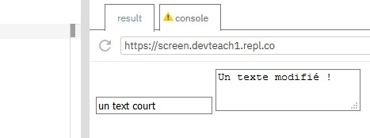
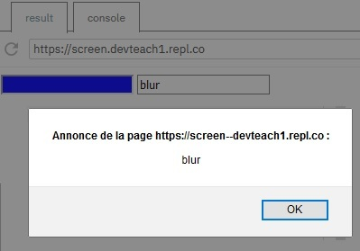

# Manipular los campos de tipo texto

## Objetivos

- Leer/escribir el valor de una zona de texto
- Manipular los escuchadores de eventos relacionados con los campos de texto

## Contexto

Nuestro formulario HTML está listo, sabemos seleccionar sus elementos a través del DOM. Es hora de interactuar con ellos. Vamos a ver cómo mostrar los datos introducidos por el usuario y cómo escribir en un campo de texto.

## Acceso y modificación del valor de una zona de texto

Para acceder al valor de una zona de texto (text o textarea) usaremos la propiedad value del elemento del DOM correspondiente. Al modificar value , seremos capaces de cambiar el valor de la zona de texto. Podremos vincular dos eventos específicos: focus y blur . El evento focus se llama cuando se hace clic en el campo, mientras que el evento blur se llama cuando se pierde el foco.

## Ejemplo: Acceso

```html
<form>
  <input type="text" id="short-txt" name="short-txt" value="un texto corto" />¹[1]
  <textarea id="long-txt" name="long-txt">Un texto largo</textarea>
</form>
```

```javascript
var shorttxt = document.getElementById("short-txt");
var longtxt = document.getElementById("long-txt");

// Acceso al valor por la propiedad value
console.log(shorttxt.value, longtxt.value);
```

## Ejemplo: Modificación

```javascript
var longtxt = document.getElementById("long-txt");
longtxt.value = "Un texto modificado!";
console.log(shorttxt.value, longtxt.value);
```



Los eventos focus y blur se pueden usar para aportar elementos de información antes y/o después de la introducción de un valor. Para ponerlos en marcha, tendremos que crear los escuchadores de eventos asociados.

## Ejemplo: Focus y blur sobre una zona de texto

```html
<form>
  <input type="text" id="txt-focus" name="txt-focus" />
  <input type="text" id="txt-blur" name="txt-blur" />
</form>
```

```javascript
var txtfocus = document.getElementById("txt-focus");
var txtblur = document.getElementById("txt-blur");

txtfocus.addEventListener("focus", (event) => {
  event.target.style.background = "blue";
});

txtblur.addEventListener("blur", (event) => {
  alert("blur");
});
```



Para más detalles sobre los escuchadores de eventos, consulta el curso sobre la Programación orientada a eventos.

## Nota

>Es totalmente posible modificar el estilo al hacer clic en el campo mediante CSS. Se trata de un enfoque más sencillo por su facilidad de ejecución.

### Ejemplo:

Encontramos a continuación, un formulario que contiene una zona de entrada de tipo texto.

```html
<form action="">
  <input type="text" />
</form>
```

La pseudo-clase de acción CSS :focus nos permitirá asignar propiedades CSS a nuestro elemento HTML.

```css
form input:focus {
  background: #f7c7cf; /* Va a colorear el fondo en rosa */
  border-color: #af7fdd; /* Va a colorear el borde en violeta */
}
```

## Atención

Recordemos siempre que la adición de escuchadores de eventos puede ser costosa para nuestro navegador. Además, el evento focus se activa constantemente mientras el campo en cuestión esté seleccionado. Cuidado con las sorpresas.

### Ejemplo

También podemos dar el foco a un campo, o quitarlo invocando sobre nuestro elemento los métodos `focus()` y `blur()`.

```javascript
let txtblur = document.querySelector("#txt-blur");
txtblur.focus(); // Selecciona el campo txtblur
let txtfocus = document.querySelector("#txt-focus");
txtfocus.blur(); // Deja de seleccionar el campo txtfocus
```

## A recordar

- Para leer o escribir el valor de un campo usamos la propiedad value del elemento del formulario deseado.
- Los eventos focus y blur nos permiten vincular acciones antes o después de una entrada en una zona de texto³[3].