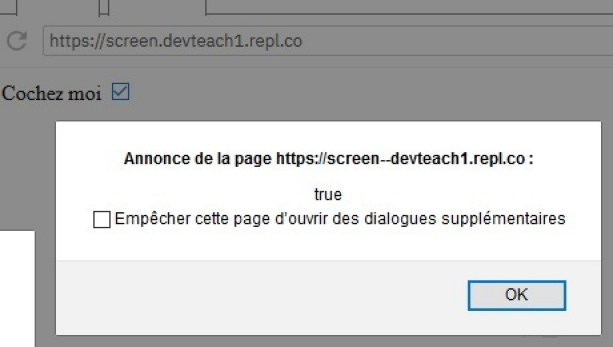
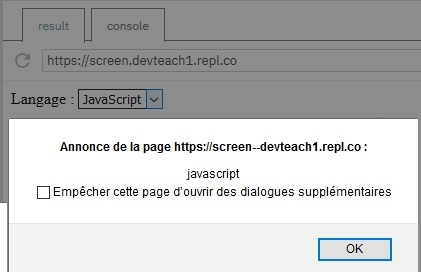

# Manipular los checkbox, radio y select

## Objetivos

- Detectar el cambio de estado de una casilla de verificación, un botón de radio y una lista desplegable
- Manipular el valor de estos campos
- Manipular los oyentes de eventos asociados a estos campos

## Contexto

Vamos a ver cómo mostrar y modificar el valor de los otros tipos de campos presentes en un formulario, es decir, las casillas de verificación, los botones de radio y las listas desplegables.

## Método

Como para los campos de tipo texto, podremos acceder a su valor gracias a la propiedad `value` del elemento del DOM correspondiente. Al modificar `value`, podremos modificar el valor elegido. Podremos vincular el evento `change` que permite detectar la modificación del
elección por parte del usuario. Los elementos de formulario que dan lugar a una elección del usuario tienen en común el evento `change`.

## Aplicación a los Checkbox

Aquí, añadimos un oyente de evento `change` a nuestra casilla de verificación. Además, para detectar si la casilla está marcada o no, utilizaremos la propiedad `checked` del objeto Event de JavaScript.

```html
<label for="check">Márqueme</label>
<input type="checkbox" id="check" name="check">
```

```javascript
var checkbox = document.getElementById('check')
checkbox.addEventListener('change', () => {
  alert(event.target.checked) // True si marcado, sino false
})
```



## Aplicación a los botones radio

Para los botones radio, el usuario dispone de varios opciones de respuesta, pero solo puede seleccionar una. Por lo tanto, debemos colocar un oyente de eventos en cada una de las opciones posibles.

```html
<input type="radio" name="gender" value="Mujer"> Mujer
<input type="radio" name="gender" value="Hombre"> Hombre
```

```javascript
var btnradio = document.getElementsByName('gender')
for (var count = 0; count < btnradio.length; count++) {
  btnradio[count].addEventListener('change', (event) => {
    alert(`Elección: ${event.target.value}`);
  });
}
```


También podemos forzar la elección asignando un valor a `value`. Atención, esta opción debe existir a nivel de las opciones de usuario.

```javascript
event.target.value = "Mujer"
```

## Aplicación a las listas desplegables

De la misma manera que para los botones radio, vamos a colocar un oyente de evento `change` y utilizar la propiedad `value` para mostrar la elección del usuario.

```html
<label for="language">Lenguaje:</label>
<select name="language" id="language">
  <option value="javascript" selected>JavaScript</option>
  <option value="php">PHP</option>
  <option value="python">Python</option>
</select>
```

```javascript
var language = document.getElementById('language')
language.addEventListener('change', (event) => {
  alert(event.target.value)
})
```



También podemos forzar la elección asignando un valor a `value`. Atención, este valor debe existir en la lista desplegable.

```javascript
event.target.value = "php"
```


## A recordar

Para leer o modificar la elección de un usuario (casilla de verificación, botón de radio, lista desplegable), utilizamos la propiedad `value` del elemento del formulario deseado. Para "escuchar" las elecciones del usuario, utilizamos el evento `change`.