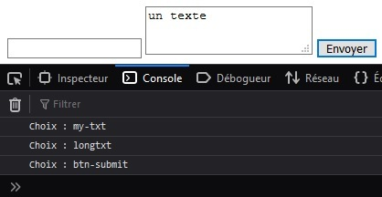
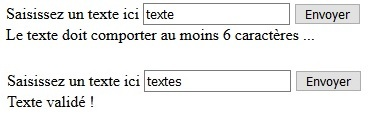
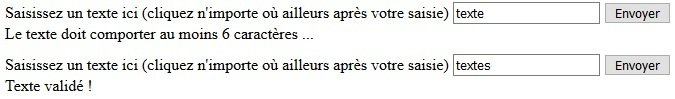

# Validación y envío de formularios HTML

## Objetivos

- Dominar el objeto formulario del DOM
- Enviar un formulario
- Validar los datos introducidos

## Contexto

Una sola regla de oro, nunca confíes en el usuario. En otras palabras, comprueba siempre los datos introducidos por el usuario antes de que sean procesados. Al hacer clic en el botón para enviar el formulario, los datos se envían al recurso indicado en el atributo action de la etiqueta `<form>`. Vamos a ver cómo interceptar los datos y validar o invalidar el formulario.

## Método

Antes de ser realmente enviado al servidor, se desencadena un evento de tipo submit en el elemento del DOM correspondiente al formulario. Podremos captarlo añadiendo un evento y así acceder a los datos del formulario. A partir de ese momento, la pelota está en nuestro campo. Podremos prohibir ciertas entradas, sugerir datos a introducir, informar sobre los datos esperados o mucho más según nuestras necesidades.

```javascript
form.addEventListener('submit', (event) => {
  // aquí nuestros tratamientos sobre los datos del formulario
  event.preventDefault(); // Cancela el envío de los datos
})
```

La interfaz Event representa un evento que ocurre en el DOM. Una vez que se llama al método preventDefault() asociado a este evento, indica que la acción por defecto no podrá ser ejecutada. Ejemplo: la redirección después del clic de un usuario sobre un elemento `<a>` puede ser cancelada gracias al método preventDefault() aplicado al evento.

El objeto formulario del DOM tiene una propiedad elements que representa el conjunto de campos de entrada en forma de un array. Estos elementos tienen a su vez propiedades para identificar los campos del formulario:

- name : el nombre del campo,
- type : el tipo de campo (password, text, etc.),
- value : el valor del campo, etc.

## Ejemplo: Acceso a los campos de un formulario

```javascript
var form = document.querySelector('form')
// Número de elementos del formulario
console.log(`Choix : ${form.elements.length}`);
// Nombre del primer elemento
console.log(`Choix : ${form.elements[0].name}`);
// Tipo del segundo elemento
console.log(`Choix : ${form.elements[1].type}`);
// Valor del segundo elemento
console.log(`Choix : ${form.elements[1].value}`);
```

Para optimizar nuestro código, podemos aquí, por ejemplo, recorrer los elementos del array elements usando estructuras iterativas de tipo for junto con estructuras condicionales de tipo if o switch/case.

## Ejemplo: Envío del formulario

El formulario enviado da lugar al desencadenamiento de un evento de tipo submit.

```javascript
var form = document.querySelector('form')
form.addEventListener('submit', (event => {
  for (var countElement = 0; countElement < form.elements.length; countElement++) {
    console.log(`Choix : ${form.elements[countElement].name}`);
  }
  event.preventDefault()
}))
```



El evento submit sólo está ahí para permitirnos acceder a los elementos de nuestro formulario. Una vez hechas nuestras comprobaciones, podremos detener la presentación del formulario invocando el método preventDefault() del objeto Event. Si este último no se llama, nuestros tratamientos se aplicarán y luego nuestro formulario se enviará al servidor.

## Complemento: Método submit()

El objeto formulario del DOM tiene un método submit() que podemos llamar para enviar un formulario, junto con un evento click sobre un botón, por ejemplo. Sin embargo, con este método, no se desencadenará ningún evento submit y las diferentes restricciones de validación (required, pattern, min, etc.) que podríamos haber puesto en marcha directamente a nivel de los campos de nuestro formulario no se ejecutarán. Tendremos que realizar toda la validación a mano.

### ¿Por qué hacer validar los datos por el navegador?

Así podremos gestionar los errores de entrada antes de que el formulario sea enviado al servidor. Esto evitará la pérdida de los datos del formulario para el usuario y los viajes innecesarios para el servidor.

## Ejemplo: Validación de los datos durante la entrada del usuario

Utilizaremos aquí el escuchador de eventos input. Se activará cada vez que se modifique el valor introducido.

```javascript
var mytxt = document.getElementById('my-txt')
var error = document.getElementById('error')
mytxt.addEventListener('input', (event) => {
  var mytxtValue = event.target.value
  if (mytxtValue.length < 6) {
    error.innerText = 'El texto debe tener al menos 6 caracteres ...'
  } else {
    error.innerText = '¡Texto validado!'
  }
})
```



## Ejemplo: Validación de los datos después de la entrada del usuario

El método será sensiblemente idéntico, sólo el escuchador de eventos será diferente. Utilizaremos aquí blur.

```javascript
mytxt.addEventListener('blur', (event) => {
  ...
})
```



## A recordar

- La presentación de un formulario desencadena un evento submit.
- Añadiendo un escuchador de eventos, podremos acceder al contenido del formulario gracias al objeto Elements de la etiqueta `<form>` y validar los datos durante la entrada con el evento input o después de la entrada con blur.