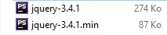
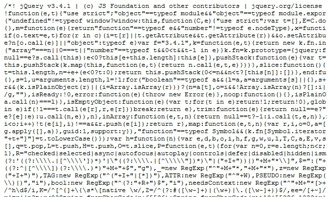
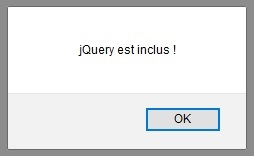

# Instalar jQuery

## Objetivos

- Instalar jQuery
- Incluir jQuery en su proyecto

## Contexto

Vamos a ver las diferentes formas de "instalar" y usar jQuery en nuestros proyectos web. Encontraremos las fuentes de la librería en el **[sitio oficial de jQuery](https://jquery.com/)**.

## ¿Qué es una librería?

Una librería es un conjunto de funciones o clases que nos facilitan la realización de ciertas tareas. Por ejemplo, jQuery es una librería que nos permite manipular el DOM, hacer peticiones AJAX, animar elementos, etc. Las librerías se diferencian de las API, que son interfaces que nos permiten comunicarnos con otros sistemas o servicios. Estas se usan más para implementar funcionalidades entre dos sistemas distintos, por lo que la frontera entre las librerías y las API es bastante fina. También se diferencian de los frameworks, que son estructuras que nos dan una arquitectura base para nuestras aplicaciones web.

## Descargar las fuentes.

**[Es posible descargar el archivo fuente de jQuery en el sitio oficial en su versión clásica jquery.js](https://jquery.com/download/)** o en su versión minificada jquery.min.js. Un archivo minificado tiene el mismo contenido que el archivo clásico, pero un algoritmo lo ha analizado para eliminar lo que no es esencial para la buena ejecución del código, como:

- los espacios
- los saltos de línea
- los comentarios

Un archivo así no es legible para nosotros, desarrolladores, pero tiene la ventaja de ser más ligero y menos costoso para la carga de nuestras páginas web.



## Ejemplo: Archivo no minificado

```javascript
/*!
 * jQuery JavaScript Library v3.4.1
 * https://jquery.com/
 *
 * Includes Sizzle.js
 * https://sizzlejs.com/
 *
 * Copyright JS Foundation and other contributors
 * Released under the MIT license
 * https://jquery.org/license
 *
 * Date: 2019-05-01T21:04Z
 */
( function( global, factory ) {

	"use strict";

	if ( typeof module === "object" && typeof module.exports === "object" ) {
		// ...
```

## Ejemplo: Archivo minificado



## Incluir y usar jQuery

Para incluirlo en nuestros propios scripts, basta con proceder de la misma manera que para cualquier otro script. Sin embargo, para usarlo en los scripts siguientes, habrá que tener cuidado de incluirlo antes que estos.

### Ejemplo

```html
<body>
  <script src="jquery-3.4.1.min"></script>
  <script src="script.js"></script>
</body>
```



No funcionará si invertimos el orden:

```html
<body>
  <script src="script.js"></script>
  <script src="jquery-3.4.1.min"></script>
</body>
```


## Usar jQuery a través de un CDN (Content Delivery Network)

Un CDN, para Content Delivery Network (o Red de distribución de contenido), está formado por ordenadores conectados en red a través de Internet que cooperan para proporcionar contenido o datos a los usuarios. Google, por ejemplo, ofrece una interfaz para difundir contenido. Concretamente, podemos incluir una librería referenciada en un CDN mediante una petición HTTP. Esto nos permitirá no tener que descargar ningún archivo y aprovechar las actualizaciones de la librería. Entre los puntos débiles, esto añade una petición HTTP a la ejecución de nuestra página web, lo que puede ser una fuente de lentitud. Los diferentes CDN en los que está alojado jQuery **[están listados aquí](https://jquery.com/download/#using-jquery-with-a-cdn)**.

### Ejemplo

```html
<body>
  <script src="https://ajax.googleapis.com/ajax/libs/jquery/3.4.1/jquery.min.js"></script>
  <script src="script.js"></script>
</body>
```

A través de un CDN, una librería se incluye de la misma manera que un script clásico salvo que el atributo src es una URL hacia otro sitio.

## Para recordar

Hay dos formas de incluir jQuery en una página:

- descargando el archivo y luego incluyéndolo: `<script src="jquery3.4.1.min.js">`

- incluyéndolo a través de un CDN: `<script src="https://code.jquery.com/jquery-3.6.0.min.js" integrity="sha256-/xUj+3OJU5yExlq6GSYGSHk7tPXikynS7ogEvDej/m4=" crossorigin="anonymous"></script>`

## Complemento

- **[jQuery.com](https://jquery.com/)**

- **[Minificador de archivo (Google)](https://closure-compiler.appspot.com/home)**

- **[Bien diferenciar librería y framework](https://waytolearnx.com/2019/03/difference-entre-framework-et-librairie.html)**
