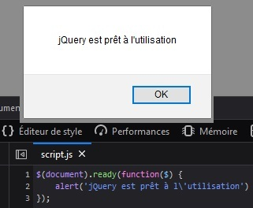
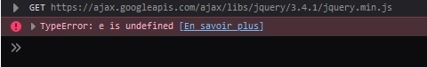
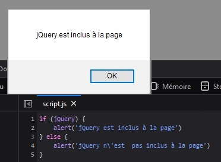

# El Alias `$`

## Objetivos
- Usar jQuery en un script
- Verificar que se puede usar

## Contexto
Una vez que incluimos jQuery en nuestras páginas, solo nos queda un paso antes de poder usar sus herramientas. Se trata de llamar a la función jQuery(). Veremos que todo jQuery se basa en esta función. También hay que verificar que está bien funcional y lista para usar.

## Incluir la función principal de jQuery
Para usar los objetos, propiedades y métodos que ofrece jQuery, es necesario incluir la función principal. El código tendrá que estar obligatoriamente dentro de esta función.

### Ejemplo:

index.html

```html
<!DOCTYPE html>
<html>
<head>
  <meta charset="utf-8">
  <meta name="viewport" content="width=device-width">
  <title>repl.it</title>
  <link href="style.css" rel="stylesheet" type="text/css" />
</head>
<body>
  <script src="https://ajax.googleapis.com/ajax/libs/jquery/3.4.1/jquery.min.js"></script>
  <script src="script.js"></script>
</body>
</html>
```

script.js

```javascript
jQuery(document).ready(() => {
  // Nuestro código usando jQuery
})
```

Esta función toma como parámetro document: se trata simplemente de la página HTML actual y más precisamente del DOM. Luego escucha el evento ready, lo que significa que el código que seguirá solo se ejecutará una vez que nuestra página esté completamente cargada. Por último, el script se coloca en una función anónima.

## Simplificar los llamados
Existe una sintaxis relativamente más corta para incluir jQuery: $(). El símbolo "dólar" es un alias de la función jQuery. Así, podremos escribir el código de abajo:

```javascript
$(document).ready(() => {
  // Nuestro código usando jQuery
});
```

## Complemento
Otras formas de llamar a jQuery

También es posible usar estructuras un poco más simplificadas para llamar a jQuery.

Ejemplo:

Sin el ready

```javascript
$(function() {
  // Nuestro código usando jQuery
});
```

## Atención
Evitar las colisiones con otra librería

```javascript
jQuery(function($) {
  alert('jQuery está incluido!')⁶[6]
});
// O también
$(function($) {
  alert('jQuery está incluido!')⁶[6]
});
```

El alias $ puede ser usado por otras librerías JS. Para evitar posibles conflictos entre dos librerías, podemos agregar $ como parámetro de la función anónima pasada a jQuery.

# Verificar la buena instalación de jQuery
Simplemente colocamos un alert() o un console.log() dentro de la función anónima. Si aparece una ventana emergente después de cargar la página o si se muestra un mensaje en nuestra consola, ¡es un éxito!

```javascript
$(document).ready(() => {
  alert('jQuery está listo para usar')
})
```



En caso de error al incluir jQuery, la ventana emergente o el mensaje de consola no se mostrarán y generalmente tendremos un mensaje de error que nos indicará la razón.




## Complemento: Prueba alternativa

Para probar jQuery, también podemos probar si el objeto global jQuery está incluido en nuestros scripts.

```javascript
if (jQuery) {
  alert('jQuery está incluido en la página')
} else {
  alert('jQuery no está incluido en la página')
}
```



# A recordar
- La forma más frecuente de inicializar jQuery es la siguiente: $(document).ready(function($){})
- Podemos escribirla más simplemente: $(function(){})
- Si integramos otras librerías que usan el alias $: $(function($){})
- Es posible probar si jQuery está listo para usar gracias a un simple alert o console.log dentro de la función anónima pasada a jQuery

```javascript
$(document).ready(() => {
  console.log('jQuery está listo para usar')
})
```