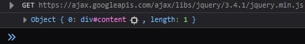
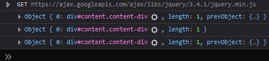
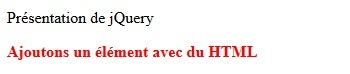
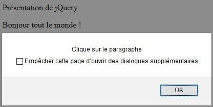
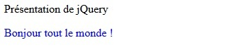

# Sintaxis básica

## Objetivos

- Seleccionar un elemento
- Aplicar un método a un elemento

## Contexto

jQuery tiene su propia sintaxis. Donde JavaScript puede ser verboso, jQuery pretende simplificarnos la tarea ofreciendo una sintaxis más intuitiva y código fácil de escribir. Una vez seleccionado un elemento del DOM, el objetivo es poder interactuar con él, asignarle un comportamiento o modificar su aspecto. Para ello, jQuery ofrece un conjunto de métodos.

## Sintaxis general

`$` es el elemento central. Este se utilizará sistemáticamente cuando se escriba código con jQuery. Luego, como en JavaScript, es necesario seleccionar el elemento del DOM sobre el que actuar. Finalmente, hay que indicar qué método utilizar para realizar el tratamiento deseado.

```javascript
$('miSelector').metodo()
```

## Nota: Los selectores

>Por convención, como en CSS, un selector por identificador empezará siempre por "#" y un selector por clase, por "." seguido del nombre del selector. Recordemos que la base de la interacción entre código HTML y código JavaScript es el DOM. jQuery tiene su propio modelo de selectores y ha elegido utilizar los selectores CSS. De la misma manera que en CSS, también es posible apuntar a cualquier etiqueta.

## Comparativa: JavaScript / jQuery

En JavaScript puro, para seleccionar un elemento del DOM, podemos utilizar el método querySelector .

```html
<div id="content">Presentación de jQuery</div>
```

```javascript
document.querySelector('#content')
```

Con jQuery, utilizaremos los selectores CSS de la siguiente manera:

```html
<div id="content">Presentación de jQuery</div>
```

```javascript
$('#content')
```

Si lo mostramos, podemos ver un objeto que contiene nuestro div.



### Ejemplo: Diferentes formas de apuntar a un objeto

```html
<div id="content" class="content-div">Presentación de jQuery</div>
```

```javascript
$('div') // Selección de la div por su nombre de etiqueta.
$('#content') // Selección de la div por su atributo id #content
$('.content-div') // Selección de las div por la clase .content-div
```



## La llamada de los métodos

Un método se llama a continuación del selector: `$('selector').metodo()`.

- **`html('<span>ejemplo</span>')`:** permite incluir código HTML en el elemento seleccionado. Equivalente a innerHTML en JavaScript.

- **`text('ejemplo')`:** permite incluir texto en el elemento seleccionado. Equivalente a innerText en JavaScript.

- **`css('key', 'value')`:** permite añadir o modificar el valor de un atributo CSS.

- **`click()`:** permite escuchar el evento click del ratón.

Existen muchas otras, todos estos métodos están listados en **[la documentación de jQuery](https://api.jquery.com/)** .

### Ejemplo

```javascript
$('#content p').html('<b>Añadamos un elemento con HTML</b>')
$('#content p').css('color', 'red') // Demos un color a nuestro párrafo
```



## Atención

Cuando se da un argumento a los métodos html y text , estos permiten inicializar el contenido de un selector con el argumento dado como parámetro. En cambio, si estos métodos se llaman sin argumento, permiten recuperar el contenido del selector apuntado.

## Método con función anónima

Esta sintaxis será sobre todo útil a la hora de poner en marcha escuchadores de eventos con jQuery. Es posible asociarles un script ejecutado al desencadenarse este.

### Ejemplo

```html
<div id="content" class="content-div">Presentación de jQuery<p>Hola a todos!</p></div>
```

```javascript
$('#content p').click(function () {
  alert('Click en el párrafo')
})
```



## Complemento: Encadenar los métodos

Los métodos pueden encadenarse. Esto nos ofrece una facilidad de escritura de nuestros scripts y nos permite asociar varios comportamientos a un elemento de una sola vez.

### Ejemplo

```html
<div id="content" class="content-div">Presentación de jQuery<p></p></div>
```

```javascript
$('#content p').text('Hola a todos!').css('color', 'blue')
```



Aquí escribimos primero el texto "Hola a todos!" en el párrafo y luego le asignamos el color azul.

## A recordar

- Un selector se escribe con el alias `$` seguido del nombre del selector entre paréntesis: `$('#mi-selector')`
- Un selector por identificador empieza por `#` y un selector por clase empieza por `"."` .
- Un método se invoca después del selector y se separa de este por un punto `"."`: `$('#selector').html('<b>texto en negrita</b>')`
- Los métodos pueden invocarse a la cadena: `$('#selector').html('<b>texto en negrita</b>').css('font-size', '2em')`

## Complemento

- **[Documentación de jQuery](https://api.jquery.com/)**

- **[Los selectores jQuery](https://api.jquery.com/category/selectors/)**
