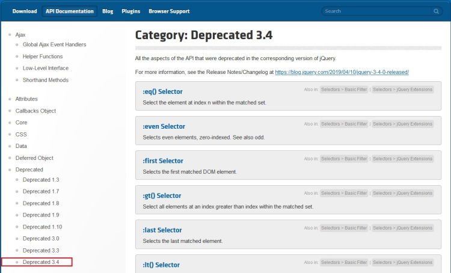
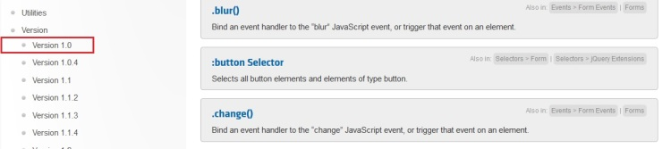
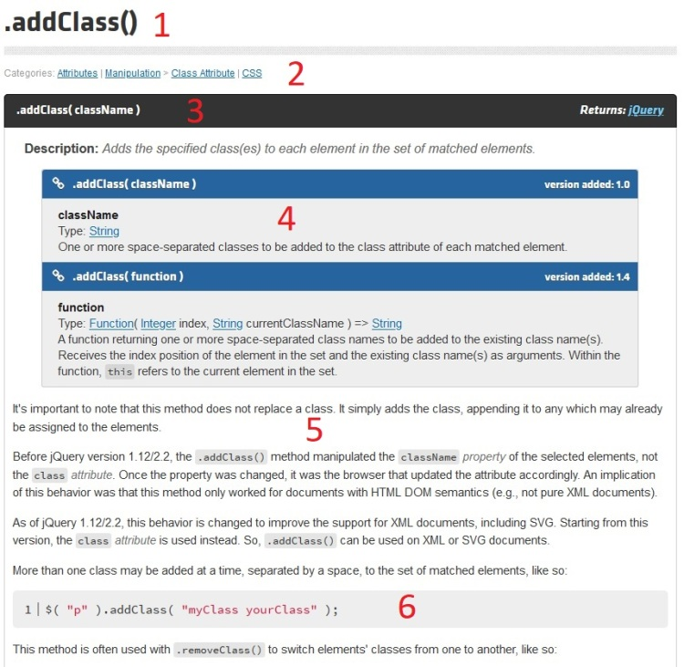
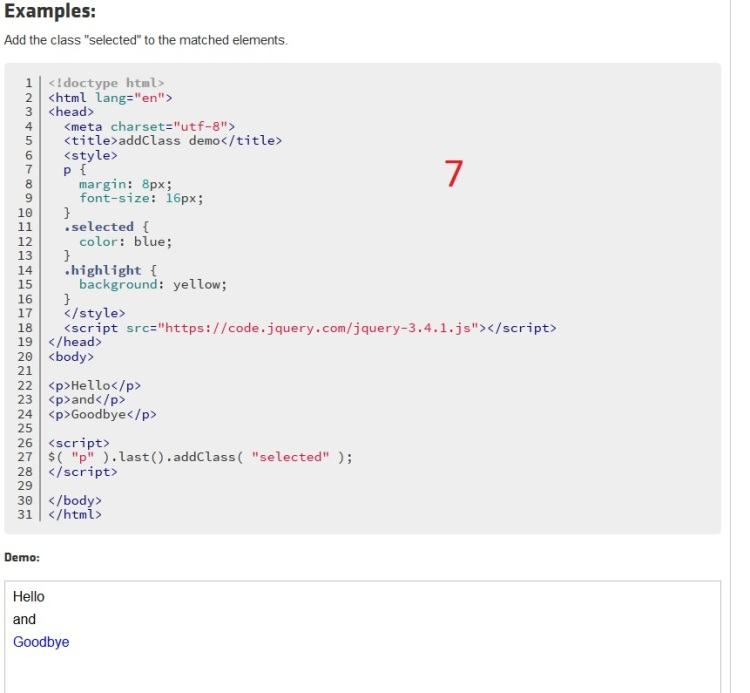

# Documentación

## Objetivo

- Buscar eficazmente en la documentación de jQuery

## Contexto

jQuery es una librería muy completa. No hay que recorrer su código para conocer sus secretos, usaremos mejor su documentación bien proporcionada.

## Presentación general

La **[documentación de la librería](https://api.jquery.com/)** se puede acceder directamente en el sitio oficial de jQuery, en el menú **API Documentation**.

Allí encontramos:

- un panel central que lista por defecto todos los métodos disponibles en jQuery, como `addClass()`, `html()`, `click()`.
- un menú de la izquierda que permite filtrar los métodos por categorías como los selectores, los eventos, los formularios.
- una zona de búsqueda en la parte superior derecha que permite buscar un método por su nombre.

## Identificar las variantes de funcionalidades

El menú de la izquierda, sección **deprecated**, permite también listar los elementos y métodos obsoletos según la versión de la librería. Esto puede ser muy útil para saber lo que habrá que actualizar en un script durante una subida de versión, por ejemplo.

Un poco más abajo, en la sección **version**, se encuentran los métodos añadidos a las diferentes versiones de jQuery.

También en el caso de una subida de versión, esto permite conocer las novedades aportadas.

## La búsqueda de información

La barra de búsqueda situada a la derecha en el menú superior permite buscar un elemento. 

Los resultados de búsqueda se actualizan según la escritura.

## Leer la documentación de un elemento

Tomemos el ejemplo del **[método `addClass`](https://api.jquery.com/addClass/#addClass-className)**.

La documentación de un método se descompone así:

1. Recordatorio del nombre del método
2. Categorías a las que pertenece: permite darnos indicaciones del contexto en el que usarlo
3. Firma del método, es decir su nombre, sus posibles parámetros y lo que devuelve
4. Una descripción precisa de los parámetros esperados
5. Indicaciones sobre el uso del método según las versiones de jQuery
6. Ejemplos de sintaxis
7. Ejemplos de aplicación con el resultado esperado

## A recordar

- En el marco de una librería tan completa como jQuery, la documentación es nuestra mejor aliada.

- Los ejemplos de aplicación son numerosos, lo que es un plus en el aprendizaje de una tecnología.