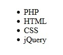

# Interactuar con un elemento

## Objetivos

- Recuperar el código HTML
- Modificar el CSS
- Recorrer una lista de elementos
- Asociar datos a un elemento

## Contexto

jQuery ofrece una multitud de métodos que permiten crear interacción. Vamos a ver los inicios de la programación orientada a eventos, es decir, cómo actuar sobre el código HTML y CSS, cómo recorrer listas de elementos y usar datos propios de jQuery.

## Recuperar el código HTML

El método `html()` permite recuperar el código HTML de un elemento. Se trata de la reescritura de `innerHTML` de JavaScript.

### Ejemplo:

```html
<div id="content">
  <h3>Presentación de jQuery</h3>
  <p>Hijo de #content</p>
</div>
```

```javascript
$(document).ready(() => {
  console.log($('#content').html())
})
```

```text
// Mostrará: <h3>Presentación de jQuery</h3> <p>Hijo de #content</p>
```

## Atención:

si le damos un argumento, este método servirá para reemplazar el contenido HTML.

### Ejemplo:

```javascript
$('#content').html('<div>Nuevo contenido</div>')
```

Los elementos `h3` y `p` serán reemplazados por este nuevo `div`.

## Modificar el CSS

El método `css()` permite añadir o modificar las propiedades CSS de un elemento. Toma como parámetros el nombre de la propiedad CSS y su valor.

### Ejemplo:

```html
<div id="content" class="content-div">
  <h3>¡Hola a todos!</h3>
</div>
```

```javascript
$(document).ready(() => {
  $('h3').css('color', 'blue')
})
```

Aquí, la propiedad `color`, con `blue` como valor, se añade al elemento HTML `h3`.


## Recorrer una lista de elementos

Si una selección devuelve varios elementos, el método `each()` permite recorrerlos. El interés es poder recuperar los elementos uno a uno para aplicarles uno o varios método(s) según las necesidades. Toma como parámetro una función anónima que toma a su vez dos parámetros no obligatorios:

- `index`: posición del elemento en la lista,
- `element`: el elemento actual de la lista (equivalente a `this`).

### Ejemplo:

```html
<div id="content">
  <ul id="list">
    <li>PHP</li>
    <li>HTML</li>
    <li>CSS</li>
    <li>jQuery</li>
  </ul>
</div>
```

```javascript
$(document).ready(() => {
  $('#list li').each(function () {
    console.log($(this).text())
  })
})
```

```text
// Mostrará: PHP HTML CSS jQuery
```

En este ejemplo, `this` podría haber sido reemplazado por `element` si este último se hubiera pasado como parámetro.

## Asociar datos a un elemento

El método `data()` permite crear variables utilizables solo por jQuery. No se incluirán en el DOM. Toma como parámetros:

- `element`: el elemento al que asociar la variable,
- `key`: el nombre de la variable,
- `value`: el valor de la variable (puede ser un dato simple de tipo entero, una cadena de caracteres o bien un array o un objeto JavaScript).

### Ejemplo:

```html
<div id="content">
  <ul id="list">
    <li></li>
    <li></li>
    <li></li>
    <li></li>
  </ul>
</div>
```

Esta vez, los elementos de la lista están vacíos.

Creación por array:

```javascript
$(document).ready(() => {
  let element = $('#content')
  $.data(element, 'languages', ['PHP', 'HTML', 'CSS', 'jQuery'])
  $('#list li').each(function (index) {
    $(this).text($.data(element, 'languages')[index])
  })
})
```

Creación por objeto:

```javascript
$(document).ready(() => {
  let element = $('#content')
  $.data(element, 'languages', { 0: 'PHP', 1: 'HTML', 2: 'CSS', 3: 'jQuery' })
  $('#list li').each(function (index) {
    $(this).text($.data(element, 'languages')[index])
  })
})
```



En este ejemplo, el dato `languages` se asocia al elemento con el id `#content`, lo que significa que `languages` solo estará disponible para ese elemento. Lo usamos luego para rellenar los elementos de la lista.

## Recuperar el valor de un elemento

El método `.val()` permite recuperar el valor de un elemento de un formulario como un `input`, un `select` o un `textarea`. Este método no toma parámetros.

### Ejemplo:

Aquí recuperamos el valor de un `select` para la opción "foo"

```javascript
$('select#foo').val()
```

## A recordar

- **[html()](https://api.jquery.com/html/#html)** permite recuperar o añadir código HTML.

- **[css()](https://api.jquery.com/css/#css2)** permite añadir y modificar propiedades CSS.

- **[each()](https://api.jquery.com/each/#each-function)** permite recorrer una lista de elementos.

- **[data()](https://api.jquery.com/jQuery.data/#jQuery-data-element-key-value)** permite asociar datos a un elemento.

- **[val()](https://api.jquery.com/val/)** permite recuperar el valor de un elemento.