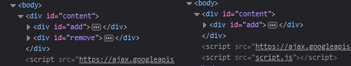

# Agregar, eliminar un elemento

## Objetivos

- Agregar un elemento
- Eliminar un elemento

## Contexto

Existen métodos que permiten modificar el DOM añadiendo nuevos elementos, copiando elementos existentes o eliminando elementos.

## Agregar un elemento

jQuery permite añadir elementos en el DOM gracias a los métodos `append()` y `prepend()`. Estos métodos toman como parámetro el nuevo elemento a añadir. `append` permite añadir un elemento como último hijo del elemento objetivo, `prepend` como primer hijo.

### Ejemplo

```html
<div id="content">
  <ul id="list">
    <li>PHP</li>
  </ul>
</div>
```

```javascript
$(document).ready(() => {
  let list = $("ul");
  list.prepend("<li>jQuery</li>");
  list.append("<li>HTML</li>");
});
```

```text
// Mostrará:
. jQuery // resultado de prepend.
. PHP
. HTML // resultado de append.
```

## Complemento

Es posible añadir un elemento ya existente en otro lugar de la página. Para ello, basta con pasar como parámetro un selector al método utilizado.

```javascript
$("ul #other-list").append($("#list :first-child")); // Añade el primer elemento de la lista al final de otra lista.
```

## Eliminar un elemento

jQuery permite eliminar elementos del DOM gracias al método `remove()`. Este método toma como parámetro opcional un elemento.

## Nota

>Los hijos del elemento, así como los eventos y datos asociados, también serán eliminados.

### Ejemplo

```html
<div id="content">
  <div id="add">
    <p>Agregar un elemento al DOM.</p>
  </div>
  <div id="remove">
    <p>Eliminar un elemento del DOM.</p>
  </div>
</div>
```

```javascript
$(document).ready(() => {
  $("#remove").remove();
});
```



El `div` con el id `#remove` ha sido eliminado del DOM, así como sus elementos hijos. También podríamos haber escrito: `$('div').remove('#remove')`.

## A recordar

- Los métodos `append()` y `prepend()` sirven para agregar elementos en el DOM.

- `remove()` sirve para eliminar elementos.

## Complemento

- **[`append()`](https://api.jquery.com/append/)** 

- **[preprend()](https://api.jquery.com/prepend/)** 

- **[remove()](https://api.jquery.com/remove/)**