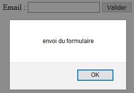

# Los eventos

## Objetivos

- Añadir un escuchador de eventos
- Simular un escuchador de eventos

## Contexto

Como en JavaScript puro, jQuery permite añadir escuchadores de eventos que serán activados por el navegador o el usuario. Puede tratarse de una carga de página, un clic en un botón o la manipulación de los campos de un formulario.

## Nota

>Sin saberlo, ya hemos usado un escuchador de eventos en los pasos anteriores de la iniciación a jQuery. Cuando escribimos:

```javascript
$(document).ready(function() {})
```

>el evento `ready` es escuchado. Significa, cuando el DOM está cargado, ejecutar el script jQuery correspondiente.

## Escuchar un evento

Crear un escuchador de eventos con jQuery es muy simple: basta con aplicar el método correspondiente al escuchador deseado sobre un elemento. Entre los escuchadores más utilizados:

- `click()` : hacer clic en un botón del ratón
- `mousedown()` : presionar un botón del ratón
- `keydown()`, `keyup()` : presionar, soltar un botón del teclado
- `focus()` : enfocar en un campo de formulario
- `submit()` : enviar un formulario

### Ejemplo: Evento formulario

```html
<div id="content">
  <form id="form">
    <label for="email">Email :</label>
    <input type="text" id="email" name="email" value="" />
    <button id="btn-submit">Validar</button>
  </form>
</div>
```

```javascript
$(document).ready(() => {
  $("#email").focus(function () {
    alert("focalización en el campo email");
  });
});
```

Aquí, el evento `focus` es escuchado en el campo email del formulario. Al hacer clic en el campo para introducir, el código correspondiente será ejecutado.


## Complément: Simular un evento

Es posible activar un evento sin esperar una acción del usuario gracias al método `trigger()`. Toma como parámetro el nombre del evento (`click`, `change`, `submit`).

```javascript
$(document).ready(() => {
  $("#form").submit(function (e) {
    e.preventDefault();
    alert("envío del formulario");
  });
  $("#form").trigger("submit");
});
```

Aquí, el escuchador `submit` es simulado desde la carga de la página, lo que tendrá como efecto enviar el formulario sin hacer clic en el botón.



## Complément: Detener la propagación

Como en JavaScript puro, `e.preventDefault()` puede ser usado para detener el comportamiento por defecto del evento.

## A recordar

- Un escuchador de eventos se escribe: `$('selecteur').click()`.
- Un evento puede ser activado: `$('selecteur').trigger('click')`.

## Complément

- **[`trigger()`](https://api.jquery.com/trigger/)**

- **[`e.preventDefault()`](https://api.jquery.com/event.preventDefault/#event-preventDefault)**
