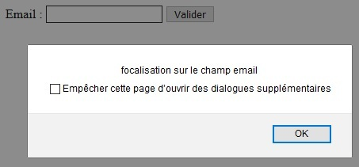
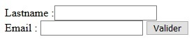
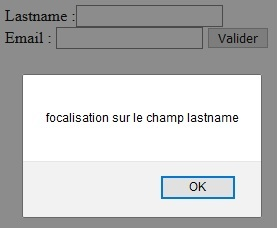

# Delegación de eventos

## Objetivos

- Añadir un escuchador de eventos con on()
- Delegar un evento

## Contexto

La programación basada en eventos reserva algunas sorpresas. Imaginemos crear un escuchador de eventos click en los botones de nuestro sitio. Si añadimos dinámicamente otros botones, estos no estarán conectados a nuestro escuchador. El papel de la delegación de eventos es precisamente resolver este problema.

## Método on()

La delegación con jQuery implica el uso de otro método de añadir escuchadores de eventos que el visto en el capítulo anterior. Usaremos `on()` con dos parámetros:

- el nombre del evento

- una función anónima que contiene el código a ejecutar.

Retomemos el formulario creado anteriormente.


```javascript
$(document).ready(() => {
  $('#email').on('focus', function() {
    alert('focalización en el campo email')
  })
});
```



De la misma manera, el mensaje de alerta se mostrará cuando el foco se haga en el campo email.

## Delegación

Para delegar un escuchador de eventos, el método on() acepta un nuevo parámetro: el elemento sobre el que delegar, que se colocará en segunda posición. Consideremos el escuchador focus colocado en los elementos input sin delegación. En un primer momento, solo el campo email está presente en el formulario.

```javascript
$(document).ready(() => {
  let form = $('#form')
  $('input').on('focus', function() {
    alert(`focalización en el campo ${$(this).attr('name')}`)
  })
  form.prepend('<input type="text" id="lastname" name="lastname" value="" />')
  form.prepend('<label for="lastname">Lastname :</label>')
});
```

Añadamos dinámicamente el campo lastname gracias a preprend. En este caso, el mensaje de alerta se mostrará al foco en el campo email, pero no en el campo lastname.



Con la delegación:

```javascript
$(document).ready(() => {
  let form = $('#form')
  form.on('focus', 'input', function() {
    alert(`focalización en el campo ${$(this).attr('name')}`)
  })
  form.prepend('<input type="text" id="lastname" name="lastname" value="" />')
  form.prepend('<label for="lastname">Lastname :</label>')
});
```



El mensaje de alerta se muestra bien al foco en el campo lastname.

## Fundamental

Para que la delegación funcione, el escuchador ha sido colocado sobre el padre directo de los elementos input.

`$('input').on('focus', function() {})` se ha convertido en:

- `$('#form').on('focus', 'input', function() {})`.

Es decir, el escuchador se coloca sobre el padre y será delegado por este a los elementos input.

## Consejo

Para optimizar la ejecución del script, la delegación debe hacerse sobre el padre más cercano no creado dinámicamente.

## A recordar

- Para delegar un escuchador de eventos, el método `on()` debe ser utilizado:

    - `on('event', 'element', function(){})`.

## Complemento

- **[on()](https://api.jquery.com/on/)**
