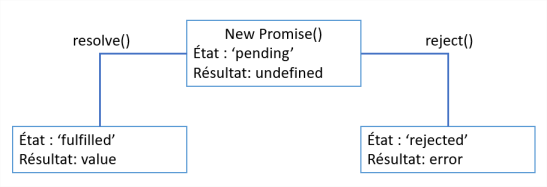

# Las promesas

## Objetivos

- Descubrir qué es una promesa JavaScript
- Crear una promesa con el objeto Promise
- Conocer los mecanismos básicos de una promesa

## Contexto

Desde la democratización de la norma ES6, cada vez más APIs JavaScript utilizan las promesas para gestionar su código asíncrono. Por lo tanto, es importante entender su funcionamiento y conocer las ventajas que aportan al desarrollo.

## ¿Qué es una promesa.

Una promesa JavaScript es un objeto Promise que representa el estado de una función asíncrona, es decir, si la operación asíncrona está "En curso", "Valida", "En error. Este objeto Promise nos permitirá definir el comportamiento (del código) a ejecutar en función del estado de la promes.

Una analogía simple sería la del candidato a una elección:

- Un candidato ha definido que:
  - Si es elegido, aplicará su programa.
  - Si es descalificado, dejará la política.
- El candidato ha hecho una promesa sobre el resultado de la elecció. Ha definido los comportamientos para los casos de éxito, fracaso o error de esta promesa.

Una promesa JavaScript está construida exactamente de la misma manera. A diferencia de que la promesa JavaScript garantiza la ejecución del código.

## Crear una promesa con el objeto Promise

Aunque el concepto sea más antiguo, ES6 introduce el objeto Promise que va a permitir crear fácilmente promesas, sin API de terceros.

```javascript
const myPromise = new Promise(
  /*Executeur*/
  (resolve, reject) => {
    var result = myAsyncFunction(); //Llamada a la función asíncrona
    if (result) {
      //Llamada a resolve() si la función asíncrona se considera un éxito (la Promise se resuelve)
    } else {
      //Llamada a reject() si la función asíncrona se considera un fracaso (la Promise se rechaza)
    }
  }
);
```

El constructor de Promise espera como parámetro una función, llamada ejecutor. A esta función, le pasaremos 2 argumentos: resolve y reject . Si la función es un éxito, llamaremos a resolve ; si es un fracaso, llamaremos a reject. La función ejecutor se ejecutará inmediatamente, sin esperar a que el objeto sea construido.

### resolve y reject

Las funciones resolve() y reject() permiten modificar el estado de la promesa. Pasará así de un estado pending a un estado fulfilled con resolve o rejected con reject. Si una de las funciones resolve() o reject() es llamada, las otras llamadas a las funciones resolve() o reject() serán ignorada. Una vez en estado fulfilled o rejected , una promesa no podrá cambiar de estado.

En la práctica, habrá que crear funciones que devolverán promesa.

## Ejemplo: Verificar la identidad de un usuario

Queremos implementar una función en nuestra aplicación que permita verificar que un usuario es administrador antes de acceder a una página. Para ello, le pedimos que indique su nombre de usuario mediante la función askUsername . Se trata aquí de nuestra función sincrónica: mientras el usuario no interactúe, nada pasa. Una vez obtenida esta respuesta, verificamos la respuesta: si ha indicado " admin ", entonces consideramos que la promesa está resuelta, sino consideramos que será rechazada. Mediante el método then , que abordaremos más adelante, indicamos lo que debe ser ejecutado en caso de resolución o rechazo de la promesa.

```javascript
function askUsername() {
  return prompt("¿Cuál es tu nombre de usuario?");
}

function redirectUser() {
  return new Promise((resolve, reject) => {
    let username = askUsername();
    if ("admin" === username) {
      resolve();
    } else {
      reject();
    }
  });
}

function success() {
  console.log("Eres administrador, puedes acceder a la página");
}

function error() {
  console.log("No has sido reconocido como administrador");
}

redirectUser().then(success, error);
```

No dudes en probar este código, en repl.it por ejemplo.

## Las propiedades de una promesa

El objeto Promise contiene dos propiedades internas, state y result :

- La propiedad state va a dar una indicación sobre el estado de la promesa: pending (en curso), fulfilled (resuelta), rejected (rechazada).
- La propiedad result va a contener el valor definido por el desarrollador como argumento de resolve() o reject() .



### Ejemplo

Llamada XHR encapsulada en una Promise

```javascript
function getFile(url) {
  return new Promise(function (resolve, reject) {
    var xhr = new XMLHttpRequest();
    xhr.onreadystatechange = function (event) {
      // Si la petición es exitosa, resolvemos la promesa pasando la respuesta como parámetro
      // Si no, rechazamos la promesa devolviendo el código HTTP
      if (xhr.readyState === 4 && xhr.status === 200) {
        resolve(xhr.response);
      } else {
        reject(xhr.status);
      }
    };
    xhr.onerror = function (err) {
      // Si la petición falla, rechazamos la promesa enviando la información del error
      reject(err);
    };
    xhr.open("GET", url);
    xhr.send();
  });
}
```

## A recordar

- Con ES6, el objeto Promise se ha vuelto imprescindible en la programación asíncrona JavaScript.

- El estado de una promesa se almacena en su propiedad state.
El valor de esta propiedad va a permitir definir las acciones a realizar en caso de éxito ( resolve ) o fracaso ( reject ) de una función asíncrona.

- El resultado de estas funciones se almacenará luego en la propiedad result .

## Complemento

- **[El objeto Promise](https://developer.mozilla.org/fr/docs/Web/JavaScript/Reference/Global_Objects/Promise)**