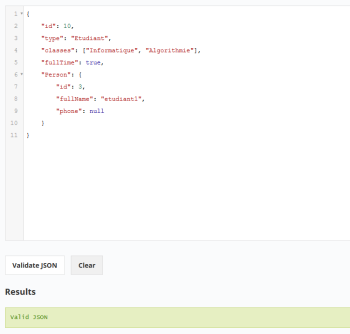
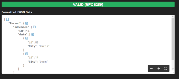

# La sintaxis

## Objetivos

- Aprender la sintaxis del formato JSON
- Descubrir herramientas de validación del formato

## Contexto

Existen diferentes formas de formalizar los datos intercambiados. Veremos que el formato JSON es especialmente adecuado para las restricciones del desarrollo web gracias a una sintaxis simple y lo suficientemente generalista para adaptarse a cualquier caso de uso. Para ello, presentaremos en detalle las especificidades de la sintaxis del formato JSON, antes de presentar los medios para verificar la validez de su estructura.

## Historia

Creado por Douglas Crockford entre 2002 y 2005, la primera norma del JSON es ECMA-404, publicada en octubre de 2003. Actualmente está descrita por las dos normas en competencia: RFC 8259 del IETF y ECMA-404 del ECMA.

- **[fr.wikipedia.org/wiki/JavaScript_Object_Notation](https://fr.wikipedia.org/wiki/JavaScript_Object_Notation)**

## Sintaxis

El formato JSON permite representar los diferentes tipos de JavaScript. Esta operación se llama serialización. Aquí hay algunas reglas de serialización para obtener la representación en JSON de los tipos más utilizados en JavaScript:

- array, representado como una estructura de datos entre `[]`, separados por una `,`
- objeto, representado como una estructura de datos entre `{}`, separados por una `,`
- booleano (`true` o `false`)
- número entero o decimal
- cadena de caracteres entre `""`
- `null`

Para la representación de los objetos, los datos en sí mismos siguen una notación `clave: valor` para la cual la clave debe ser una cadena de caracteres entre `""`, y el valor puede utilizar una de las representaciones mencionadas anteriormente.

### Ejemplo

```json
{
  "id": 10,
  "type": "Estudiante",
  "classes": ["Informática", "Algoritmia"],
  "fullTime": true,
  "person": {
    "id": 3,
    "fullName": "John Doe",
    "phone": null
  }
}
```

La estructura de datos presentada contiene:

- un número correspondiente a la clave `"id"`,
- un array que contiene los valores `"Informática"` y `"Algoritmia"` asociados a la clave `"classes"`,
- un booleano `true` asociado a la clave `"fullTime"`,
- un objeto, registrado con la clave `"person"`, que contiene un `id` con el valor `3`, una cadena de caracteres `"John Doe"` asociada al atributo `"fullName"` y un valor `null` para el atributo `"phone"`.

## Nota

>Gracias a su flexibilidad, el formato JSON permite representar estructuras de datos complejas fácilmente mediante la encapsulación de las estructuras de datos. Por lo tanto, es posible representar un array de objetos dentro de otro objeto.

### Ejemplo

```json
{
  "person": {
    "adresses": {
      "id": 45,
      "data": [
        {
          "id": 89,
          "city": "París"
        },
        {
          "id": 14,
          "city": "Lyon"
        }
      ]
    }
  }
}
```

## Atención

El formalismo JSON no admite la adición de comentarios en la descripción de las estructuras de datos. Para asegurarse de que las estructuras JSON transmitidas sean válidas, existen herramientas en línea que permiten validar el formalismo utilizado, como **[https://jsonlint.com/](https://jsonlint.com/)** o **[https://jsonformatter.curiousconcept.com/](https://jsonformatter.curiousconcept.com/)**. Estas herramientas permiten introducir una estructura en JSON y verificar que cumpla con las normas de sintaxis de este formato.

### Ejemplo



Ejemplo de resultado de validación de la estructura JSON vista en el primer ejemplo en jsonlint.com.

### Ejemplo



Ejemplo de resultado de validación de la estructura JSON vista en el segundo ejemplo en jsonformatter.curiousconcept.com.

## Para recordar

Es posible representar estructuras de datos siguiendo el formato JSON de forma sencilla y rápida, gracias a su sintaxis flexible y no tipada.

## Complemento

- **[RFC 8259](https://www.bortzmeyer.org/8259.html)**

- **[Presentación del JSON](https://www.json.org/json-fr.html)**
