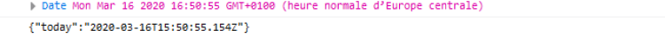

# JSON con JavaScript

## Objetivo

Aprender a serializar y deserializar datos en formato JSON con JavaScript

## Contexto

Como la mayoría de los tipos de datos existentes, el formato JSON es independiente del lenguaje utilizado. Su origen ligado a la estructura intrínseca de los objetos de JavaScript asegura una gran facilidad de uso con este lenguaje. Vamos a ver cómo JavaScript transpone datos en formato JSON, y luego veremos cómo nos permite utilizar datos estructurados según este formato.

## El objeto JSON de JavaScript

JavaScript incorpora nativamente un objeto que permite la gestión del formato JSON. Este objeto propone dos métodos:

- `JSON.stringify()` para serializar datos en JSON
- `JSON.parse()` para deserializar datos JSON en un tipo JavaScript

## `JSON.stringify()`

El método `stringify()` del objeto JSON de JavaScript toma como parámetro un tipo JavaScript, y lo serializa en una cadena de caracteres en formato JSON.

### Ejemplo:

```javascript
const fields = [
  { id: 2, label: "Campo de fútbol", area: 200 },
  { id: 5, label: "Campo de rugby", area: null },
];
const data = {
  stadium: {
    id: 18,
    label: "Estadio de Francia",
    fields: fields,
  },
};
const json = JSON.stringify(data);
console.log(json);
```

La ejecución del código anterior muestra la siguiente cadena de caracteres en la consola del navegador:

```json
{"stadium":{"id":18,"label":"Estadio de Francia","fields":[{"id":2,"label":"Campo de fútbol","area":200},{"id":5,"label":"Campo de rugby","area":null}]}}
```

## Atención

El formato JSON no acepta ningún formato de fecha propiamente dicho, por lo que los datos en formato de fecha de JavaScript se traducen en cadenas de caracteres.

### Ejemplo:

```javascript
const object = {
  today: new Date(),
};
const jsonObject = JSON.stringify(object);
console.log(object.today);
console.log(jsonObject);
```

El resultado de la ejecución del código anterior muestra que el objeto `Date` de JavaScript ha sido traducido en una cadena de caracteres al transcribirlo en JSON.



A través del ejemplo anterior, se constata que la función `JSON.stringify()` de JavaScript permite obtener una representación estructurada en formato JSON de los datos.

## `JSON.parse()`

El objeto JSON de JavaScript expone una función que permite deserializar una cadena de caracteres que respeta un formato JSON válido en un tipo JavaScript clásico. Esto significa que los datos pueden ser recuperados respetando la notación punteada de JavaScript. Esta función es `parse()`.

### Ejemplo:

```javascript
const json =
  '{"stadium":{"id":18,"label":"Estadio de Francia","fields":[{"id":2,"label":"Campo de fútbol","area":200},{"id":5,"label":"Campo de rugby","area":null}]}}';
const data = JSON.parse(json);
console.log(data.stadium.id);
```

La ejecución del código anterior muestra el valor del atributo `id` del objeto contenido en el atributo `stadium` del objeto obtenido, es decir, 18.

## Nota

>La buena ejecución de la instrucción `JSON.parse()` depende de la validez del formato JSON de la cadena de caracteres pasada como parámetro. De hecho, en caso de invalidez de la estructura de datos, se lanza una excepción del tipo `SyntaxError`. Por eso, el uso de `JSON.parse()` se hace dentro de un bloque `try/catch` para permitir una gestión del error.

### Ejemplo:

```javascript
try {
  const json =
    '{"stadium:{"id":18,"label":"Estadio de Francia","fields":[{"id":2,"label":"Campo de fútbol","area":200},{"id":5,"label":"Campo de rugby","area":null}]}}';
  const data = JSON.parse(json);
  console.log(data.stadium.id);
} catch (error) {
  console.log(error);
}
```

El código anterior genera el siguiente error:

```javascript
SyntaxError: Unexpected token i in JSON at position 12
    at JSON.parse (<anonymous>)
    at <anonymous>:4:21
```

## A recordar

- El lenguaje JavaScript incorpora nativamente un objeto JSON que expone las funciones `JSON.stringify()`, para serializar un tipo JavaScript en una cadena de caracteres que respeta el formato JSON

- Y `JSON.parse()`, para deserializar una cadena de caracteres en formato JSON válido en un tipo JavaScript
