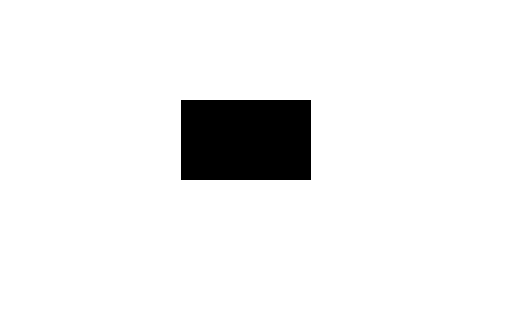
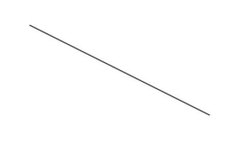
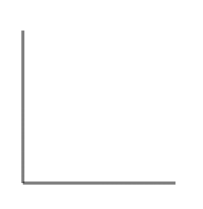
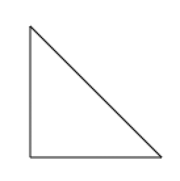
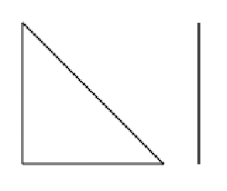
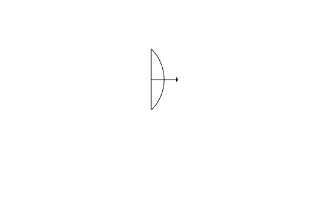
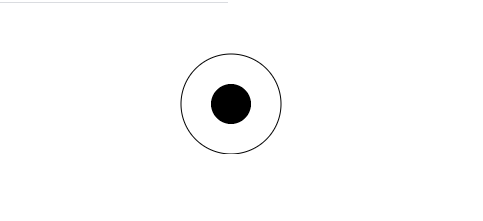

# Dibujar Rectángulos y Definir Trayectorias y Formas

## Objetivo
- Construir formas geométricas

## Contexto
Ahora que sabemos cómo implementar un lienzo (canvas), vamos a ver cómo construir formas geométricas y trazar líneas.

## Nota: Sistema de Coordenadas HTML
>Las coordenadas x y y de una página HTML se basan en una cuadrícula cuyos puntos 0,0 se ubican en la esquina superior izquierda de la página. Por lo tanto, si x y y son iguales a 10, el punto se ubicará a 10 píxeles de la esquina superior izquierda de la página.

Un lienzo (canvas) funciona bajo el mismo principio.

## Los Rectángulos
Existen 3 funciones que permiten dibujar rectángulos:

- `fillRect(x, y, width, height)` que dibuja un rectángulo relleno.
- `strokeRect(x, y, width, height)` que dibuja un rectángulo vacío con contorno.
- `clearRect(x, y, width, height)` que hace transparente una zona rectangular.

## Ejemplo: Un Rectángulo Relleno

```html
<!doctype html>
<html lang="es">
<head>
  <meta charset="utf-8">
  <title>Rectángulo</title>
  <link rel="stylesheet" href="style.css">
</head>
<body>
  <canvas id="rectangulo"></canvas>
</body>
<script>
  const canvas = document.getElementById('rectangulo');
  let ctx;
  if (canvas.getContext) {
    ctx = canvas.getContext('2d');
    // Indicamos al contexto que construya un rectángulo a 10px desde la parte superior, 10px desde la izquierda, 50px de ancho y 30px de alto
    ctx.fillRect(10, 10, 50, 30);
  } else {
    // código para navegadores antiguos
  }
</script>
</html>
```



## Los Trazos
Para construir otras formas geométricas aparte de rectángulos, se deben hacer conectando puntos para crear trazos. Este conjunto de puntos se llama un trazo. Está compuesto por varios segmentos, donde el último punto se conecta con el primero. Estos segmentos pueden ser de cualquier forma (rectas, curvas, etc.).

### Funciones Principales
Para realizar un trazo, se debe inicializar con la función `beginPath()`, y el método `moveTo(x, y)` establecerá el punto de partida de nuestra forma.

### Construir Líneas
Las funciones más comúnmente utilizadas para construir líneas son `lineTo(x, y)` que define una línea recta, y `arcTo(x1, y1, x2, y2, radius)` que define una línea curva.

Si el último punto no ha cerrado nuestro objeto, será necesario terminar la forma con la función `closePath()`, que creará una línea recta hacia este punto.

## Ejemplo de Código

```html
<!doctype html>
<html lang="es">
<head>
  <meta charset="utf-8">
  <title>Trazo</title>
  <link rel="stylesheet" href="style.css">
</head>
<body>
  <canvas id="trazo"></canvas>
</body>
<script>
  const canvas = document.getElementById('trazo');
  let ctx;
  if (canvas.getContext) {
    ctx = canvas.getContext('2d');
    // Indicamos al contexto que trace una línea que comienza en las coordenadas 50px, 25px y termina en las coordenadas 250px, 125px
    ctx.beginPath();
    ctx.moveTo(50, 25);
    ctx.lineTo(250, 125);
    ctx.stroke();
  } else {
    // código para navegadores antiguos
  }
</script>
</html>
```



Podemos dibujar todo tipo de figuras trazando múltiples líneas consecutivas en el lienzo. Una de las figuras más simples para crear es el triángulo.

Para dibujar múltiples líneas consecutivas, simplemente usamos la función `lineTo()` varias veces. Las coordenadas del punto definido por el primer método `lineTo()` servirán como punto de partida para la línea trazada por el segundo llamado al método `lineTo()`, y así sucesivamente.

```javascript
ctx.beginPath();
ctx.moveTo(25, 25);
ctx.lineTo(25, 125);
ctx.lineTo(125, 125);
ctx.stroke();
```



Es posible cerrar el trazo uniendo el primer y el último punto mediante el comando `closePath()`.

```javascript
ctx.beginPath();
ctx.moveTo(25, 25);
ctx.lineTo(25, 125);
ctx.lineTo(125, 125);
ctx.closePath();
ctx.stroke();
```



varios trazos en un mismo lienzo (canvas)

```js
ctx.beginPath();
ctx.moveTo(25, 25);
ctx.lineTo(25, 125);
ctx.lineTo(125, 125);
ctx.closePath();
ctx.stroke();
ctx.beginPath();
ctx.moveTo(150, 25);
ctx.lineTo(150, 125);
ctx.stroke();
```



🤖🤖

## arcTo()

Construir una curva no es una tarea fácil y a menudo requerirá varios intentos y un poco de práctica. El método `arcTo(x1, y1, x2, y2, radius)` toma como parámetros dos puntos de control y un radio.

Los puntos de control forman un ángulo correspondiente a las tangentes en ambos extremos de la curva. El primer punto de control está conectado al punto de partida y construye la primera tangente, mientras que el segundo punto de control está conectado al primero y crea la segunda tangente.
El radio determinará la curvatura del arco.

🤖🤖

## Consejo:
Antes de codificar una forma geométrica, puede ser útil dibujarla primero en un papel cuadriculado para tener puntos de referencia.

## Nota:
>Existen varias métodos para crear arcos con la API Canvas. Puedes encontrar estas métodos **[en la documentación correspondiente.](https://developer.mozilla.org/fr/docs/Web/API/Canvas_API/Tutorial/Drawing_shapes#Arcs)**

## Arco con una Flecha

A continuación se muestra un ejemplo de cómo dibujar un arco con una flecha utilizando HTML y JavaScript:

```html
<!doctype html>
<html lang="es">
<head>
  <meta charset="utf-8">
  <title>Círculo</title>
  <link rel="stylesheet" href="style.css">
</head>
<body>
  <canvas id="arco"></canvas>
</body>
<script>
  const canvas = document.getElementById('arco');
  let ctx;
  if (canvas.getContext) {
    ctx = canvas.getContext('2d') ;
    // construcción del arco
    ctx.beginPath();
    ctx.moveTo(20,20);
    //ctx.arcTo(70, 50, 10, 80, 30)
    ctx.arcTo(70, 70, 20, 120, 70);
    // cuerda del arco
    ctx.moveTo(20,20);
    ctx.lineTo(20,120);
    // asta de la flecha
    ctx.moveTo(20, 70);
    ctx.lineTo(60,70);
    ctx.stroke();
    // punta de la flecha
    ctx.beginPath();
    ctx.moveTo(60, 65);
    ctx.lineTo(64,70);
    ctx.lineTo(60,75);
    ctx.fill();
  }
</script>
</html>
```



## Los Círculos

Para crear un círculo en un lienzo (`canvas`), se utiliza el método `arc(x, y, radio, ángulo de inicio, ángulo de fin)`.

Para crear un círculo completo, el valor del ángulo de inicio debe ser `0` y el valor del ángulo de fin debe ser igual a `Math.PI * 2`.

## Un Círculo Lleno Dentro de un Círculo Vacío

Para dibujar un círculo lleno dentro de un círculo vacío en un lienzo HTML (`canvas`), puedes utilizar el siguiente código:

```html
<!doctype html>
<html lang="es">
<head>
  <meta charset="utf-8">
  <title>Círculo</title>
  <link rel="stylesheet" href="style.css">
</head>
<body>
  <canvas id="circulo"></canvas>
</body>
<script>
  const canvas = document.getElementById('circulo');
  const ctx = canvas.getContext('2d');
  // Círculo vacío
  ctx.beginPath();
  ctx.arc(100, 100, 50, 0, Math.PI * 2);
  ctx.stroke();
  // Círculo lleno
  ctx.beginPath();
  ctx.arc(100, 100, 20, 0, Math.PI * 2);
  ctx.fill();
</script>
</html>
```



## A Recordar

- El único tipo de forma geométrica que se puede dibujar de manera nativa en un canvas es el rectángulo. Para cualquier otra forma, tendrás que crear un trazo.

- Es recomendable dibujar formas complejas en un papel cuadriculado antes de programarlas, para tener una idea más clara de los diferentes puntos de coordenadas que se necesitan.

- Existen varias métodos para dibujar arcos en canvas. Puedes encontrar más información sobre estos métodos en la documentación correspondiente.