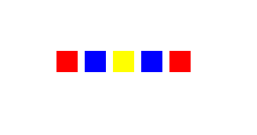
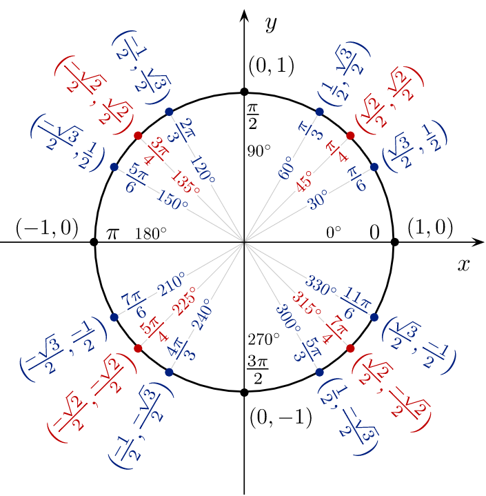
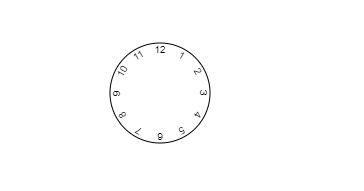

# Aplicar transformaciones

## Objetivos

- Realizar una traslación
- Realizar rotaciones
- La método `transform()`

## Contexto

Como en CSS3, es posible transformar nuestros lienzos para crear formas más complejas o animaciones.

`save()` y `restore()`

Antes de empezar a estudiar los métodos de transformación, vamos a examinar dos métodos indispensables para la creación de formas más complejas:

- `save()` : guarda el estado del lienzo en su totalidad y registra los estados en una pila. `save()` se puede llamar varias veces.
- `restore()` : restaura el estado más reciente guardado. Cada llamada a `restore()` elimina el último estado guardado y restaura todos los parámetros guardados.

## Ejemplo: Crear y restaurar cuadrados

Veamos cómo funcionan `save()` y `restore()` a partir de un ejemplo simple.

```javascript
const canvas = document.getElementById('canvas');
let ctx;
if (canvas.getContext) {
  ctx = canvas.getContext('2d');
  ctx.fillStyle = 'red';
  ctx.fillRect(30, 30, 30, 30);
  ctx.save(); // Guarda el estado
  ctx.fillStyle = 'blue';
  ctx.fillRect(70, 30, 30, 30);
  ctx.save(); // Guarda el estado
  ctx.fillStyle = 'yellow';
  ctx.fillRect(110, 30, 30, 30);
  ctx.restore(); // Restaura el último estado guardado y borra el guardado
  ctx.fillRect(150, 30, 30, 30);
  ctx.restore(); // Restaura el primer estado guardado y borra el guardado
  ctx.fillRect(190, 30, 30, 30);
} else {
  // código para los navegadores antiguos
}
```



## La traslación

La traslación corresponde al desplazamiento de las coordenadas del origen. Se utiliza este método mediante `translate(x, y)`.

## Ejemplo: Traslación de dos cuadrados

```javascript
let ctx;
if (canvas.getContext) {
  ctx = canvas.getContext('2d');
  ctx.fillStyle = 'red';
  ctx.fillRect(10, 10, 50, 50);

  // Se desplaza el punto de origen del lienzo
  ctx.translate(90, 60);

  ctx.fillStyle = 'blue';
  ctx.fillRect(10, 10, 50, 50);
}
```

## Las rotaciones

Para realizar una rotación, se va a utilizar el método `rotate(angle)`. La rotación va a girar los elementos del lienzo en el sentido de las agujas de un reloj, a partir del punto de origen. Las rotaciones se acumulan: si se crean varias rotaciones sucesivas, se acumularán entre ellas.

## Ejemplo: Texto vertical

```javascript
const canvas = document.getElementById('myFirstCanevas');
let ctx;
if (canvas.getContext) {
  ctx = canvas.getContext('2d');

  // Rotación
  ctx.rotate(Math.PI / 2);

  ctx.font = '30px Arial';
  ctx.fillText('Hello world', 0, -30);
}
```

## Nota

>Las rotaciones modifican la ubicación visual del punto de origen. Esto puede ser bastante desorientador. Para orientarse más fácilmente, puede ser interesante utilizar este método con `translate`.

## Algunas nociones de trigonometría

En matemáticas, el círculo trigonométrico es un círculo que permite ilustrar y definir nociones como las de ángulo, radián y las funciones trigonométricas: coseno, seno, tangente. En nuestro caso , nos servirá para trabajar sobre los círculos , semicírculos, ángulos y las rotaciones.

De manera muy simplificada, este círculo nos permite asociar un ángulo a un valor de Pi para utilizar este valor en nuestras fórmulas.



Tabla extraída del círculo trigonométrico.


## Ejemplo: Un reloj

```javascript
const canvas = document.getElementById('cible');
let ctx;
if (canvas.getContext) {
  ctx = canvas.getContext('2d');

  // Desplazamiento del punto de origen
  ctx.translate(150, 75);

  // círculo del reloj
  ctx.beginPath();
  ctx.arc(0, 0, 50, 0, 2 * Math.PI);
  ctx.stroke();

  // Colocación de las horas
  ctx.textAlign = 'center';
  ctx.fillText('12', 0, -40);
  for (let i = 1; i < 12; i++) {
    ctx.rotate(Math.PI / 6);
    ctx.fillText(`${i}`, 0, -40);
  }
}
```



## `transform()`

El método `transform()` permite:

- Escalar,
- Girar,
- Desplazar,
- Inclinar.

El método `transform()` toma 6 parámetros. Estos parámetros forman una matriz que corresponde a la de transformación de la API Canvas. Cuando se utiliza `transfom(p1, p2, p3, p4, p5, p6)`, se multiplica la matriz de transformación actual por la matriz descrita por los argumentos de este método.

- `p1` : Escala horizontal.
- `p2` : Inclinación horizontal.
- `p3` : Inclinación vertical.
- `p4` : Escala vertical.
- `p5` : Desplazamiento horizontal.
- `p6` : Desplazamiento vertical.

## Ejemplo: Los cuadrados

Repetimos el ejemplo de los cuadrados visto anteriormente. Este código proporcionará exactamente el mismo resultado:

```javascript
const canvas = document.getElementById('canvas');
let ctx;
if (canvas.getContext) {
  ctx = canvas.getContext('2d');
  ctx.fillStyle = 'red';
  ctx.fillRect(30, 30, 30, 30);
  ctx.save();
  ctx.fillStyle = 'blue';
  ctx.transform(1, 0, 0, 1, 40, 0); // desplaza de 40px sobre el eje de las x
  ctx.fillRect(30, 30, 30, 30);
  ctx.save();
  ctx.fillStyle = 'yellow';
  ctx.transform(1, 0, 0, 1, 40, 0); // desplaza de 40px sobre el eje de las x
  ctx.fillRect(30, 30, 30, 30);
  ctx.restore();
  ctx.transform(1, 0, 0, 1, 80, 0); // desplaza de 80px sobre el eje de las x a partir del último estado guardado
  ctx.fillRect(30, 30, 30, 30);
  ctx.restore();
  ctx.transform(1, 0, 0, 1, 160, 0); // desplaza de160px sobre el eje de las x a partir del primer estado guardado
ctx.fillRect(30 ,30 ,30 ,30 );
} else {
// código para los navegadores antiguos
}
```

## A recordar

Las transformaciones permiten modificar el estado de los elementos del lienzo. Es posible:

- Desplazar el eje de origen,
- Realizar una rotación,
- Cambiar de escala,
- Inclinar.

Es posible guardar el estado de un elemento y restaurarlo.