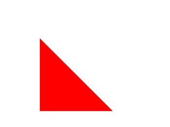
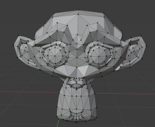

# Introducción a la 3D en JavaScript: three.js

## Objetivos

- Descubrir el WebGL
- Comprender la utilidad de three.js

## Contexto

El HTML5 ha sido una revolución que ha cambiado de manera radical la forma de crear sitios web. Nuevos bloques, posibilidad de añadir fácilmente sonidos o vídeos, nuevos elementos de formulario... Sus aportes son numerosos y sus beneficios son indiscutibles. Pero entre todos estos añadidos, uno en particular permite extender las capacidades del navegador para no limitarse a la visualización de sitios web: el lienzo.

## Canvas y WebGL

El elemento `<canvas>` es una etiqueta que apareció en HTML5 que permite realizar dibujos en JavaScript. El lienzo puede utilizar varias tecnologías para crear y mostrar el dibujo, llamadas contextos de renderizado (o rendering contexts). Se puede ver un contexto de renderizado como una caja de herramientas que contiene todo lo que JavaScript necesita para interactuar con el lienzo. Existen dos contextos principales que están implementados de forma nativa en los navegadores recientes: Canvas2D, que permite realizar dibujos en 2D, y WebGL, que permite hacer 3D.

### Ejemplo

La forma más primitiva que se puede hacer con Canvas2D es un rectángulo. Sin entrar en detalles, aquí está el código necesario para crear un rectángulo rojo:

```html
<canvas id="canvas" width="300" height="300"></canvas>
<script>
  let canvas = document.getElementById('canvas');
  let ctx = canvas.getContext('2d'); // Recuperación del contexto Canvas2D
  ctx.fillStyle = "#FF0000"; // Color de relleno (rojo)
  ctx.fillRect(50, 50, 100, 75); // Dibujo de un rectángulo de 100x75 en las coordenadas (50,50)
</script>
```


En tres dimensiones, la forma predilecta es un triángulo. Aquí está el código necesario para crear un triángulo rojo:

```html
<canvas id="canvas" width="300" height="300"></canvas>
<script>
  let canvas = document.getElementById('canvas');
  gl = canvas.getContext('webgl'); // Recuperación del contexto WebGL

  let vertices = [
    -0.5, 0.5, 0.0,
    -0.5, -0.5, 0.0,
    0.5, -0.5, 0.0
  ];
  let indices = [0,1,2];

  // Creación de dos buffers de datos: uno para los vértices y otro para los índices
  let vertexBuffer = gl.createBuffer();
  gl.bindBuffer(gl.ARRAY_BUFFER, vertexBuffer);
  gl.bufferData(gl.ARRAY_BUFFER, new Float32Array(vertices), gl.STATIC_DRAW);
  gl.bindBuffer(gl.ARRAY_BUFFER, null);
  gl.bindBuffer(gl.ARRAY_BUFFER, vertexBuffer);

  let indexBuffer = gl.createBuffer();
  gl.bindBuffer(gl.ELEMENT_ARRAY_BUFFER, indexBuffer);
  gl.bufferData(gl.ELEMENT_ARRAY_BUFFER, new Uint16Array(indices), gl.STATIC_DRAW);
  gl.bindBuffer(gl.ELEMENT_ARRAY_BUFFER, null);
  gl.bindBuffer(gl.ELEMENT_ARRAY_BUFFER, indexBuffer);

  // Creación del shader de los vértices y de los fragmentos, y luego del shader general
  let vertCode =
    'attribute vec3 coordinates;' +
    'void main(void) {' +
      ' gl_Position = vec4(coordinates, 1.0);' +
    '}';
  
  let vertShader = gl.createShader(gl.VERTEX_SHADER);
  gl.shaderSource(vertShader, vertCode);
  gl.compileShader(vertShader);

  let fragCode =
    'void main(void) {' +
      ' gl_FragColor = vec4(1, 0.0, 0.0, 1);' +
    '}';
  
  let fragShader = gl.createShader(gl.FRAGMENT_SHADER);
  gl.shaderSource(fragShader, fragCode);
  gl.compileShader(fragShader);

  let shaderProgram = gl.createProgram();
  gl.attachShader(shaderProgram, vertShader);
  gl.attachShader(shaderProgram, fragShader);
  gl.linkProgram(shaderProgram);
  gl.useProgram(shaderProgram);

  let coord = gl.getAttribLocation(shaderProgram, "coordinates");
  gl.vertexAttribPointer(coord, 3, gl.FLOAT, false, 0, 0);
  gl.enableVertexAttribArray(coord);

  // Dibujo en el lienzo
  gl.clearColor(1, 1, 1, 1);
  gl.enable(gl.DEPTH_TEST);
  gl.clear(gl.COLOR_BUFFER_BIT);
  gl.viewport(0,0,canvas.width,canvas.height);
  gl.drawElements(gl.TRIANGLES, indices.length, gl.UNSIGNED_SHORT,0);
</script>
```



Los ejemplos anteriores permiten destacar una diferencia evidente entre los dos contextos: WebGL es mucho más complejo de manipular que Canvas2D. La adición de una tercera dimensión requiere gestionar elementos que no están necesariamente presentes en 2D, como los shaders, los buffers, los vértices...

> Nota: Puede parecer extraño que la forma básica de un objeto 3D sea un triángulo, pero, en realidad, un modelo 3D suele estar compuesto por un conjunto de triángulos (un rectángulo puede estar compuesto por dos triángulos).



Afortunadamente, existen librerías JavaScript que permiten simplificar el uso de WebGL. Vamos a ver la más conocida y la más utilizada: three.js.

## Three.js

Three.js es una librería JavaScript que permite manipular fácilmente objetos en 3D. Gracias a ella, es posible dibujar formas primitivas tridimensionales o importar modelos 3D en unas pocas líneas de código, y mostrarlos usando numerosas tecnologías de renderizado, incluyendo WebGL. También dispone de herramientas para animar estos objetos o gestionar las colisiones entre ellos. Incluso es posible crear entornos accesibles desde un casco de realidad virtual.

### Método

Para usar la librería three.js, primero habrá que importarla en el proyecto. Para ello, existen dos soluciones: el uso de un CDN y la descarga vía npm.

Un CDN (por Content Delivery Network) es un alojador de archivos cuyo objetivo es poner contenido a disposición de la forma más eficiente posible. En el momento de la importación de las herramientas de three.js, habrá que indicar un enlace al archivo JavaScript remoto. El CDN recomendado por three.js es unpkg.com y el enlace es https://unpkg.com/three@[PONER LA VERSIÓN AQUÍ]/build/three.module.js. Por ejemplo, para recuperar la versión 0.122.0, hay que usar el código siguiente:

```html
<script type="module">
  import * as THREE from 'https://unpkg.com/three@0.122.0/build/three.module.js';
  // Resto del código
</script>
```

También es posible descargar three.js gracias a npm, con la línea de comando `npm install --save three`. Bastará entonces con importar la librería usando el código siguiente:

```html
<script type="module">
  import * as THREE from 'three';
  // Resto del código
</script>
```

> Atención: Aunque three.js solo esté compuesto por JavaScript, importa sus propios módulos. Hay que usar siempre `type="module"` en la etiqueta de script, lo que provoca llamadas HTTP que pueden fallar si la aplicación no usa un servidor web. Para usar esta librería, hay dos opciones:
>
> - Poner todo el código JavaScript en el índice del sitio, para evitar las llamadas HTTP
> - Usar un servidor web, como Apache (a través de una solución como XAMPP, WAMP...) o un bundler , como Webpack. Node está desaconsejado por three.js.
>
> Por razones de accesibilidad, todos los ejemplos mostrados en este curso están previstos para funcionar en local, sin servidor web. Todo el código JavaScript está situado entre etiquetas `<script>`. Por supuesto, no es una buena práctica: se recomienda exportar el código en varios archivos JavaScript. No dudes en poner en marcha tu propio servidor web.

## A recordar

- La etiqueta HTML5 `<canvas>` permite hacer dibujo en JavaScript.
- Existen varias tecnologías, llamadas "contextos", que permiten usar un lienzo: Canvas2D, más simple, pero limitado al dibujo en dos dimensiones; y WebGL, mucho más complejo, pero permitiendo la 3D.
- Para simplificar el dibujo en 3D, se puede usar.

## Complemento

Una flipada!!

- **[Sitio Official de Three.JS](https://threejs.org/)**