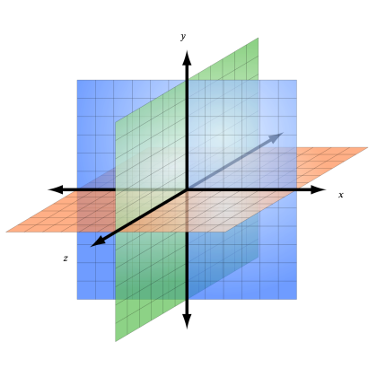

# Escena, cámara y renderizador

## Objetivos

- Comprender los conceptos de escena, cámara y renderizador
- Implementar estos conceptos en three.js

## Contexto

Organizar el espacio 3D con three.js puede compararse con la realización de una película. Los objetos 3D serán nuestros actores, pero no se bastan por sí mismos. Para funcionar, van a necesitar 3 cosas: una escena en la que actuar, una cámara para filmarlos, y luego, una vez rodada la película, habrá que ponerla en un soporte para ser vista (DVD, Blu-ray, VHS, formato mp4, formato AVI...). Estos tres conceptos se encuentran en muchos programas de diseño 3D, y three.js no es una excepción.

## La escena

Una escena es un espacio 3D que va a acoger los diferentes elementos a mostrar. Todos los objetos 3D que three.js va a manipular deben ser añadidos a una escena para ser visibles. Es posible crear varias escenas, pero solo se mostrará una a la vez.

## Método

Para crear una escena en three.js, basta con instanciar un objeto de tipo `Scene`. El constructor de esta clase no tiene parámetros.

```javascript
import * as THREE from 'https://unpkg.com/three@0.122.0/build/three.module.js';

// Declaración de la escena
let scene = new THREE.Scene();
```

Una escena siendo un espacio tridimensional, la posición de cada elemento que va a ocuparla se definirá por sus coordenadas en los ejes x, y y z. Por defecto, los objetos tendrán la posición (0, 0, 0).



## La cámara

La escena sola no sirve si nadie está ahí para verla. La cámara permite definir el punto de vista que se mostrará en el lienzo. Si tomamos, por ejemplo, una escena que contiene una casa, es la cámara la que va a decidir si el punto de vista está dentro o fuera de la casa. Existen varios tipos de cámara, pero el más utilizado en 3D es el `PerspectiveCamera`, que simula la visión del ojo humano.

## Método

Para crear una cámara, hay que instanciar un objeto de tipo `PerspectiveCamera`. El constructor de esta clase tiene 4 parámetros:

- `FieldOfView`, el campo de visión de la cámara, en grados.
- `AspectRatio`, el ratio ancho/alto de la imagen final. Este ratio está directamente relacionado con el tamaño del contenedor: poner uno diferente provocaría efectos de estiramiento de la imagen.
- `NearClippingPlane`, la distancia de visualización mínima. Todos los objetos situados por debajo de esta distancia de la cámara no se mostrarán.
- `FarClippingPlane`, la distancia de visualización máxima. Todos los objetos situados por encima de esta distancia de la cámara no se mostrarán.

Un objeto `camera` tiene una propiedad `position` que contiene sus coordenadas en el espacio. Una posición tiene así componentes x, y y z.

### Ejemplo:

El siguiente código permite crear una cámara con un campo de visión de 75 grados, en un contenedor que ocupa toda la ventana (cuyo ancho y alto son accesibles respectivamente mediante `window.innerWidth` y `window.innerHeight`) y cuya distancia de visualización está entre 0.1 y 1000:

```javascript
let camera = new THREE.PerspectiveCamera(
  75,
  window.innerWidth / window.innerHeight,
  0.1,
  1000
);
```

Luego es posible modificar su posición. Por ejemplo, para desplazarla hacia la derecha, hay que jugar con el eje de las x:

```javascript
camera.position.x = 3;
```

## Nota

>Desplazar la cámara hacia la derecha tendrá como efecto desplazar todos los objetos del campo de visión hacia la izquierda de la pantalla.

## El renderizador

Una vez creada la escena y colocada la cámara, habrá que capturar la imagen: ese es el papel del renderizador. Es él quien va a determinar cómo se generará la imagen final. El renderizador principal es `WebGLRenderer`, que permite dibujar en un `<canvas>` usando el WebGL.

## Método

Para crear un renderizador, basta con crear una instancia de la clase `WebGLRenderer`, cuyo constructor tiene un parámetro opcional en forma de objeto que permite configurar el renderizador. Por defecto, este renderizador crea su propio `<canvas>`, cuyo tamaño hay que definir mediante el método `setSize`, que toma como parámetros una longitud y una altura. Este lienzo se almacena en la propiedad `domElement` y debe ser añadido a la página para ser visible. También es posible utilizar un lienzo existente indicando la propiedad `canvas` en el objeto de configuración del constructor. Para dibujar la imagen final, hay que utilizar el método `render`, que toma como parámetros la escena a dibujar y la cámara a utilizar.

## Nota

>En el caso de un renderizado en un lienzo, el "aspect ratio" de la cámara debe ser calculado a partir del ancho y del alto de éste.

### Ejemplo

Si la página no tiene ningún lienzo, entonces se puede crear un `WebGLRenderer` sin pasar parámetros al constructor. Aquí hay un ejemplo de creación de un lienzo del tamaño de la ventana, y su añadido en el HTML de la página:

```javascript
let renderer = new THREE.WebGLRenderer();
// Se ajusta el tamaño del lienzo
renderer.setSize(window.innerWidth, window.innerHeight);
// Se añade el lienzo a la etiqueta <body>
document.body.appendChild(renderer.domElement);
```

En cambio, si el lienzo ya ha sido preparado, basta con pasarlo como parámetro del constructor:

```html
<!DOCTYPE html>
<html>
  <head></head>
  <body>
    <canvas width="200" height="200" id="canvas3d"></canvas>
    <script type="module">
      const renderer = new THREE.WebGLRenderer({
        canvas: document.getElementById('canvas3d'),
      });
    </script>
  </body>
</html>
```

En este caso, no hay que olvidar calcular el `aspect ratio` de la cámara usando el ancho y el alto del lienzo existente antes de generar la imagen final con el método `render`, si no la imagen se estirará:

```javascript
let canvasElement = document.getElementById('canvas3d');
let scene = new THREE.Scene();⁷[7]
let camera = new THREE.PerspectiveCamera(
  75,
  canvasElement.width / canvasElement.height,
  0.1,
  1000
);
let renderer = new THREE.WebGLRenderer({ canvas: canvasElement });
renderer.render(scene, camera);
```

Por el momento, este ejemplo solo muestra una pantalla negra, pero servirá de base para los futuros entornos 3D.

## A recordar

Para crear un entorno 3D, hay que crear una escena en la que se colocarán los objetos, una cámara que definirá el punto de vista y un renderizador que creará la imagen final. Cada elemento situado en la escena tiene unas coordenadas que permiten definir su posición en los ejes x, y y z.

## Complemento

- **[Introducción a three.js](https://threejs.org/docs/index.html#manual/en/introduction/Creating-a-scene)**