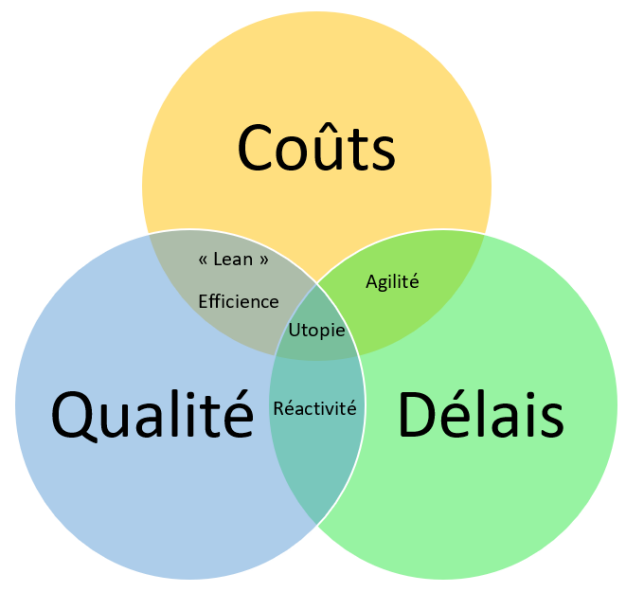

# ¿Qué es la gestión de proyectos?

## Objetivo:

- Descubrir los elementos constitutivos de un proyecto

## Contexto
Por definición, la gestión de proyectos es el conjunto de medios que se implementan para seguir y lograr el éxito de un proyecto. Para comprender su esencia, es necesario poder definir los aspectos y las consecuencias de lo que es un proyecto. Para ello, vamos a precisar primero esta noción antes de identificar los actores, luego las restricciones, y finalmente describiremos los criterios que permiten considerarlo como terminado.

## Definición de un proyecto
Un proyecto es un conjunto de actividades temporales iniciadas con el fin de proporcionar un producto, un servicio o un resultado único. Los aspectos temporales y únicos son importantes, porque esto distingue los proyectos de las "operaciones". Las operaciones son un conjunto de procesos continuos (sin principio ni fin), repetitivos y con recursos asignados. Los proyectos pueden tener un aspecto repetitivo, por supuesto. Sin embargo, el resultado sigue siendo único: por lo tanto, el enfoque y su gestión también son únicos. Movilizan recursos durante su ejecución (humanos, materiales, financieros, etc.) y tienen un alcance que impacta en la organización dentro de la cual se ejecutan.

El cambio es la razón de ser de un proyecto. Este cambio es necesario para responder a las necesidades de creación de valor para la organización (valor que puede ser tangible o intangible). Los resultados esperados del proyecto se llaman "entregables".

### Ejemplo
Un proyecto puede consistir en crear un edificio. Aunque este edificio sea similar a otros edificios, puede estar hecho por equipos diferentes, con variaciones diferentes, en un terreno diferente, con materiales diferentes, etc. Entre los entregables, podríamos encontrar el edificio en sí mismo, pero también los planos, las actas de reunión, etc. Estos entregables responden a una necesidad y van a crear valor (podemos imaginar que el edificio se va a alquilar o vender, por ejemplo).

Una operación, por su parte, puede consistir en hacer una solicitud para la creación de una línea telefónica: el proceso es conocido, controlado, predecible y estándar. Basta con seguir las instrucciones ya establecidas para llegar a un resultado que no es único.

## Los actores de un proyecto
La iniciación de un proyecto pasa por la identificación de todos los actores que concierne. Estos se pueden agrupar en las siguientes categorías:

- El patrocinador (o cliente o comité directivo): es la entidad (persona o grupo de personas) que encarga al jefe de proyecto y al equipo de gestión del proyecto la realización de objetivos.
- El jefe de proyecto (o el equipo de gestión del proyecto): es la o las personas que tienen la responsabilidad de llevar a cabo el proyecto.
- El equipo del proyecto: son las personas que van a realizar el proyecto.
- Las partes interesadas: se trata de todas las personas o entidades afectadas positiva o negativamente por el proyecto. En esta categoría, encontramos por ejemplo al patrocinador, al jefe de proyecto, a los usuarios del producto/servicio realizado, etc.

La buena consideración de las partes interesadas es extremadamente importante, porque estas tienen una influencia sobre el buen logro de los objetivos del proyecto.

### Ejemplo
Tomemos un ejemplo: un proyecto de construcción de una carretera que estaba muy avanzado; los planos estaban terminados, los proveedores estaban contratados, las autorizaciones firmadas. El primer día que empezaron las obras, los vecinos se quejaron de no haber sido consultados ni informados, presentando una denuncia que resultó en la paralización de las obras y en un retraso de varios meses. Los costes de este retraso y de la gestión de esta crisis llevaron evidentemente al proyecto a no cumplir dos objetivos: el respeto del presupuesto y del plazo inicial. ¡La gestión del proyecto no había identificado ni tenido en cuenta estas partes interesadas!

## Las restricciones de un proyecto
Una restricción es un factor que limita el rendimiento del proyecto. Hay generalmente tres, pero se pueden definir otras si es necesario:

- Los costes: el presupuesto nunca es ilimitado, por lo que hay un límite de gastos a respetar.
- Los plazos: se suele admitir que habrá una restricción de tiempo para alcanzar los objetivos definidos lo más rápido posible.
- La calidad: la calidad se define por el grado de conformidad con los requisitos del patrocinador.

### El impacto de las restricciones en la ejecución del proyecto
Las restricciones de un proyecto son como una manta no extensible: se pueden privilegiar algunas restricciones, pero no se pueden tener en cuenta todas al 100%. Es importante que el jefe de proyecto haga consciente de esta ecuación a los diferentes actores del proyecto. El patrocinador debe hacer una elección sobre la prioridad de las restricciones del proyecto definiendo un nivel realista a alcanzar para cada una de ellas. El jefe de proyecto debe asegurarse del cumplimiento de esta decisión.

La consideración de las restricciones y su impacto en el proyecto se pueden representar por la siguiente modelización:

### Ejemplo
Un proyecto de construcción de un coche impone ponerlo en el mercado lo más rápido posible, respetando una calidad mínima para permitir la homologación de éste en el mercado europeo únicamente. Aquí hay un ejemplo de restricciones fuertes sobre los plazos, medias sobre la calidad y las funcionalidades (homologación buscada solo en un mercado) y débiles sobre los costes. Sería imposible hacer este proyecto con un coste bajo, una calidad irreprochable y unos plazos muy cortos: cada una de estas restricciones impacta negativamente en las otras.

## El final de un proyecto
La naturaleza temporal de un proyecto hace que tenga un principio y un fin. El final de un proyecto se desencadena por uno o varios de los siguientes elementos:

- Los objetivos del proyecto se cumplen
- Los objetivos del proyecto no se pueden cumplir
- Los objetivos ya no responden a la estrategia de la empresa o la necesidad ya no existe
- Los recursos ya no están disponibles (fondos, personas, material, etc.)
- Otros eventos desencadenan el final del proyecto (aspectos legales, etc.)

## Para recordar
- La iniciación de un proyecto es la consecuencia directa de una necesidad de tener en cuenta cambios para un actor dado. Está constituido por un conjunto de tareas únicas y temporales que deben permitir llegar a la realización de los objetivos finales.

- La gestión del proyecto es, pues, la disciplina que se asegura del buen cumplimiento del camino a recorrer para alcanzar estos objetivos. Para ello, debe identificar y tener en cuenta los diferentes actores del proyecto, así como las restricciones que le conciernen.