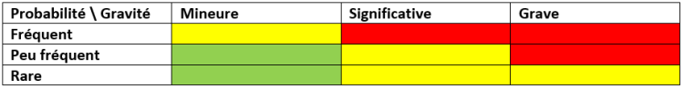

# La preparación de un proyecto

## Objetivo

Descubrir las primeras etapas de la vida de un proyecto

## Contexto

No importa la metodología elegida para la realización de un proyecto, este va a abordar diferentes procesos repartidos en diferentes grandes etapas, que no están fijas en el tiempo ni en su ordenamiento. De hecho, se puede volver sobre cualquier etapa en cualquier momento de la vida del proyecto. Durante su desarrollo, un proyecto atravesará las cinco fases siguientes: inicialización, planificación, ejecución, control y, por último, una fase de cierre. Describiremos aquí en detalle las fases de inicialización y planificación de la vida de un proyecto.

## Fase de inicialización

En esta primera fase, se va a definir qué es el proyecto y quiénes son los actores. Para ello, se puede apoyar en dos componentes:

- El registro de las partes interesadas: se trata de una lista de las partes interesadas del proyecto. Se presenta en forma de un registro que contiene información para permitir identificar y clasificar a los actores (nombre, función, rol en el proyecto, influencia, legitimidad, urgencia, expectativas hacia el proyecto, implicación en el proyecto, etc). Esta lista va a servir de base para tener en cuenta a todos los actores del proyecto, así como para establecer la buena estrategia para que las partes interesadas clave se adhieran al proyecto.

- La carta del proyecto: define los objetivos del proyecto y actúa como una especie de contrato entre el patrocinador, las partes interesadas clave y el equipo del proyecto. Contiene:
  - El contexto del proyecto,
  - Los objetivos y restricciones,
  - El alcance,
  - Los principales actores,
  - Los primeros riesgos potenciales,
  - Los beneficios del proyecto,
  - Una idea del presupuesto.

### Ejemplo

Este ejemplo ilustra la constitución del registro de las partes interesadas: se encuentra, en forma de una hoja de cálculo, los elementos que identifican a un actor del proyecto, así como la información que resume su implicación en el contexto del proyecto.

| Nombre | Función | Rol | Influencia | Legitimidad | Urgencia | Expectativas | Implicación |
| ------ | ------- | --- | ---------- | ----------- | -------- | ------------ | ----------- |
| Ana    | Jefa de proyecto | Patrocinadora | Alta       | Alta        | Alta       | Que el proyecto se realice en tiempo y forma | Alta        |
| Luis   | Analista funcional | Responsable del alcance | Media      | Media       | Media      | Que el alcance se defina correctamente y se respete | Alta        |
| Pedro  | Desarrollador     | Miembro del equipo      | Baja       | Baja        | Baja       | Que el trabajo sea interesante y bien remunerado    | Media       |
| María  | Cliente           | Usuario final           | Alta       | Alta        | Media      | Que el producto cumpla con sus necesidades          | Baja        |

## Fase de planificación

En esta segunda etapa, se trata de describir lo que va a pasar. Permite prever los diferentes aspectos de la ejecución del proyecto para responder a sus objetivos. Hay que tener en cuenta que todas las metodologías de gestión de proyectos pasan por esta etapa, pero, para algunas de ellas, el grado de detalle puede ser profundizado progresivamente a medida que avanza el proyecto. La fase de planificación permite la constitución del plan de gestión del proyecto , que es un documento de referencia que sirve durante todo el proyecto. Va a contener una descripción de cómo se ejecutará el proyecto bajo todos sus aspectos. Este plan va a servir de referencia a todo el equipo del proyecto durante su ejecución. Va a vivir con él, ya que el equipo va a hacerle modificaciones a lo largo del proyecto.

El plan de gestión del proyecto va a definir los siguientes elementos de manera más o menos detallada:

- El alcance
- El cronograma
- Los costes
- La calidad
- Los recursos
- La comunicación
- Los riesgos
- El compromiso de las partes interesadas
- Las prestaciones

### Ejemplo

Tomemos por ejemplo la llegada de un nuevo miembro al equipo. Este se pregunta cómo debe gestionar los riesgos y qué tipo de respuesta dar. Por lo tanto, va a consultar el plan de gestión del proyecto.

## El alcance

En esta primera parte del plan de gestión del proyecto se describirá la gestión del alcance del proyecto, es decir, cómo se recogerán y realizarán las especificaciones, así como la forma en que se gestionarán las solicitudes de cambio al proyecto. Los actores se describen con sus responsabilidades. También se detallará cómo listar los elementos del proyecto y cómo obtener la aceptación de los entregables.

## El cronograma

Esta parte del plan de gestión del proyecto va a describir cómo gestionar la planificación del proyecto y de sus tareas, pero también el seguimiento del rendimiento y el nivel de detalle del seguimiento, es decir, el esfuerzo que se pondrá durante el proyecto para seguir su avance.

### Ejemplo

Por ejemplo, podemos definir unos KPI sobre la progresión en el tiempo del proyecto. En algunas metodologías de gestión de proyectos, se puede definir la velocidad en un período de ejecución corto. También se puede definir un KPI sobre la cantidad de trabajo realizada en relación con la cantidad prevista. La idea es comparar lo previsto y lo real para tomar medidas en caso de divergencia.

## KPI

Un KPI (por Key Performance Indicator ) es un dato cuantificable que permite medir el éxito o el fracaso de un elemento. Se trata de un índice de rendimiento por la medida de variables determinadas.

## Los costes

En esta sección del plan de gestión del proyecto se describirán todos los elementos de gestión de los costes. Se va a precisar las unidades de medida (por ejemplo, todo en euros), el nivel de precisión (se redondea al céntimo superior o al euro superior), el nivel de variación después del cual se deben tomar medidas correctivas (+ 10 % de variación en los gastos, por ejemplo).

### Ejemplo

Por ejemplo, esta parte puede describir que se van a apuntar todos los gastos relativos a los desarrolladores en un número de cuenta X y todos los gastos de material en una cuenta Y, al céntimo cerca, en euros. La frecuencia de actualización deberá ser de una vez al mes.

## La calidad

Aquí, se va a asegurar que el nivel de esfuerzo dado para garantizar la calidad de los entregables sea suficientemente alto para alcanzar los objetivos del proyecto. Para ello, se va a describir la expectativa sobre estos esfuerzos. Generalmente, se habla de « coste de la calidad », que puede ser visto como una especie de equilibrio entre el sobrecoste para asegurarse de responder al 100 % a las necesidades (los costes de conformidad), y el sobrecoste provocado por una mala calidad (los costes de no conformidad).

Los costes de conformidad incluyen los costes de prevención , que están constituidos por las auditorías y generalmente por el aseguramiento de la calidad, y los costes de detección , realizados durante la ejecución del proyecto (ejemplo: los costes de pruebas).

Los costes de no conformidad conciernen sobre todo a los costes de no calidad interna , que representan el tiempo dedicado a corregir los defectos de los entregables, pero cuyo conocimiento está limitado al equipo del proyecto o a la empresa. Por el contrario, cuando los entregables se entregan a los usuarios finales, todos los defectos detectados son costes de no calidad externos (por ejemplo, la pérdida de confianza de los clientes, la gestión de la garantía, etc.).

La descripción de las modalidades de gestión de la calidad se divide en dos partes:

- Aseguramiento de la Calidad: se va a describir cómo se asegura que los procesos calidad puestos en marcha son adecuados a lo que se espera. Es el aspecto « prevención » de la gestión de la calidad.

- Control de Calidad: se va a describir cómo se va a controlar que el nivel de calidad se alcanza, pero también cuáles son los procesos en caso de desviación del resultado esperado. Es el aspecto « detección » de la gestión de la calidad.

Por supuesto, aquí está el texto traducido y formateado en Markdown:

### Ejemplo 1
Podemos imaginar, en el mundo del desarrollo, que el aspecto de aseguramiento de la calidad especifica que se debe lograr una cobertura del 40 % de las funciones de la aplicación con pruebas unitarias automatizadas.

El control de calidad va a describir que se realizarán varias auditorías sobre la forma en que el equipo que ejecuta el proyecto hace el seguimiento.

Si las auditorías muestran que el 40 % no era suficiente, porque implicaba más pruebas manuales en partes no cubiertas, el aseguramiento de la calidad va a proponer un cambio al proyecto con, por ejemplo, la definición de las funciones críticas de la aplicación y la implementación de pruebas unitarias automatizadas solo para ellas, sin tener en cuenta un porcentaje de cobertura.

Es importante tener en cuenta que, cuanto más tarde se detecta la falta de calidad en el ciclo de vida del entregable, más altos son los costes asociados.

### Ejemplo 2
Imaginemos un proyecto de fabricación de una moto.

Los ingenieros encargados de los planos detectan un problema de diseño que implica que la horquilla pueda romperse. Deciden cambiar los planos cuando la cadena de producción aún no se ha modificado para este nuevo modelo de moto. Pasan a 2 personas durante 3 días y el problema se resuelve.

Supongamos ahora que este problema se remonta cuando esta moto ya se ha vendido durante varias semanas. Habrá que:

- Reparar las primeras motos (0,5 días por moto),
- Informar del problema que afecta a varias motos (0,1 días por informe + análisis),
- Cambiar los planos (3 días de 2 personas) y gestionar la adaptación de la cadena de producción (5 días de 4 personas),
- Comunicarse con los clientes (0,1 días por llamada y 0,5 días por correo electrónico)
- Recuperar las motos (x k € de gastos de transporte, x días de gestión, etc.)...

Sin hablar de la imagen de marca, los costes se disparan, poniendo en peligro al fabricante!

## Las Recursos
Esta parte del plan de gestión del proyecto presenta cómo se gestionarán los recursos del proyecto (humanos y materiales). Vamos a describir el enfoque para adquirir y gestionar estos recursos.

## La Comunicación
Esta componente del plan de gestión del proyecto describe los tipos de comunicación que se realizarán durante la vida del proyecto, es decir, el contenido esperado, la forma, la frecuencia y los destinatarios.

Podemos encontrar aquí las diferentes reuniones, informes, llamadas, correos electrónicos, etc.

## Los Riesgos
Aquí se describirá cómo gestionar los riesgos y las oportunidades del proyecto.

Esta descripción incluye la definición de la prioridad del riesgo, generalmente a través de una matriz de clasificación: Importancia = Gravedad x Probabilidad.

También se define el apetito por el riesgo, así como la forma en que se seguirán los riesgos, por ejemplo a través de una matriz de riesgos. Este apetito dirigirá el esfuerzo gastado para gestionar los riesgos.

Esta matriz de riesgos permitirá centrarse en los riesgos más importantes para darles respuesta.

## Compromiso De Las Partes Interesadas
En esta parte, vamos a definir la estrategia a seguir para asegurar el apoyo de las partes interesadas al proyecto. Por lo tanto, vamos a llenar el registro de las partes interesadas con información procedente de esta estrategia.

## Prestación
Esta última parte del plan de gestión del proyecto identifica la necesidad de recursos externos y cómo recurrir a ellos.

## A Recordar
- La vida de un proyecto comienza antes de su realización, a través de una fase inicialización que permite definir su contexto general y sus actores, y una fase planificación que permite detallar todos sus elementos constitutivos gracias a la redacción un plan gestión del proyecto.