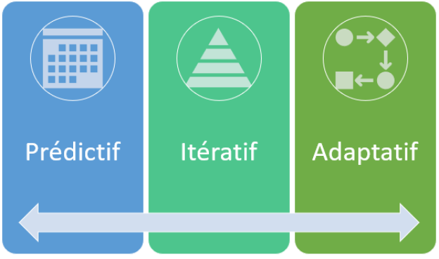
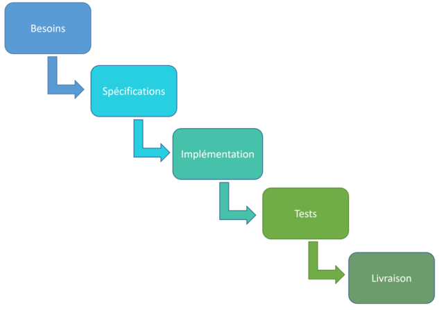
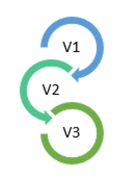
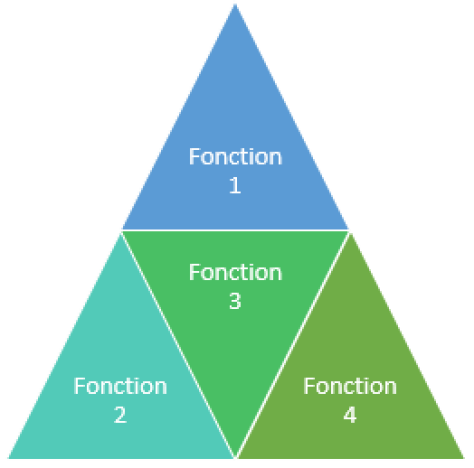

# Los modelos de gestión de proyectos

## Objetivo

- Descubrir los diferentes modelos teóricos de gestión de proyectos

## Contexto

Las metodologías de gestión de proyectos se basan en su adaptación a un modelo teórico que define las filosofías. Veremos que estos modelos se pueden clasificar en cuatro categorías, desde los modelos predictivos hasta los modelos híbridos, pasando por los modelos iterativos y adaptativos.

## Modelos predictivos

Los modelos predictivos tienden a definir el alcance del proyecto con detalle desde el principio, para prever lo que va a pasar hasta el final del proyecto. Este tipo de enfoque es preferible en un entorno que necesita un alto grado de certeza sobre lo que el proyecto debe entregar. No funciona bien en un entorno con muchos cambios o incertidumbres. Típicamente, este tipo de enfoque va a proporcionar una forma de controlar fuertemente el proyecto y su contenido. No hay que creer que esto añade un esfuerzo administrativo: el nivel de responsabilidad se puede dar al equipo a cargo del proyecto para evitar validaciones de alto nivel y así agilizar la realización del proyecto. El sector de la construcción suele elegir este tipo de modelo, pero también se encuentra en proyectos informáticos a medida, donde el alcance está bien definido al principio y hay una necesidad de predecir con detalle cuándo se utilizarán los recursos. Este modelo se puede dividir en dos aplicaciones: los proyectos en cascada y los proyectos que siguen un ciclo en V.

## Modelo predictivo en cascada (Waterfall)

Se trata del modelo predictivo por excelencia donde todas las grandes fases de un proyecto se hacen en orden. La ventaja, cuando se cumple un buen nivel de condiciones iniciales (conocimiento del alcance, planificación realista, gestión de riesgos suficiente, etc.), es obtener entregables definidos previamente, dentro de un presupuesto contenido y generalmente a tiempo. El problema es que estas condiciones iniciales rara vez se cumplen. Esto puede conducir a un producto final que no responde a las necesidades de los usuarios.

## Modelo predictivo: el ciclo en V

Este modelo se puede ver como una evolución de la "cascada". Se trata de un ciclo que realiza acciones por adelantado y permite detectar los errores de diseño o especificación al principio de la vida del proyecto. Se puede modelar de la siguiente manera:

Esta modelización, que se lee horizontalmente, permite observar que:

- El análisis de las necesidades permitirá realizar los casos de prueba de aceptación,
- La redacción de las especificaciones permitirá describir las pruebas de validación,
- El diseño arquitectónico permitirá la definición de pruebas detalladas,
- El diseño detallado estará asociado a la realización de pruebas unitarias.

Sólo una vez validadas las etapas anteriores podrá tener lugar la realización del proyecto. Pero los problemas inherentes al enfoque "cascada" sólo se atenúan. Todavía podemos darnos cuenta al final de que las necesidades no corresponden a lo que los usuarios quieren, si el equipo del proyecto no toma las precauciones necesarias.

## Modelos incrementales o iterativos

Los modelos iterativos son aquellos que realizan el producto final siguiendo una serie de ciclos repetitivos.

Los modelos incrementales buscan crear el producto final añadiendo sucesivamente funcionalidades hasta obtener el producto terminado.

Estos dos enfoques se utilizan generalmente para proyectos complejos que se pueden dividir, o para proyectos cuya entrega parcial puede beneficiar a una parte de las partes interesadas. Como las etapas están divididas, se planificará al principio de cada una de ellas cómo van a desarrollarse, exactamente como en un mini-modelo predictivo.

### Ejemplo

Un ejemplo sería la implantación de un ERP (Enterprise Resource Planning) cuyo módulo que aportará menos riesgos y el mayor valor añadido a la organización se configurará y desplegará primero (por ejemplo, la gestión de nóminas), sin esperar a que los otros módulos estén configurados.

## Modelos adaptativos

También llamados "dirigidos por el cambio", estos modelos son una variación de los anteriores. Se utilizarán en un entorno donde los cambios son frecuentes y donde se cuenta con la participación de todas las partes interesadas. Las iteraciones son muy cortas (generalmente de 2 a 4 semanas) y, durante estas iteraciones, los cambios están prohibidos. Se privilegian estos modelos cuando no se sabe a dónde se va de antemano, cuando se quiere entregar valor rápidamente y/o cuando el entorno de la organización cambia rápidamente. Si no se cumplen las condiciones anteriores, estos modelos no serán óptimos y generarán costes y plazos adicionales, pero también una calidad menor. Por lo tanto, es importante que el patrocinador y los usuarios finales formen parte integrante del equipo y estén disponibles a lo largo del proyecto para que el producto refleje sus necesidades reales y actuales.

### Ejemplo

Estos modelos se utilizan en organizaciones que desarrollan productos innovadores, es decir, nunca realizados antes, por lo que tienen un alto grado de incertidumbre. Por ejemplo, para desarrollar coches eléctricos con conducción autónoma o para desarrollar aplicaciones cuyas funcionalidades pueden cambiar rápidamente. En realidad, este modelo se utiliza desde hace mucho tiempo por los grandes chefs para desarrollar recetas de cocina en los restaurantes.

## Los modelos híbridos

Poco a poco, se ha hecho evidente que era necesario adaptar estos modelos al contexto, lo que puede dar lugar a un mosaico de metodologías en constante evolución. Así, podemos encontrar proyectos gestionados inicialmente en modo adaptativo para realizar un ejemplo de solución, y luego el proyecto pasará a modo incremental para realizar el producto final.

### Ejemplo

En industrias donde la restricción legal es muy fuerte, podemos encontrar un modelo que va a empezar con un mini-ciclo predictivo destinado a definir la solución en su conjunto, y luego realizar la solución de forma adaptativa. Una vez terminada la solución, debe pasar por una fase de calificación y documentación legal, y el modelo predictivo vuelve a tomar el control hasta la entrega final del producto.

## A recordar

- Las metodologías de gestión de proyectos pueden basarse en diferentes modelos teóricos que proponen enfoques diferentes, cada uno con sus ventajas e inconvenientes. Así, algunos modelos serán óptimos en algunas situaciones, mientras que representarían un obstáculo en otro contexto. Por eso, la aplicación de un modelo u otro debe depender del entorno en el que interviene el proyecto.

- Es importante conocer los paradigmas de cada uno de ellos para poder aprovechar sus ventajas y limitar sus inconvenientes poniendo en marcha un modelo de gestión de proyectos híbrido adaptado a la situación del proyecto cuando sea necesario.