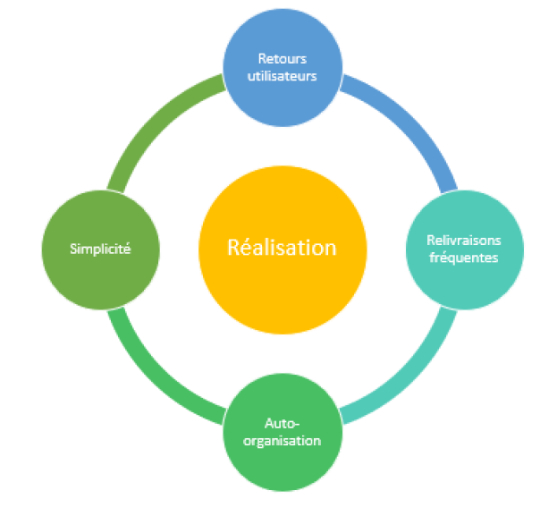
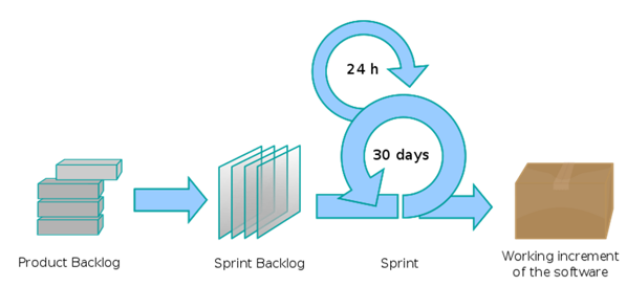

# Los métodos ágiles

## Objetivos

- Descubrir los principios del Manifiesto Ágil
- Descubrir algunos métodos ágiles

## Contexto

Los diferentes modelos teóricos de gestión de proyectos tienen cada uno sus propias implementaciones de metodologías según sus principios. Entre los modelos adaptativos e híbridos, han surgido diferentes metodologías. A menudo tienen un punto en común: se denominan "ágiles". Vamos a estudiar aquí los principios relacionados con la definición de los métodos ágiles, y luego presentaremos algunas implementaciones con, entre otras, los métodos Scrum y Kanban.

## La filosofía Ágil

La aparición de la "agilidad" en la gestión de proyectos tiene su origen en una voluntad de salir de los corsés administrativos y de los marcos herméticos de los procesos existentes anteriormente. Para ello, propone como paradigma de funcionamiento la realización de los productos o proyectos, poniendo de relieve el retorno de la inversión de los cambios realizados e implicando fuertemente a los usuarios finales en el desarrollo de las soluciones. Los fundamentos que constituyen sus principios se describen en el Manifiesto Ágil.

## El Manifiesto Ágil

El Manifiesto Ágil, redactado por expertos en diseño de software en 2001, presenta los denominadores comunes a todos los métodos ágiles. Se puede consultar en la dirección: **[https://agilemanifesto.org/iso/es/manifesto.html](https://agilemanifesto.org/iso/es/manifesto.html)**. Describe cuatro valores fundamentales a privilegiar. Hay que dar importancia:

- A las personas y sus interacciones más que a los procesos y sus herramientas
- A un software funcional más que a una documentación exhaustiva
- A la colaboración con los clientes más que a la negociación contractual
- A la adaptación al cambio más que a la ejecución de un plan

Y 12 principios generales:

1. La mayor prioridad es satisfacer al cliente mediante la entrega temprana y continua de software con valor.
2. Aceptar con agrado los requisitos cambiantes, incluso si llegan tarde al desarrollo. Los procesos ágiles aprovechan el cambio para proporcionar ventaja competitiva al cliente.
3. Entregar software funcionando frecuentemente, desde un par de semanas hasta un par de meses, con preferencia al periodo de tiempo más corto posible.
4. Los responsables de negocio y los desarrolladores deben trabajar juntos a diario durante todo el proyecto.
5. Construir proyectos alrededor de individuos motivados. Darles el entorno y el apoyo que necesitan y confiarles la ejecución del trabajo.
6. El método más eficiente y efectivo de comunicar información al equipo de desarrollo y entre sus miembros es la conversación cara a cara.
7. El software funcionando es la medida principal de progreso.
8. Los procesos ágiles promueven el desarrollo sostenible. Los promotores, desarrolladores y usuarios deben ser capaces de mantener un ritmo constante de forma indefinida.
9. La atención continua a la excelencia técnica y al buen diseño mejora la agilidad.
10. La simplicidad (el arte de maximizar la cantidad de trabajo no realizado) es esencial.
11. Las mejores arquitecturas, requisitos y diseños emergen de equipos autoorganizados.
12. A intervalos regulares, el equipo reflexiona sobre cómo ser más efectivo para a continuación ajustar y perfeccionar su comportamiento en consecuencia.

Existen muchas metodologías de gestión de proyectos que siguen estos principios, que constituyen lo que se denomina "los métodos ágiles".

## El método Scrum

Scrum es un método ágil para desarrollar productos complejos. No es una metodología de gestión de proyectos en el sentido de que no describe cómo gestionar el presupuesto frente a una organización, cómo gestionar los contratos de prestación, etc. En su lugar, Scrum es una metodología empírica que se basa en una cadencia fijada y un retorno de los usuarios para dirigir la realización de un producto. Responde a muchos puntos del Manifiesto Ágil y está adaptado a proyectos complejos con un equipo reducido (3 a 9 personas).

### Los pilares de Scrum

La metodología Scrum respeta tres pilares fundamentales:

- La transparencia: el equipo debe tener un lenguaje común y una confianza entre sus miembros, para evitar los problemas de transmisión de información.
- La inspección: regularmente, los artefactos (entregables) deben ser revisados.
- La adaptación: si hay una desviación de lo esperado, el proceso de realización debe ser adaptado. Es el principio aplicado de la mejora continua.

### Los roles en el método Scrum

Esta metodología describe tres entidades con roles específicos:

- El Product Owner o PO: persona encargada de maximizar el valor del producto y por tanto del trabajo del equipo de desarrollo. Tiene a su cargo la definición de los elementos del product backlog, su orden de prioridad y su buena comprensión.
- El Scrum Master o SM: persona encargada del aspecto metodológico. Es un líder al servicio del equipo. Ayuda y facilita el trabajo de las personas.
- El equipo de desarrollo: formado por 3 a 9 personas encargadas de entregar un incremento potencialmente utilizable del producto. El equipo es autogestionado, no tiene jefe de equipo ni responde a un jefe de proyecto. También es pluridisciplinario: cada uno de los miembros es capaz de hacer el trabajo de los demás (con más o menos especialización).

### Los eventos del método Scrum

El vocabulario del método Scrum determina una serie de términos específicos de su organización:

- Definition of Done: se trata del conjunto de criterios, definidos por el equipo, que hacen que un elemento del backlog esté terminado.
- Sprint: este término corresponde a un período de máximo 1 mes, al final del cual se entrega un incremento del producto, es decir, potencialmente utilizable. Al inicio de cada sprint, se define una lista de elementos a realizar (sprint backlog) a partir de la lista de elementos del producto (product backlog), que no puede ser modificada durante la ejecución del mismo.
- Daily meeting: se trata de una reunión diaria de una duración máxima de 15 minutos entre los miembros del equipo de desarrollo, con intervención al principio y al final del Scrum Master. Se abordan tres puntos: lo que se ha realizado el día anterior, lo que se va a realizar hoy y los obstáculos que impiden realizarlos.
- Planificación de sprint: es una etapa de la metodología, sobre un día entero, realizada al inicio de cada sprint. Sirve para identificar el contenido y los objetivos del sprint que viene, en colaboración con todo el equipo Scrum.
- Revisión de sprint: es una reunión organizada por el equipo de desarrollo con el Product Owner y los usuarios finales como invitados. Tiene como objetivo presentar el sprint realizado en una duración máxima de 4 horas para recoger los comentarios de los usuarios.
- Retrospectiva de sprint: es una reunión realizada internamente en el equipo Scrum. Su objetivo es adaptar los procesos de realización en el marco de la mejora continua. Se lista lo que se podría haber hecho mejor y cómo mejorar las cosas.

### Los entregables del método Scrum

La metodología Scrum propone la entrega de diferentes entregables, llamados "artefactos":

- El product backlog: está formado por la lista ordenada de los elementos a realizar para llegar al producto final. Esta lista se actualiza constantemente por el Product Owner: se añaden o eliminan elementos en función de las necesidades de los usuarios, se prioriza la lista y se detallan los elementos más prioritarios.
- El sprint backlog: es una lista de los elementos, procedentes del product backlog, elegidos para ser realizados en el sprint. No puede ser cambiada durante el mismo.
- El product increment: se trata de una versión del producto que es potencialmente utilizable en producción. Es importante señalar que el incremento debe aportar valor, por lo que hay que tenerlo en cuenta a la hora de crear el sprint backlog.

## El método Kanban
El método Kanban surgió en Japón durante los años 1950: se trata de un método de gestión del conocimiento relacionado con el trabajo, que busca organizar las tareas de forma simple y transparente entre todos los participantes. Se inspira en las metodologías Lean, que implementan prácticamente todos los fabricantes de automóviles.

Se basa, entre otras cosas, en el uso de un tablero cuyas columnas representan los diferentes estados posibles de las tareas del proyecto. Luego, las tareas se colocan en el tablero, en forma de tarjetas, en las columnas que representan su estado actual.

Así, se diferencia de los enfoques de flujo empujado por un sistema de flujo tirado. Es, por ejemplo, la llegada de un pedido lo que desencadena la cadena de producción para realizarlo.

En sí mismo, el método Kanban no es óptimo para la gestión de un proyecto informático, pero es más adecuado para la gestión de operaciones (por ejemplo, operaciones de mantenimiento).

## Metodologías Lean
Las metodologías llamadas Lean tienen como objetivo la búsqueda de rendimiento mediante la mejora continua de los procesos y la eliminación del desperdicio.

## Los principios y prácticas del método Kanban
El método Kanban define los siguientes principios generales:

- Adaptarse a lo existente
- Implementar los cambios de pequeña escala, de forma continua, a medida que avanzan
- Los roles y procesos actuales se mantienen, pero se mejoran poco a poco
- Los actos de liderazgo en todos los niveles del equipo deben ser alentados

Respeta cinco prácticas:

- Visualizar: gracias al uso del tablero Kanban para mostrar el flujo de trabajo,
- Limitar el número de tareas en curso: cada etapa del tablero solo puede contener un número reducido de tareas asociadas, según el tamaño del equipo. Por tanto, se busca concentrarse en el mínimo de tareas posible,
- Gestionar los flujos: es esencial seguir, medir y registrar el desarrollo del trabajo a través de cada etapa del tablero. El objetivo es conocer la velocidad y la fluidez del trabajo,
- Explicar: las normas y reglas deben ser comprendidas y seguidas por todos,
- Mejorar: mejorar el sistema continuamente y por pequeños toques.

## El método SAFe
El método SAFe (por Scaled Agile Framework) es una metodología que busca aplicar la agilidad a nivel de toda una organización y no solo de un equipo único. También busca desarrollar una cultura ágil y lean a gran escala.

Es especialmente adecuada cuando el contexto implica la intervención de varios equipos de desarrollo, que trabajan cada uno en un componente de un producto final.

Tiene la ventaja de poder coordinar el desarrollo de un producto a gran escala, asociando las diferentes capas de actores involucrados, desde los equipos de desarrollo hasta los decisores estratégicos de la empresa.

Especifica cuatro capas de gestión:

- La capa Team: reúne a los equipos que realizan las soluciones en iteraciones sincronizadas,
- La capa Program: sincroniza los equipos de la capa Team en un Agile Release Train que busca producir entregables coherentes y funcionales,
- La capa Large Solution: coordina varios Agile Release Train cuando la organización es demasiado grande (más de 120 a 150 personas),
- La capa Portfolio: corresponde al nivel de planificación estratégica de la empresa (presupuesto, arquitectura...).

## Otras metodologías ágiles
RAD (Rapid Application Development): una de las primeras metodologías ágiles. Después de una fase de expresión de necesidades y diseño, la realización se hace iterativamente involucrando lo más posible a los usuarios finales.

XP (Extreme Programming): lleva al extremo los principios ágiles. Por ejemplo, como se busca la calidad, la revisión del código se hará en pareja. Como se busca la simplicidad, siempre se elegirá la solución más simple, etc.

Scrum of Scrum: para gestionar varios equipos Scrum en una organización.

BDD (Behavior Driven Development): enfocada en la colaboración de todos los actores en la realización de un proyecto con un lenguaje natural común y donde la creación se valida con pruebas basadas en lo que debería hacer la solución.

## A recordar
En el ámbito de la gestión de proyectos, el término "ágil" se refiere a un conjunto de valores y principios descritos en el Manifiesto Ágil.

Se llama "metodologías ágiles" a las metodologías que intentan implementarlos. Entre ellas, se encuentran la metodología Scrum, adaptada para equipos pequeños de desarrollo, la metodología Kanban, optimizada para la mejora continua de los procesos de producción y la reducción del desperdicio, así como metodologías como SAFe, para la gestión de proyectos a gran escala.