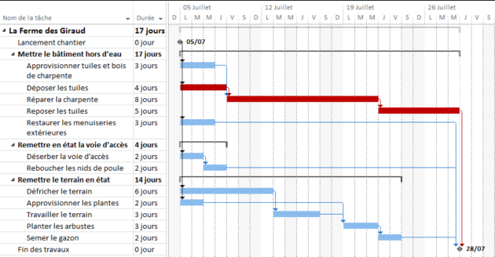
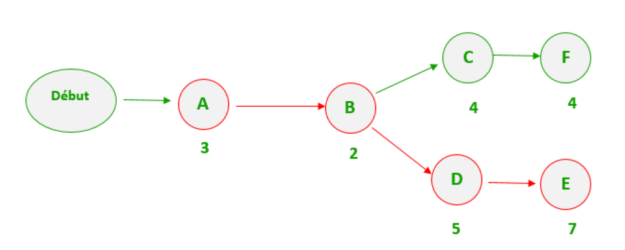
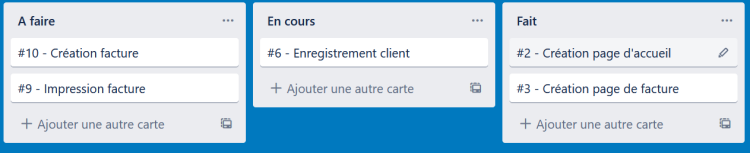
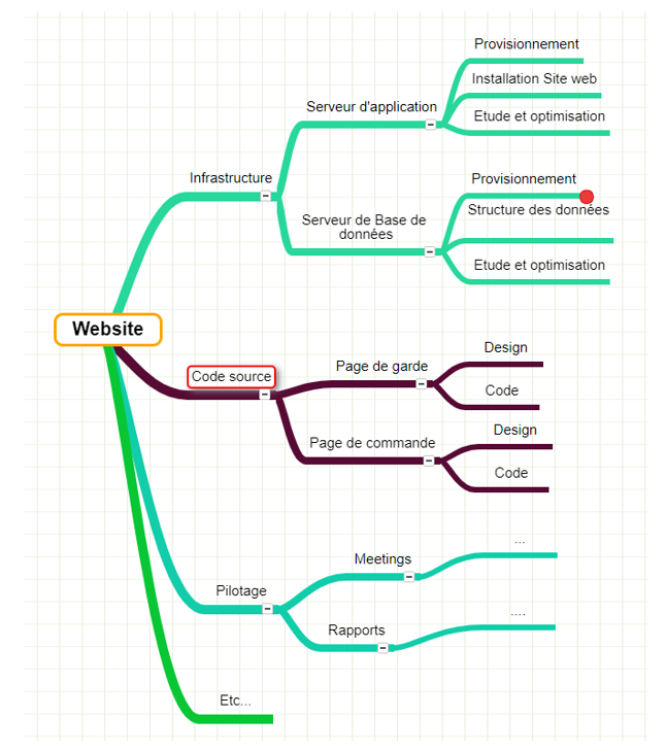
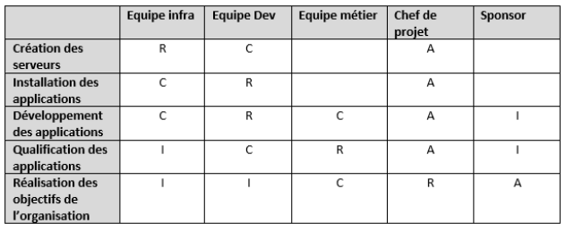

# Herramientas de gestión de proyectos

## Objetivo

- Descubrir algunas herramientas de la gestión de proyectos

## Contexto

Independientemente de las metodologías que utilicen los equipos de gestión de proyectos, pueden apoyarse en numerosas herramientas de ayuda a la toma de decisiones o de gestión de las tareas. Aquí vamos a presentar algunas de ellas, como el diagrama de Gantt, el camino crítico, el tablero Kanban, el Work Breakdown Structure o la matriz RACI.

## Diagrama de Gantt

Un diagrama de Gantt enumera todas las tareas que hay que realizar para llevar a cabo un proyecto, e indica la fecha en la que estas tareas deben ser realizadas. El diagrama de Gantt sirve para modelar las tareas necesarias para la realización de un proyecto y para asegurar su seguimiento. Permite representar los vínculos de dependencia entre las tareas, su grado de realización en cada momento o las recursos implicados en su ejecución. La columna de la izquierda del diagrama enumera todas las tareas a realizar, mientras que la línea de cabecera representa las unidades de tiempo más adecuadas al proyecto (días, semanas, meses). Cada tarea se materializa por una barra horizontal, cuya posición y longitud representan la fecha de inicio, la duración y la fecha de fin. Así pues, se puede visualizar de un solo vistazo:

- Las tareas del proyecto
- Las fechas de inicio y fin de cada tarea
- La duración estimada de cada tarea
- El solapamiento eventual de las tareas, y la duración de este solapamiento
- La fecha de inicio y la fecha de fin del proyecto en su conjunto

Esta herramienta permite ofrecer una ayuda a la constitución de un planificación de realización del proyecto, así como una asistencia al seguimiento de la distribución de los recursos para la ejecución de las tareas.

### Ejemplo

El diagrama de Gantt presentado permite visualizar el encadenamiento lógico de las tareas y su repartición en el tiempo, teniendo en cuenta su duración prevista.

## Camino crítico

El método del camino crítico es una técnica de gestión de proyectos que permite identificar las actividades paso a paso y determinar su criticidad. Para realizar esto, hay que seguir un proceso en cuatro fases:

- Dividir el proyecto en tareas y determinar sus dependencias,
- Estimar la duración de cada tarea,
- Crear el diagrama de red (PERT),
- Identificar el camino crítico.

La determinación del camino crítico está constituida por el conjunto de las tareas que tienen la duración más larga en cada bifurcación del modelado. Esta herramienta permite visualizar el encadenamiento y las dependencias entre las tareas. Además, permite, haciendo la suma de las duraciones de las tareas que constituyen el camino crítico, calcular la duración mínima necesaria para realizar el proyecto.

### Ejemplo

En este ejemplo de modelización, el camino crítico es pues constituido por las etapas A-B-D-E. La duración mínima de este proyecto sería pues 17 días.

## Complemento: El método PERT

El método PERT (Program Evaluation and Review Technic) se puede definir como un método que consiste en ordenar bajo forma
de red un conjunto de tareas que, gracias a sus dependencias y su cronología, contribuyen al logro
de un objetivo.

## Tablero Kanban

El tablero Kanban es una herramienta derivada de la metodología Kanban. Se utiliza a menudo durante
la realización
de proyecto con el fin
de visualizar el estado
de avance
de las diferentes tareas. Permite efectivamente visualizar un flujo
de trabajo (por ejemplo,
los desarrollos
de un proyecto) con el fin
de clarificar,
seguir y mejorar los procesos. Se presenta normalmente,
bajo su forma más simple,
en 3 columnas: "por hacer", "en curso" y "hecho". Su funcionamiento consiste en colocar,
bajo forma
de etiquetas,
las diferentes tareas en la columna correspondiente a su estado. Así, una tarea aparece primero en el tablero Kanban al estado "por hacer"; luego, una vez que es tomada en cuenta por el equipo, se transfiere a la columna "en curso" antes de pasar al estado "hecho" una vez terminada su realización.

Esta herramienta permite conocer en todo instante el estado de las tareas de un proyecto o de una iteración.

### Ejemplo

La utilización del tablero Kanban en este ejemplo permite constatar que dos tareas deben aún ser tomadas en cuenta, que una tarea está en curso de realización por el equipo y que dos tareas están terminadas.

## Work Breakdown Structure

El Work Breakdown Structure (o diagrama de estructura de desglose del trabajo) es una herramienta simple y potente para organizar el alcance del proyecto y comunicar sobre él. Servirá también para hacer el cálculo del proyecto completo, para identificar los riesgos o las compras a realizar, pero también para delegar las tareas a cada actor. Se presenta bajo la forma de un árbol invertido donde cada sub-rama va a descomponer los entregables y las etapas necesarias para realizarlos. El primer elemento que se encuentra en la parte superior del gráfico es el proyecto en sí mismo. Los elementos más elementales, en la parte inferior de esta jerarquía, se llaman work package ("lote de trabajos") y representan el nivel de detalle máximo a alcanzar para realizar el cálculo. Normalmente es inútil bajar más abajo, a un nivel de detalle como una tarea. El Work Breakdown Structure sirve principalmente para no olvidar nada en los entregables a realizar y para determinar la cantidad de trabajo a proporcionar. Comprende pues el 100 % de los trabajos a realizar para lograr todos los objetivos de un proyecto. Hay varias estrategias de descomposición, pero es importante descomponer por resultado y no por acción. Se puede así descomponer un proyecto:

- Por entregables principales
- Por fase de proyecto, luego por entregables/resultados
- Por oficio, luego por entregables/resultados
- Por responsabilidad, luego por entregables/resultados

Esta herramienta pone de relieve el entregable, o el resultado, como un elemento central para identificar el trabajo a realizar. Este gráfico va a ser realizado por el jefe de proyecto en colaboración con las personas que van a realizar cada parte del proyecto. Es importante tener los comentarios de cada uno para que todo el equipo se lo apropie y se sirva de él. Esta herramienta se aplica tanto en un modelo de gestión de proyecto predictivo como en un proyecto llamado "ágil". En un proyecto predictivo, se va a buscar detallar todos los work packages para luego realizar el cálculo de cada uno de ellos. En modo Ágil, se va a detallar los primeros work packages y dejar el resto para detallar más tarde. La constitución del Work Breakdown Structure va a permitir la realización de un diagrama de Gantt, descomponiendo los work packages en tareas.

### Ejemplo

Este diagrama de estructura de desglose del trabajo de un proyecto de constitución de un sitio web permite visualizar todos los entregables y las implicaciones de su realización.

## La matriz RACI

RACI es el acrónimo de Responsible, Accountable, Consulted, Informed:

- Responsible es un falso amigo, la traducción al español significa "el que realiza la acción",
- Accountable es la persona que debe asegurarse de que la acción se hace,
- Consulted es un contribuyente a la acción,
- Informed es la persona que será informada sobre el estado
  de la acción.

El RACI es una tabla que va a representar las acciones y sus responsables. Esto permite mostrar claramente quién hace qué en un proyecto o un proceso. Solo debe haber un único responsable (Accountable) para una tarea dada. En efecto, si hay varios responsables, entonces no hay ningún responsable: tan pronto como surja un conflicto, se producirá un juego
de ping-pong donde cada uno se pasará la pelota
de la responsabilidad y el tema no avanzará. También hay solo una persona que va a realizar la acción (Responsible). Esta herramienta permite visualizar y repertoriar las responsabilidades
de cada actor dentro
de un proyecto.

### Ejemplo

Este ejemplo de matriz RACI para la realización de un sitio web permite entre otros constatar que la tarea de desarrollo deberá ser realizada por el equipo de desarrollo, que los equipos de negocio y de infraestructura serán consultados, que el jefe de proyecto será responsable de su realización, mientras que el patrocinador será informado de su avance.

## A recordar
La gestión de proyectos puede apoyarse en el uso de diferentes herramientas para asistirla en su toma de decisión y su determinación de la organización de un proyecto.

Puede así, entre otros, basarse:

- en la realización de un diagrama de Gantt para hacer la planificación,
- en la definición de un camino crítico para determinar la duración total,
- en el uso de un tablero Kanban para la realización y la gestión del avance de las tareas,
- en la constitución de un Work Breakdown Structure para organizar el perímetro del proyecto,
- en la definición de una matriz RACI para centralizar las responsabilidades de las partes interesadas del proyecto.