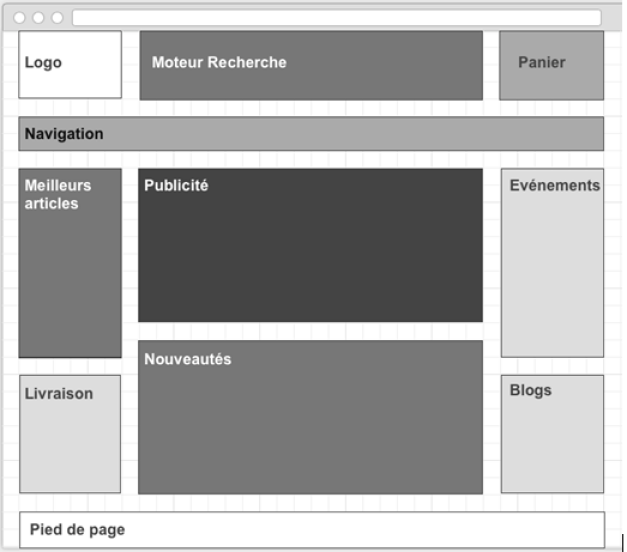

# El zoning

## Objetivos

- Comprender el papel del zoning
- Descubrir los elementos que lo constituyen

## Contexto

Primera etapa del diseño gráfico, el zoning juega un papel importante en la definición de la estructura de las páginas de una aplicación. Vamos a ver en qué momento se inscribe en la realización de un proyecto, antes de describir su papel, luego su contenido y las reglas que respeta.

## Definición

El zoning es el primer tipo de maqueta, estática, en forma de papel, en tonos de gris, que consiste en definir el recorte y la organización del contenido de las páginas.

## ¿Cuándo se realiza?

Se suele realizar durante los talleres de co-diseño, entre el UX designer, el Product Owner, representantes de los equipos de negocio y de los usuarios, durante la fase de ideación del Design Thinking. Interviene después de la definición de la arborescencia y de la arquitectura funcional de la aplicación o del sitio web, y sirve de base para el diseño de los wireframes. Esta versión de la futura interfaz se centra en detallar el fondo, pero no la forma.

## El Design Thinking

En el método de diseño centrado en el usuario, llamado Design Thinking , el UX designer y sus colaboradores (UI designer, desarrolladores, PO, etc.) avanzan de forma iterativa, a través de las 5 etapas siguientes:

- Investigación: comprender los objetivos del cliente y sobre todo comprender las expectativas y necesidades de sus usuarios, aprehender su entorno de uso
- Definición: precisar quiénes son los usuarios finales, qué tareas tendrán que realizar, evaluar el presupuesto y el tiempo de realización
- Ideación: generar ideas, visualizar los usos, definir los pasos sin entrar en la técnica
- Diseño: jerarquizar el contenido, agrupar la información y las funcionalidades en secciones, escenificar visualmente la experiencia del usuario
- Integración o diseño de interfaz: crear un ambiente gráfico respetando la identidad gráfica de la marca

## ¿Por qué?

El zoning permite materializar las primeras ideas. Para cada página, se trata de identificar las diferentes zonas o bloques de contenido y definir sus objetivos, las acciones que deberán proponer y que se integrarán en la interfaz del sitio. En arquitectura, el zoning equivaldría a definir la ubicación de las habitaciones en una casa.

## Su contenido

Existen plantillas de pantallas-tipo o « design patterns » que contribuyen a la homogeneidad de las interfaces. Esto permite a los usuarios leer y memorizar más rápidamente la información, porque se encuentran frecuentemente en el mismo lugar. Esta maqueta de baja fidelidad incluye generalmente los siguientes elementos:

- Logo
- Navegación
- Contenido
- Herramientas
- Publicidades si están previstas en la interfaz
- Fil d'Ariane
- Campo de búsqueda
- Pie de página

## Ejemplo

Este ejemplo de zoning permite visualizar la colocación de los diferentes elementos que compondrán la página. Se encuentran una gran parte de los componentes habitualmente presentes en las aplicaciones web, como un carrito, un espacio de navegación y paneles laterales con diferentes informaciones rodeando un contenido principal.

## Las reglas a respetar

Los bloques de contenido se representan generalmente con un tono de gris más o menos fuerte, para ilustrar su jerarquía visual en la interfaz, y por tanto su nivel de lectura en la arborescencia. La resolución de la pantalla y el tipo de dispositivo utilizados van a orientar evidentemente las elecciones en términos de organización del espacio. Los elementos de navegación, por ejemplo, no se pensarán ni se colocarán del mismo modo en un ordenador o en un móvil. Si tu bloque de contenido principal (bloque publicidad, en el ejemplo) se encuentra bajo la línea de flotación en móvil, habrá que revisar su posicionamiento. De la misma manera, el zoning permite pensar las zonas de contenido en términos de dimensiones y proporciones. Por eso se recomienda, para los sitios sometidos a la restricción del responsive, empezar este esquema de diseño por el móvil. Este enfoque te permitirá:

- Dar prioridad a los contenidos más importantes.
- Dar a los usuarios una experiencia completa, a pesar del tamaño de su soporte.
- Permitir pensar en términos de rendimiento, desde el principio del proyecto.

## Las herramientas de diseño

Para diseñar un zoning, no es necesario tener un software de diseño gráfico en su posesión. Solo se necesita papel y lápiz. Sin embargo, puedes ilustrar tu zoning con aplicaciones como:

- Balsamiq Mockups
- PowerPoint
- Illustrator
- Excalidraw
- O también:
- Adobe XD
- Figma

## Nota

>Esta etapa no debe ser subestimada, ya que permite presentar una primera pista de reflexión a los equipos de desarrollo, que, a partir de este modelo, estudiarán la viabilidad técnica y estimarán una duración de desarrollo. Un zoning no es necesario para todas las páginas de tu sitio. Solo las páginas clave (como la página de inicio, la página de producto y la página de búsqueda, por ejemplo) son lo suficientemente críticas en términos de experiencia de usuario como para dedicarles tiempo de diseño.

## A recordar

- La etapa de zoning juega un papel importante en la realización de la fase de ideación del Design Thinking. En efecto, su estructura, ilustrando la arquitectura de una página, facilita el intercambio de ideas y permite centrar el estudio en la satisfacción de las necesidades de los usuarios.

- El zoning debe permitir representar la posición de los elementos estructurales de una página. En el marco de las aplicaciones web, existen patrones de colocación de los elementos que es bueno respetar, porque son familiares para los usuarios.

- Su representación, en los tonos de gris más o menos acentuados, permite representar la estructura jerárquica visual de los diferentes componentes de la página.