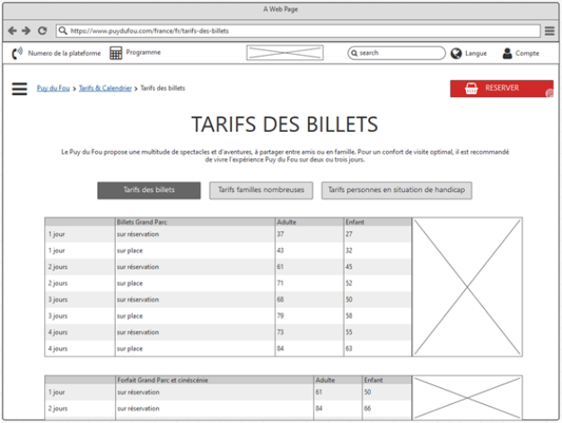

# Los wireframes

## Objetivo

- Descubrir la estructura de los wireframes

## Contexto

Una vez validado el zoning por los representantes de los equipos de negocio y el Product Owner, los equipos de UX Design van a realizar las diferentes maquetas necesarias para una primera visualización de los contenidos, respetando la arquitectura definida por este último. Para ello, van a utilizar una representación llamada "en alambre": los wireframes. Vamos a ver de qué se componen, así como el papel que juegan en el diseño final de la representación gráfica de un sitio o una aplicación.

## Definición

>Según **[usability.gov:](https://www.usability.gov/)**
>
> Un wireframe es una ilustración bidimensional de la interfaz de una página que se enfoca específicamente en la asignación del espacio y la jerarquización del contenido, las funcionalidades disponibles y los comportamientos previstos.

## ¿De qué se trata?

Los wireframes (o "maquetas en alambre", también llamadas "maquetas de baja fidelidad" o "maquetas low fidelity") representan el esqueleto del sitio o de la aplicación. Se diseñan como un plano de arquitecto para la construcción de una casa. Elaborados a partir del zoning de las páginas establecido previamente, permiten colocar los principales elementos UI de tu interfaz (menú de navegación, texto, botón, imagen, etc). Definen la organización general de los bloques de contenido y materializan la navegación entre las páginas. Se trata de orientar su reflexión teniendo en cuenta los estándares del Web y los criterios ergonómicos. Constituyen por lo tanto la primera etapa de la fase de diseño de la metodología de Design Thinking.

## Los criterios ergonómicos

Los criterios ergonómicos derivados de los trabajos de J.C. Bastien y retomados por la norma AFNOR Z67-133-1 permiten evaluar la usabilidad de un sitio o una aplicación y sirven de guías a los diseñadores durante la concepción gráfica de las páginas de un sitio web o una aplicación:

- Compatibilidad: capacidad de la solución digital para integrarse en la actividad real de los usuarios. La lógica de uso de la aplicación debe corresponder a la lógica del usuario.
- Guiado: medios implementados para asistir al usuario en el empleo de la aplicación. El objetivo es facilitar el uso y el aprendizaje.
- Homogeneidad: coherencia entre las páginas de la aplicación y dentro de las páginas.
- Flexibilidad: variar los medios que permiten alcanzar un mismo objetivo.
- Control: hacer al usuario autónomo en su aprendizaje y reducir el número de errores potenciales.
- Error: prevenir y detectar los errores (mensajes pertinentes y corrección simple y rápida).
- Tratamiento de los errores y carga mental: disminuir el número de informaciones y conservar solo lo esencial, simplificar las acciones, evitar manipulaciones o entradas erróneas y ayudar al usuario a corregir sus errores.

## Ejemplo

Este ejemplo de wireframes permite constatar la organización de los bloques de contenido dentro de la página. Además, se encuentran los elementos de navegación y las interacciones existentes entre los elementos.

## El nivel de detalles

En esta etapa del diseño, el color interviene muy poco, las maquetas son principalmente en tonos grises. El aspecto visual se limita al posicionamiento de los bloques de contenido, a su proporción unos respecto a otros y a las elecciones de los componentes tipo formulario. En efecto, se ha constatado muchas veces que los elementos gráficos (como el color, la tipografía o las imágenes) distraen al usuario del tema principal del test e interfieren con su reflexión sobre la estructura de la interfaz. Es por esta razón que el UI designer interviene solo a partir del siguiente paso, el del diseño de los mockups, donde entran en juego los códigos gráficos del cliente.

## El papel de los wireframes

Los wireframes pueden ser en papel (estáticos) o en formato digital (interactivos o no). Permiten a los equipos, a los actores de negocio y a los usuarios proyectarse y por lo tanto probar las soluciones propuestas. Cada uno puede así evaluar su comprensión de los textos elegidos, de la visibilidad y de la accesibilidad de las funcionalidades clave. Las maquetas en alambre no se sustituyen al pliego de condiciones funcional, pero siguen siendo un excelente complemento en términos de especificaciones.

## Herramientas de diseño

Un wireframe pudiendo ser estático o dinámico, además del papel y un lápiz, seguramente será útil poseer una aplicación dedicada al diseño de wireframes. Aquí hay algunas:

- Balsamiq Mockups
- Axure
- Flairbuilder
- Wirefame CC

O también:

- Adobe XD
- Figma

## A recordar

La fase de realización de los wireframes permite definir la organización general de los bloques de contenidos y materializar la navegación. Permiten a cada uno de los participantes del proyecto visualizar, con más detalles que durante la fase de zoning, los diferentes elementos gráficos de una página, así como sus funcionalidades.