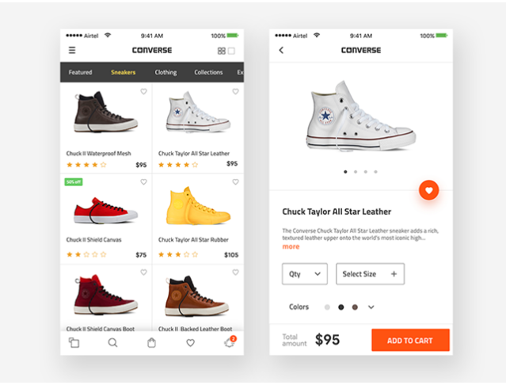

# Los mockups

## Objetivo

Descubrir el contenido y el papel de los mockups

## Contexto

Es a partir de la versión final de los wireframes que el equipo de UI Design puede intervenir en el proyecto. De hecho, es basándose en estos que podrá elaborar propuestas gráficas detalladas, los mockups. Vamos a ver cuál es su contenido y su papel.

## El contenido de los mockups

Los mockups (o maquetas UI) son la primera etapa que implica al UI designer. Diseñado a partir de los wireframes proporcionados por el UX designer, este entregable es un modelo de interfaz de usuario realista y acabado, que debe ser lo más fiel posible al resultado final. En esta etapa, no nos interesamos por la navegación entre las páginas o las animaciones de los botones, sino solo por la representación visual del contenido.

Como en el ámbito de la arquitectura, donde los planos de un proyecto de construcción siempre se complementan con maquetas en volumen que permiten a los decisores y a los futuros compradores visualizar el proyecto en tres dimensiones, los mockups permiten a los diferentes participantes del proyecto tener una representación del aspecto gráfico final de cada página.

Esta previsualización de alta fidelidad hace intervenir los códigos gráficos de la guía del cliente, teniendo en cuenta las recomendaciones ergonómicas expresadas por el UX designer.

### Ejemplo

Este ejemplo de mockup permite visualizar de la manera más fiel posible el aspecto gráfico de las páginas, desde el aspecto de las imágenes hasta los colores específicos utilizados.

## El papel de los mockups

Los mockups, que no se diseñan con herramientas de desarrollo, suelen ser estáticos. Permiten validar con el usuario todos los aspectos visuales de la interfaz, como la disposición general, la elección de un tipo de botón u otro, el tamaño de la tipografía, la comprensión de los iconos, la calidad de las imágenes, etc. A menudo sirven como libro de especificaciones gráficas a los equipos de integración e intervienen como una segunda etapa en la fase de diseño de la metodología Design Thinking.

## Las herramientas de diseño

- Photoshop
- Illustrator

O también:

- Adobe XD
- Figma

## A recordar

Los mockups son representaciones gráficas lo más cercanas posible a lo que será el resultado final. Al ser estáticos, no servirán para representar las diferentes animaciones previstas, sino solo la representación visual de los elementos de cada página. Su elaboración debe tener en cuenta la guía gráfica y los imperativos ergonómicos definidos en las etapas de diseño anteriores.