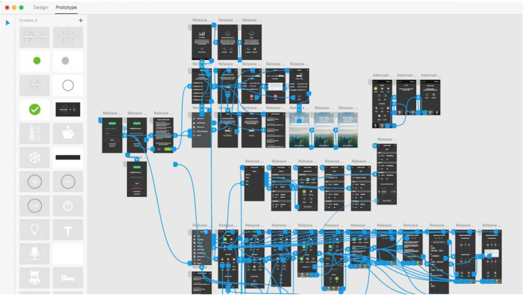
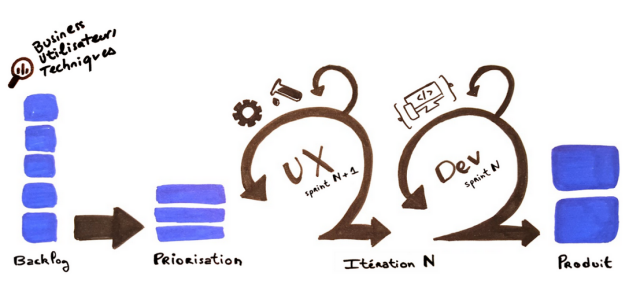

# El prototipo

## Objetivo

- Descubrir los principios del prototipado y su papel

## Contexto

Una vez que se finalizan los bocetos UI estáticos, es necesario hacerlos dinámicos para permitir una validación de los usos de la aplicación o del sitio web. Esta validación de la ergonomía se hace mediante la realización de un prototipo que incluye todas las funcionalidades previstas. Vamos a ver en qué consiste la elaboración de un prototipo, y luego veremos cómo asociar todas las etapas del diseño gráfico a un proceso de desarrollo ágil.

## Prototipo

El prototipo es la última etapa de la fase de bocetado. Este entregable, que puede ser diseñado en HTML, es una simulación de alta fidelidad e interactiva del producto final. El prototipo se utiliza a menudo para hacer pruebas A/B cuando hay dudas sobre las orientaciones estratégicas y las opciones ergonómicas. Por lo tanto, es esencial, para realizar las pruebas, resolver los problemas y mejorar lo que se debe mejorar, antes de iniciar los desarrollos.

## Pruebas A/B

Las pruebas A/B son una metodología de prueba que consiste en comparar dos versiones de una página web o de una aplicación para medir su rendimiento. En el diseño gráfico, el rendimiento se puede medir según criterios variados: número de clics, tasa de validación, tasa de visibilidad...

## El prototipo, una dinamización de los mockups

Los prototipos se pueden realizar rápidamente gracias a herramientas como Adobe XD, que van a hacer interactivos los bocetos UI de la fase anterior. Pero también se pueden desarrollar con la misma tecnología que el producto final. Esto permite evaluar la viabilidad en la elección de las librerías de componentes, y de las interacciones y animaciones previstas. Así, un prototipo funcional e interactivo permite probar todos los elementos de tipo botones, enlaces, y evaluar la calidad del feedback del usuario.

La realización del prototipo es la última etapa de la fase de diseño de la metodología Design Thinking.

## Una etapa a menudo ignorada

La fase de prototipado se suele descartar, erróneamente, porque los equipos temen que sea demasiado costosa en tiempo y que reduzca los tiempos de desarrollo o alargue los plazos de entrega. Esta etapa es fundamental en la evaluación de la ergonomía de un sitio o de una aplicación, porque permite manipular un producto dinámico en una representación lo más cercana posible al resultado final. Por lo tanto, es esencial integrar la planificación de los bocetos muy pronto en el cronograma del proyecto, y esto mucho antes de la fase de integración, para que no bloquee el inicio de los desarrollos.

## Ejemplo

Este ejemplo ilustra la creación de un prototipo con Adobe XD: se encuentran las diferentes páginas del proyecto y sus interacciones entre ellas, y se observa que sus diferentes versiones se pueden incluir en el prototipo.

## Herramientas de diseño

- Adobe XD
- Sketch
- Invision

O también:

- Adobe XD
- Figma

## Una metodología ágil del diseño gráfico

Existe desde hace unos años un nuevo enfoque metodológico del diseño gráfico, el SCRUX. Esta metodología se basa en utilizar los principios del método ágil SCRUM, que es el más utilizado en los sectores del IT, y en adaptarlos a las realidades del diseño gráfico.

Como en SCRUM, esta organización del trabajo se basa en períodos cortos (los sprints) durante los cuales el equipo se concentra en objetivos precisos y hace reportes regulares.

Generalmente, este modo de funcionamiento es difícil de seguir en términos de diseño gráfico, porque requiere poder proporcionar bocetos de baja fidelidad, luego de alta fidelidad, acabados y validados tanto por el cliente como por los usuarios, en el momento de iniciar los desarrollos de una tarea.

Para permitir esto, respetando los principios del método SCRUM, los equipos de diseño gráfico funcionan con una iteración de adelanto respecto a los equipos de desarrollo¹¹[11]. Además, es frecuente que los diseñadores UX y UI estén integrados en el equipo de desarrollo. Esto favorece la comunicación, el peer-programing, la iteración rápida y reactiva, la búsqueda de solución, y aporta más flexibilidad en la construcción de un producto final¹²[12].

## Ejemplo

El dibujo de abajo ilustra la integración del diseño gráfico en los procesos ágiles del método SCRUM. Se puede observar que las iteraciones de diseño gráfico intervienen antes de los desarrollos de un sprint.

## A recordar

- La constitución de un prototipo, que es una representación fiel y dinámica del resultado final, es una etapa importante del diseño gráfico, porque es la única capaz de confirmar las opciones ergonómicas.

- Hemos podido ver que el diseño gráfico sigue una metodología iterativa precisa y que puede consumir tiempo. Para integrarlo en los procesos ágiles de la concepción de proyectos, se puede seguir el método SCRUX, que se inspira en los principios del SCRUM, mediante la realización de iteraciones cortas, los sprints, que intervienen antes de las iteraciones de desarrollo.