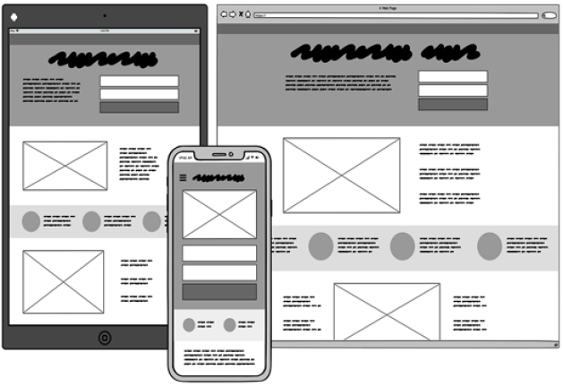
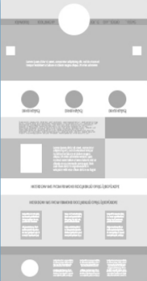

# ¿Qué son los wireframes?

## Objetivos

- Recordar qué son los wireframes
- Descubrir lo que aportan

## Contexto

Durante el diseño de un proyecto, es necesario, a través de diferentes intercambios y talleres de trabajo, identificar de manera clara las diferentes necesidades de los usuarios. Antes de convertirse en funcionalidades específicas, las necesidades identificadas serán objeto de propuestas de resolución gráficas: los wireframes constituyen para ello una herramienta ideal. Vamos a detallar aquí los elementos que los componen, luego veremos cuáles son las condiciones esenciales para poder realizarlos de manera eficaz. Por último, presentaremos las razones por las que son primordiales para el proceso de diseño gráfico.

## Recordatorio

Los wireframes (o maquetas funcionales, también llamadas « alambre ») son una representación visual esquemática, a menudo en blanco y negro. Se utilizan durante el diseño de una interfaz de usuario para definir las zonas y componentes que debe contener. Es un esquema de baja fidelidad de la interfaz, que debe ilustrar la disposición de las partes que van a componer cada una de las páginas.



El ejemplo de arriba muestra la estructura de una página en forma de wireframes según el soporte utilizado.

## Un manual del recorrido del usuario

Las maquetas en wireframe no deben confundirse con el zoning, aunque son muy parecidos. El zoning, a menudo realizado en papel, es la primera etapa en el proceso de diseño. Permite visualizar únicamente los bloques y las proporciones de las superficies dedicadas a cada función. El wireframe contiene más elementos de información. Sirve para definir:

- la tipología del contenido (texto, componentes, medios)
- la jerarquía y la estructura de la información (por ejemplo, construir una aplicación en forma de rejilla con 4 o 5 columnas)
- los elementos de navegación

Se trata de hacer un manual detallado del recorrido del usuario para visualizar lo que funciona o no funciona en términos de experiencia de usuario. Su objetivo es validar con el usuario final la navegación, es decir, las secuencias entre las pantallas, y priorizar la información, es decir, la estructura del diseño.

---


```
Zoning
```
---



```
Zoning
```
---

## El impacto del color

En esta etapa del diseño, las producciones son borradores que no tienen vocación de ser conservados tal cual. Sin embargo, como acabamos de abordar, estas maquetas alambre servirán de soporte para validar, con los usuarios, la estructura de la aplicación y los principios de navegación. La adición del color en esta etapa del diseño puede comunicar un estado de avance « terminado » a los usuarios, y por tanto encerrar la reflexión en orientaciones sobre las que será difícil volver. Por eso, los wireframes se realizan principalmente en blanco y negro.

## ¿Cuándo se pueden realizar wireframes?

Acabas de cerrar la fase de descubrimiento (fases de Investigación y Definición en Design Thinking), durante la cual has tomado el tiempo de hacer investigaciones sobre tus usuarios, de realizar entrevistas sobre sus objetivos y motivaciones con respecto a tu aplicación. Has definido, en la fase de Ideación, unos escenarios (recorridos típicos de tus usuarios) e imaginado la estructura, la arborescencia de tu solución interactiva, que has plasmado mediante un flow map . Ahora tienes una buena comprensión de las necesidades y expectativas de tus usuarios y empiezas a visualizar los elementos que deben figurar dentro de tus páginas. Los wireframes sólo pueden ser diseñados eficazmente si dispones de toda esta información: no puedes crear un wireframe si no conoces las necesidades de tus usuarios.

## ¿Por qué realizar wireframes?

La fase de Diseño de la metodología Design Thinking (y especialmente el paso de los wireframes) permite responder a las siguientes preguntas:

- ¿Cómo puede la interfaz del producto responder favorablemente a las necesidades de los usuarios?
- ¿Cómo saber si las soluciones, las interacciones, la navegación que proponemos resuelven bien los problemas que los usuarios pueden encontrar?

Los wireframes permiten formalizar y aclarar, mediante bocetos más o menos elaborados, las expectativas y necesidades de los usuarios, pero también confirmar los objetivos del proyecto. La finalidad es obtener feedbacks , no sólo por parte del equipo, sino también de los usuarios, y hacer las correcciones necesarias antes de continuar con las etapas de diseño y de integración. En un enfoque ergonómico, los wireframes permiten detectar los problemas de usabilidad, es decir, verificar si el usuario consigue encontrar, leer y comprender la información. Se trata, pues, de ver las debilidades y los puntos fuertes de cada una de las ideas expresadas, y de tomar las acciones correctivas lo antes posible para mejorar la experiencia del usuario. Es sobre todo más fácil y menos costoso, a largo plazo, hacer correcciones o cambiar completamente de orientación UX en la etapa de los wireframes que en una maqueta UI detallada o un prototipo.

## Ventajas

Los wireframes presentan varias ventajas:

- Es un método de diseño rápido y poco costoso en términos de inversión.
- Permiten correcciones más fáciles y rápidas que un producto terminado, lo que permite una gran reactividad.
- Ofrecen la posibilidad de probar una o varias soluciones con los usuarios.
- Son una buena herramienta de comunicación interna (entre el UX Designer, el Product Owner y los desarrolladores) como con los equipos de negocio, pero sobre todo con los usuarios.
- Facilitan el trabajo colaborativo con los equipos de desarrollo, ya que pueden servir de especificaciones funcionales, en ausencia de pliego de condiciones.
- Permiten estimar y cuantificar el tiempo de desarrollo.

## Las herramientas de creación asociadas

Los wireframes se pueden realizar gracias a diferentes herramientas descargables, como:

- Balsamiq, disponible en todos los soportes (Mac, Windows, Linux) y propone una versión web que permite trabajar en la nube (SaaS): **[https://balsamiq.com/](https://balsamiq.com/)**

- Axure, uno de los primeros softwares de wireframing profesionales. Este software es ahora compatible con Mac y Windows: **[https://www.axure.com/](https://www.axure.com/)**

- Flairbuilder, mucho más reciente que Axure, disponible en versión Mac y Windows: **[https://fantastech.co/flair-builder/](https://fantastech.co/flair-builder/)**

- Adobe XD, el último llegado de la suite Adobe, que permite crear wireframes bastante alta fidelidad y producir un prototipo pre-desarrollo. Es especialmente apreciado por los UI Designers, ya que permite probar en las condiciones óptimas la experiencia de usuario: **[https://www.adobe.com/es/products/xd.html](https://www.adobe.com/es/products/xd.html)**

También existen herramientas totalmente en línea, como:

- Mockflow: **[https://mockflow.com/](https://mockflow.com/)**
- UXpin: **[https://www.uxpin.com/](https://www.uxpin.com/)**
- Wireframe.cc: **[http://wireframe.cc/](http://wireframe.cc/)**

- Excalidraw: **[https://excalidraw.com/](https://excalidraw.com/)**

- Figma: **[https://www.figma.com/](https://www.figma.com/)**

## A recordar

- Los wireframes intervienen durante la fase de Diseño de la metodología Design Thinking. En efecto, es necesario haber podido identificar las necesidades de los usuarios para poder realizarlos. Servirán luego de base para validar una solución gráfica más que otra ante los equipos de negocio y los usuarios.

- Para que puedan desempeñar este papel lo mejor posible, es importante no poner demasiados elementos en relieve y proponer maquetas principalmente en blanco y negro. Esto permite a los intervinientes concentrarse en la estructura de los elementos más que en su contenido.