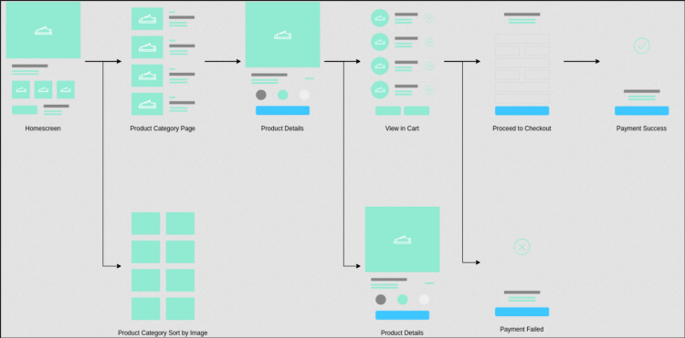

# Las etapas de creación de los wireframes

## Objetivo

- Aprender la metodología de creación de los wireframes

## Contexto

La concepción de wireframes es una etapa esencial del proceso de creación gráfica, porque permiten validar las soluciones a los problemas de los usuarios, en colaboración con todas las partes involucradas en el proyecto. Vamos a ver que es necesario seguir un proceso en cinco etapas para diseñar wireframes de calidad: la articulación, la producción, la repetición, la comunicación y la validación.

## Articulación

Esta primera etapa se realiza generalmente en un taller de co-diseño durante la fase de Ideación. Pero, en un ciclo corto, no es raro que inicie el proceso de producción gráfica.

La etapa de articulación es primordial, porque permite responder a 3 preguntas:

- ¿Quién usará la interfaz? ¿Cuál es el perfil de sus usuarios (personas)?
- ¿Cuál es el objetivo de sus usuarios? ¿Qué problemas resuelve esta aplicación y las funcionalidades que la componen?
- ¿Qué acciones pueden realizar sus usuarios (flujo de usuario)? ¿Cuáles son sus necesidades?

Si falta alguna respuesta a al menos una de estas preguntas, no se recomienda empezar la fase de diseño. El alcance del producto no está aún claramente definido. Hay entonces un alto riesgo de ser contraproducente y de responder al lado de la necesidad real de los usuarios.

Por el contrario, cuando se hayan elaborado los perfiles de las personas y se hayan determinado claramente los objetivos y necesidades de los usuarios, se podrá mapear el flujo de los usuarios (o user flow) a través de un mapa del sitio. Un user flow es una representación de una serie de pasos que un usuario debe seguir para alcanzar un objetivo específico. Te permitirá determinar el número de pantallas necesarias para que un usuario navegue desde un punto A a un punto B. Por supuesto, es el rol del UX Designer proponer a los usuarios diferentes caminos posibles para alcanzar sus objetivos.

### Ejemplo

El ejemplo de user flow siguiente presenta el recorrido del usuario de una aplicación, desde la pantalla de inicio hasta el pago de un producto, pasando por su búsqueda y su selección en un carrito. Permite representar cada una de las etapas necesarias para la realización de este objetivo.

## Producción

Una vez en posesión de los user flow representativos de los recorridos del usuario relacionados con cada necesidad, se puede materializarlos en forma de wireframes. Para ello, se aconseja realizar tantos wireframes (papel o digitales) como haya pistas de reflexión para un flujo dado. Lo principal es no censurarse y no dudar en buscar inspiración en modelos UX que han demostrado su eficacia. Durante la realización de estos bocetos, es importante tener en cuenta las siguientes reglas:

- Limitar el uso del color y las imágenes: se trata de probar la arquitectura de la información y la navegación, y no la estética. El color debe indicar solo la información prioritaria.
- La información más importante debe ser lo primero que vea el usuario. Hay que pensar entonces en términos de espacio entre los elementos, tamaño del texto y los botones, etc.
- Usar lo más posible contenido real para respetar la legibilidad de los textos y darse cuenta del tamaño necesario para una fuente para ser suficientemente impactante.
- Todos los elementos deben estar presentes, pero no hay que sobrecargar. Hay que pensar responsive first: las versiones móvil y tableta de los wireframes deben ser diseñadas antes de pasar a la versión desktop, porque es más fácil colocar los componentes ampliando el espacio que confinándolos.
- Adaptar la interacción y la navegación según el dispositivo.

## Repetición

Se trata aquí de hacer un balance de las ideas propuestas, comparar las diferentes soluciones maquetadas y constatar lo que funciona o no. Esta etapa puede realizarse en una reunión de diseño con el Product Owner y los equipos de desarrollo. Una mirada externa permite muy a menudo considerar una solución desde otro ángulo. Se trata entonces de tomar lo mejor de cada propuesta, es decir, los elementos que proporcionan una respuesta lo más ergonómica posible a las expectativas y necesidades de los usuarios.

## Comunicación

Una vez en posesión de lo que parece ser, en esta etapa, las propuestas más adecuadas, es hora de hacerlas probar por los futuros usuarios y los equipos de negocio. Según los comentarios relacionados con esta fase, será necesario realizar tantas iteraciones como sea necesario, hasta proponer soluciones aceptadas por todos los participantes del proyecto.

No hay que olvidar que los usuarios no son los únicos afectados por el trabajo de reflexión inducido por la realización de los wireframes. Por eso es importante someterlos a los equipos de desarrollo. Esto permite exponer y explicar las elecciones hechas a las personas que se encargarán de la integración. Así tendrán una mejor visibilidad de lo que les espera. Estas personas se sentirán además más involucradas en el proceso de creación y podrán también anticipar los comentarios de los usuarios y ser más reactivos en términos de integración, rendimiento, etc.

## Validación

Después de la etapa de comunicación, es importante anotar todos los comentarios recibidos durante las presentaciones y las fases de prueba sobre el diseño de los wireframes. Se pueden dividir en tres grandes categorías:

- Contenido: etiqueta, elección de los componentes
- Apariencia y sensación
- Interacción o flujo completo

Todos los comentarios deben ser escuchados, registrados, sintetizados y deben generar correcciones hasta la validación de todos los participantes. Los wireframes acabados deberán (antes de ser transformados en mockups UI) ser sometidos a validación final por los equipos de desarrollo y el Product Owner, que juzgarán no solo la viabilidad técnica, sino sobre todo la coherencia entre la carga de integración prevista y los plazos de entrega impuestos.

## A recordar

La creación de wireframes de calidad requiere seguir diferentes etapas, que habrá que repetir hasta la validación para pasar a la siguiente. Estas se descomponen en cinco partes:

- La articulación: es la definición del user flow que responde a las necesidades de los usuarios y permite representar cómo se articularán las páginas entre sí.
- La producción: se trata de la etapa durante la cual se realizan los wireframes siguiendo diferentes recomendaciones.
- La repetición: esta etapa hace colaborar a diferentes participantes, como el Product Owner y representantes de los equipos técnicos si es necesario, para ofrecer una visión externa de las diferentes propuestas y hacer una preselección.
- La comunicación: se trata en esta etapa de presentar los wireframes a los participantes del negocio, a los usuarios y a los equipos de desarrollo para recoger sus comentarios.
- La validación: última etapa del proceso de creación de los wireframes, permite, después de haber tenido en cuenta los comentarios de la etapa anterior, seleccionar los wireframes que aportan las respuestas más adecuadas a las necesidades de los usuarios.