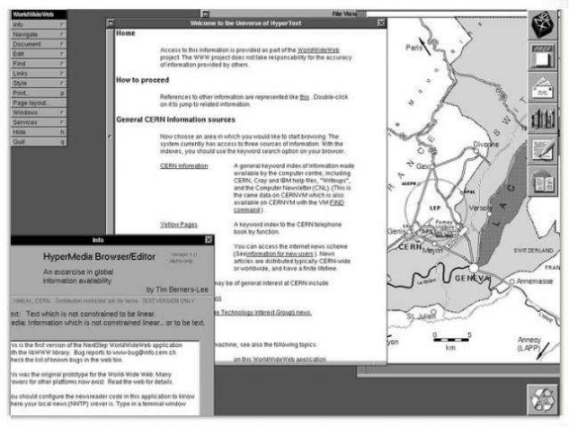
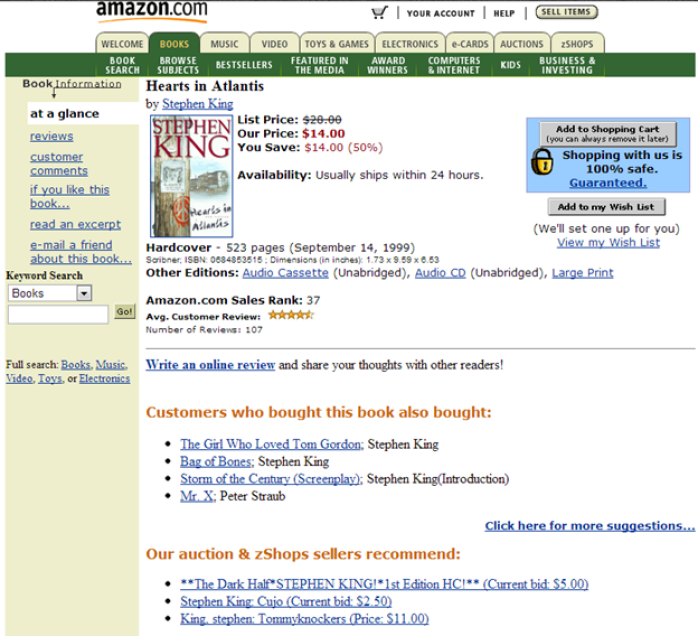
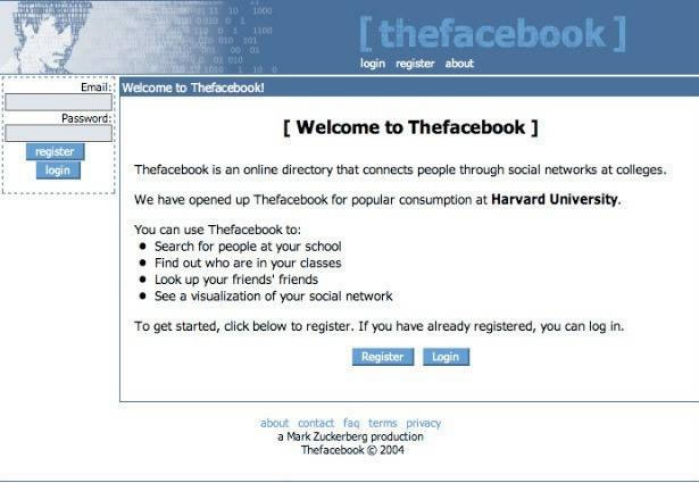

# ¿Qué es una interfaz web?

## Objetivos

- Definir el concepto de interfaz web
- Descubrir la evolución de las interfaces web

## Mise en situation

La noción de interfaz es, desde hace mucho tiempo, inseparable de la informática. Existen diferentes tipos de interfaces: física (en el sentido «objeto»: ratón, teclado, etc.) y sistema. Pero la que nos interesa hoy es la interfaz gráfica digital. Sería un error reducir esta noción a la esfera artística, pues las interfaces web son ante todo funcionales y utilitarias (¿funciona? ¿para qué sirve?) y se han vuelto, desde hace unos años, estrechamente ligadas a la interactividad. Veamos juntos cómo, en treinta años, hemos pasado del Web 1.0 al Web 2.0, centrado en la personalización del contenido.

## Definición

Una interfaz web corresponde a una interfaz (llamada «hombre-máquina») que permite el diálogo y la interacción entre una aplicación web y su usuario. Se puede visualizar desde cualquier dispositivo que tenga un navegador web (ordenador, tableta o smartphone, etc). La interfaz web se diferencia de la interfaz sistema, que permite controlar un sistema operativo (líneas de comando). Sin embargo, ambas utilizan una interfaz gráfica: objeto a manipular (ratón, menús, etc.), texto a leer o a introducir.

## Web 1.0

Los primeros sitios web de los años 90 estaban centrados en la documentación. Se utilizaban principalmente correos electrónicos y portales de contenidos, es decir, páginas estáticas, sin interacción entre la interfaz y su lector. Los sitios de comercio electrónico, por ejemplo, eran en realidad catálogos virtuales sin opción de compra. Internet era simplemente un canal de difusión de la información, de un profesional a un particular.

## Web 2.0

En los años 2000, la aparición de los primeros blogs y sitios de contribuciones editoriales (como Wikipedia) permitieron al Web convertirse en interactivo. El internauta ya no es un lector pasivo, sino un actor, tanto en su relación con «el objeto» o «sistema técnico», como dentro de una comunidad mundial.

De 2003 a 2005, el nacimiento de las redes sociales más emblemáticas (Facebook, Linkedin y Youtube) cambiaron radicalmente la relación del internauta con el Web. Internet se democratizó en todos los hogares. El internauta se convirtió en usuario, consumidor. Los códigos de uso evolucionaron, los códigos gráficos también. El sector digital tuvo que profesionalizarse y recurrir a nuevas competencias técnicas, creativas, sociológicas. Se crearon nuevos perfiles, como UX Designer, UI Designer, Community Manager, etc.

El diseño de las interfaces web se volvió metodológico. Un trabajo de estructuración y vestimenta gráfica ergonómica que acabará imponiendo estándares de diseño.

## Recordatorio: El método Design Thinking

En el método de diseño centrado en el usuario, llamado Design Thinking , el UX Designer y sus colaboradores (UI Designer, desarrolladores, PO, etc.) avanzan de forma iterativa, a través de las 5 etapas siguientes:

- Investigación: comprender los objetivos del cliente y sobre todo comprender las expectativas y necesidades de sus usuarios, entender su entorno de uso
- Definición: precisar quiénes son los usuarios finales, qué tareas tendrán que realizar, evaluar el presupuesto y el tiempo de realización
- Ideación: generar ideas, visualizar los usos, definir los pasos sin entrar en la técnica
- Diseño: jerarquizar el contenido, agrupar la información y las funcionalidades en secciones, escenificar visualmente la experiencia del usuario
- Integración o diseño de interfaz: crear un ambiente gráfico respetando la identidad gráfica de la marca, reforzar la affordance

## Affordance

Se llama «affordance» a la capacidad de un elemento gráfico para explicar su función. Así pues, una alta affordance para un elemento gráfico significa que su función es lo suficientemente explícita como para no necesitar explicaciones detalladas.

## A recordar

- Una interfaz web permite los intercambios entre los usuarios y un sitio web.

- El diseño de interfaces web ha evolucionado mucho desde los años 1990: primero con un objetivo puramente informativo, se orienta hoy hacia una interactividad cada vez mayor entre el usuario y el sistema.

- Esta evolución ha dado lugar a una metodología de diseño de interfaz centrada en el usuario, siguiendo los pasos de investigación, definición, ideación, diseño e integración.

## Complemento

- **[https://www.usabilis.com/definition-affordance/](https://www.usabilis.com/definition-affordance/)**

Este sitio web le quiere decir que la affordance es la capacidad de un objeto o un sistema de sugerir su uso o su función, especialmente de una manera fácilmente perceptible para el usuario. Por ejemplo, un botón que dice "enviar" le indica que puede hacer clic en él para enviar un mensaje. La affordance es importante para el diseño de interfaces y servicios, porque ayuda a que la utilización sea intuitiva y agradable. El sitio web también explica los diferentes tipos de affordance, como la affordance real, la affordance percibida, la affordance cultural y la affordance emocional. Además, el sitio web compara diferentes estilos de diseño, como el skeuomorfismo, el flat design y el material design, y cómo afectan a la affordance. El sitio web se basa en las teorías de dos psicólogos: James J. Gibson y Donald Norman.