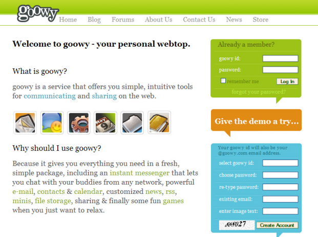
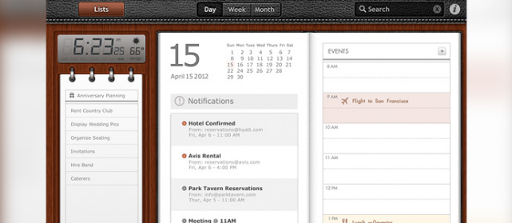
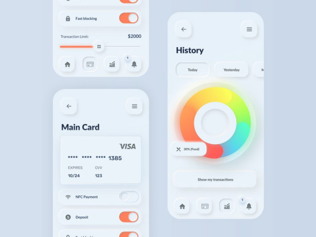
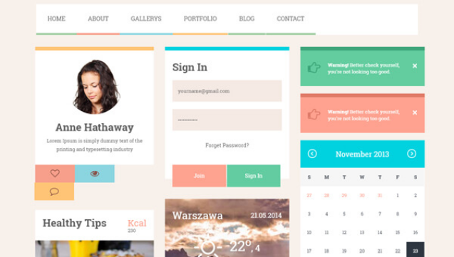
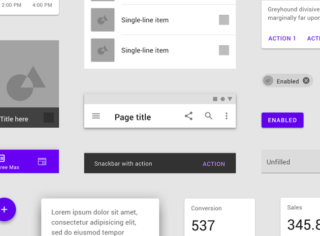
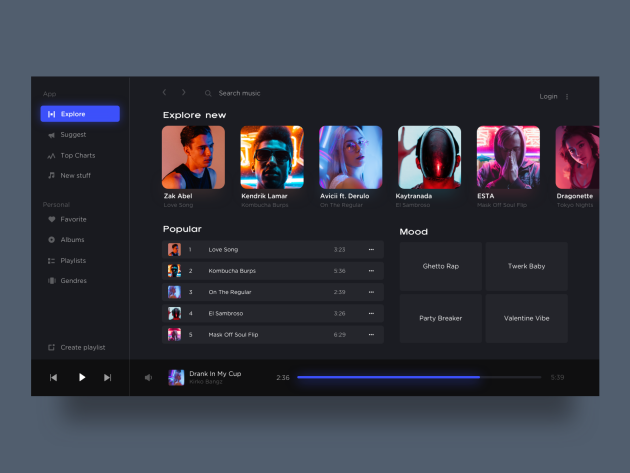

# Un diseño visual sometido a las modas

## Objetivo

- Descubrir los principales estilos del diseño web

## Contexto

Al igual que la calle moldea el estilo de vestir de mañana, los comportamientos de los usuarios en la web definen desde hace unos años las tendencias gráficas de los años venideros. Desde principios de los años 2000, nuestras interfaces han sufrido grandes cambios, no solo desde el punto de vista ergonómico, sino también estilístico. El lugar de las imágenes, la tipografía, los colores se estudian hoy cuidadosamente para mejorar el confort del lector y la comprensión del producto. Vamos a descubrir cómo empresas como Apple o Google han, desde hace 30 años, modelado e influido en nuestras propuestas gráficas (nosotros, diseñadores y desarrolladores).

## Web 2.0 (2003 - 2010)

La democratización de Internet y de los ordenadores personales en los hogares ha dado lugar a nuevos modos de consumo de la información en línea y marca el nacimiento del "Web social". Las aplicaciones en línea empiezan a aparecer, Internet se vuelve colaborativo. Las tecnologías y lenguajes de desarrollo deben adaptarse a los contenidos que se vuelven dinámicos y cada vez más rápidos en términos de velocidad. El diseño web 2.0 corresponde al uso del marcado semántico del HTML combinado con el CSS y el JavaScript. Reemplaza el diseño web 1.0 a principios de los años 2000. Se acabó el diseño en tabla, el contenido deja espacio al vacío para hacer la información más legible: less is more . También vemos surgir nuevas profesiones, como el diseño UX y la difusión de nuevos modelos de interfaz. Este estilo permite así a los internautas con pocos conocimientos técnicos apropiarse de las funcionalidades de la Web. Ahora no solo los sitios web ponen a sus internautas en el centro de sus preocupaciones, sino que además el internauta se convierte en el usuario ya que es actor de la Web y puede enriquecer y alimentar la red con sus conocimientos (wiki, blogs, redes sociales, etc.).

### Complemento

Podemos retener algunos elementos gráficos destacados del estilo 2.0, como:

- una fuente bastante grande: los títulos suelen estar sobredimensionados
- contenedores con esquinas redondeadas
- degradados sobre los fondos, que permiten jugar con la luz (serán reemplazados por texturas hacia 2007)
- en la misma línea, los efectos espejo y reflejo se utilizan para dar profundidad
- iconos más impactantes y más rápidos de entender que el texto (sobre todo permiten un ahorro de espacio)

## Ejemplo: El estilo web 2.0

En este ejemplo de interfaz de los años 2000 encontramos contenedores con esquinas redondeadas en la parte derecha de la página y el uso de iconos para representar las diferentes funcionalidades disponibles.

## Skeuomorphic design (2010 - 2012) o Neumorphic design (2019)

El Skeuomorfismo , luego el Neumorfismo , consisten en imitar la apariencia de un objeto real al diseñar un objeto virtual. El Neumorfismo (contracción de New y Skeuomorfismo ) es un estilo que busca más el detalle y la precisión que el Skeuomorfismo , sobre todo gracias a brillos, juegos de sombras y efectos de luces. Los ejemplos más destacados son los iconos de IOS6, como el cubo de basura, la brújula y el bloc de notas Notes. Es en parte gracias al Skeuomorfismo que Apple se ha convertido en uno de los líderes mundiales, porque, en aquella época, este estilo proporcionaba una referencia visual a los usuarios: los botones e iconos eran fáciles de entender, porque estéticamente cercanos a la realidad. El fundamento de este estilo gráfico es la búsqueda de affordance , es decir, la capacidad de un producto para sugerir su propio uso. Muy utilizado por Apple en sus sistemas operativos desde los años 90, este estilo ya no era adecuado para los nuevos soportes móviles y sobre todo para las restricciones de transversalidad de las interfaces aplicativas y las diferentes resoluciones de los dispositivos ( desktop , móvil y tableta).

## Ejemplo: Skeuomorfismo

Esta interfaz contiene una representación virtual de una agenda, así como un bloc de notas y un reloj digital tal y como los podemos encontrar en la realidad, lo que es la esencia misma del Skeuomorfismo . El usuario tiene así la sensación de trabajar con objetos cotidianos colocados sobre un escritorio de madera.

## Ejemplo: Neumorfismo

El ejemplo presentado juega con el uso de sombras para hacer resaltar los diferentes elementos con los que se puede interactuar, lo que acentúa la impresión de objetos anclados en la realidad. Además, los elementos en cuestión presentan de forma intuitiva sus funcionalidades: su affordance es pues elevada.

## Flat design (2012 - hoy)

Es un estilo depurado, minimalista, que se basa en formas simples, con planos de colores (ausencia de relieve y de profundidad, efectos de transparencia, sin degradados ni juegos de sombras). Se inscribe como contrapunto del Skeuomorfismo y suprime todos los elementos considerados decorativos o superfluos (sombras, efecto 3D, etc). Permite así aportar una primera solución a la necesidad de diseño responsive de las interfaces, pero también una comprensión más rápida y una lectura más ligera de los elementos gráficos. Las palabras clave son: simplificación y legibilidad.

## Ejemplo: Flat design

Podemos constatar el apego a la tendencia del Flat Design en este ejemplo por la ausencia de elementos gráficos demasiado complejos. Los bloques presentan colores con rupturas claras (sin degradados), los elementos gráficos de la página son planos y solo lo esencial de la información se pone de relieve.

## Material design

Es un conjunto de directrices UX y UI creadas por Google en 2014, primero para los desarrolladores, para permitirles integrar más fácilmente las especificaciones gráficas en las aplicaciones móviles y otros dispositivos gestionados por Android. Superado este objetivo primero, Google fue más lejos en la definición de estas reglas, y buscó facilitar el uso de sus aplicaciones haciéndolas más simples, más depuradas e intuitivas. El ordenamiento del espacio es un fundamento del principio del Material Design , ya que este se inspira en el papel y la tinta: "A diferencia del papel real, el material digital puede estirarse y modificarse de forma inteligente. El material contextual tiene una superficie física y bordes. Las superposiciones y las sombras dan información sobre lo que puedes tocar." ( traducción de Matias Duarte, diseñador y creador de interfaz en Google ). El responsive y el diseño por rejilla se han convertido pues naturalmente en un estándar. Para el diseño de los componentes gráficos, el Flat Design se mantiene como referencia: ángulo redondeado, una paleta de 3 colores en planos con una principal, con sus matices, una tipografía legible por el mayor número ( Roboto o su hermana pequeña, noto sans ) y micro-interacciones que permiten una retroalimentación visual inmediata.

## Ejemplo: Material Design

Este ejemplo representa un conjunto de elementos gráficos siguiendo un diseño en Material Design : encontramos diferentes formatos de inputs , para los cuales el label juega el papel de placeholder cuando están vacíos, luego se convierte en un label posicionado verticalmente cuando contienen un valor. También hay un ejemplo de contenido adaptado al móvil, con una información principal visible directamente y botones de acción bajo forma de iconos explícitos, y diferentes botones cuya visibilidad cambia según si son utilizables o no.

🤖🤖

## Modo oscuro o modo sombrío
Esta nueva tendencia de 2020 consiste en producir interfaces negras o muy oscuras, con juegos de colores más claros sobre el contenido (texto, imágenes, botones, etc).

Este enfoque estilístico surgió a raíz de los nuevos usos y comportamientos de los usuarios, deseosos de reducir el brillo de su pantalla en uso nocturno. De hecho, el 60 % de los usuarios consultan su smartphone antes de dormirse.

Este nuevo modo permite, por tanto:

- mejorar la legibilidad del contenido y, por tanto, reducir la fatiga ocular gracias a un mejor contraste y una reducción del brillo
- limitar la huella de carbono de tu sitio o aplicación, ya que consume menos batería

## Ejemplo: Modo oscuro

Se puede observar que el uso del modo oscuro se caracteriza por un fondo oscuro, incluso negro, y textos en tonos grises con muy poco blanco. El fuerte contraste entre estos extremos permite resaltar los elementos principales de la página (botones de acción, títulos, menús).

## Los estilos del mañana (2021 y más)
- Los elementos 3D inmersivos e interactivos: al límite de lo real gracias al 3D o a la realidad virtual, las interfaces se vuelven interactivas.

- Diseño minimalista: en la línea del principio ergonómico, esta tendencia desea una interfaz simple, funcional, accesible y depurada mediante títulos de gran tamaño y caracteres en negrita, iconos lineales y muy pocos colores.

- Eco-webdesign: el objetivo es reducir los impactos ambientales de los programas informáticos mejorando su diseño y realización (disminuir la velocidad de carga de las páginas, por ejemplo).

## A recordar
- El diseño de las interfaces web ha seguido diferentes corrientes de pensamiento y estilos, pasando de alto en color a un minimalismo gráfico, cuyo objetivo es resaltar la quintaesencia de la información.

- Los diferentes modos de diseño han sido ampliamente influenciados y aclamados por los líderes del mundo web, como Google y Apple.

## Complemento

- Elementos 3D inmersivos e interactivos: **[https://useplink.com/fr/](https://useplink.com/fr/)**

- Diseño minimalista: **[https://www.wanadev.fr/148-less-is-more-comment-le-minimalisme-applique-au-design-renforce-lefficacite-du-message/](https://www.wanadev.fr/148-less-is-more-comment-le-minimalisme-applique-au-design-renforce-lefficacite-du-message/)**

- Eco-webdesign: **[https://www.wholegraindigital.com/](https://www.wholegraindigital.com/)** y **[https://www.websitecarbon.com/](https://www.websitecarbon.com/)**