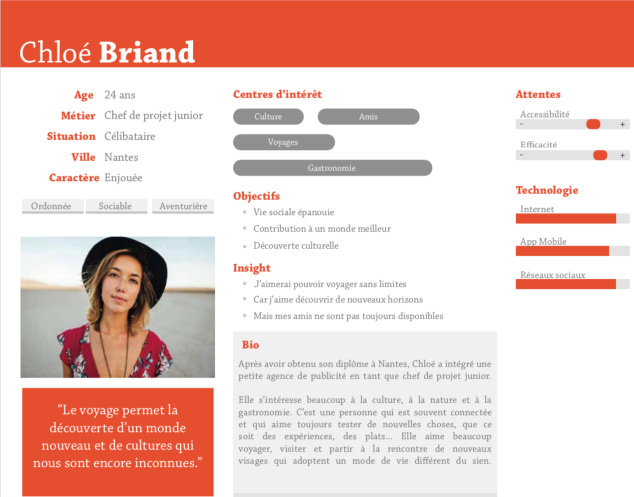
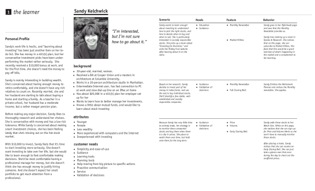

# Introducción a los conceptos de UX (versus UI)

## Objetivos

- Comprender el proceso de diseño del diseño
- Saber ponerse en el lugar del usuario
- Descubrir las fichas personas

## Contexto

Anteriormente, vimos que la clave de una interfaz simple, eficaz e intuitiva pasaba por una primera fase de descubrimiento y de investigación de datos, esencial para comprender y describir las expectativas, necesidades y comportamientos de nuestros futuros usuarios.

Esta fase, que puede desarrollarse bajo diferentes formas (observaciones, entrevistas individuales y/o grupales, presenciales y/o en línea) tiene como objetivo definir con precisión el perfil de las personas que van a utilizar el producto, y que van a servir de referencias para la redacción de las personas. Es en este momento cuando se definirán también las partes interesadas, es decir, las personas que se ven afectadas directa o indirectamente por este uso.

El conjunto de los datos recogidos durante esta fase, sean cualitativos o cuantitativos, permitirá también comprender los sesgos de los usuarios, definir sus exigencias y sus motivaciones, hacer resaltar las fortalezas y las debilidades del producto. Tanta información que servirá a la redacción de escenarios de uso, con el fin de tomar la mejor dirección durante las fases siguientes (Definición e Ideación), orientadas sobre la concepción de la solución digital.

## ¿Qué es una persona?

Una persona no corresponde a una persona real, sino que es una persona imaginaria cuyo perfil es, él, realista y corresponde a verdaderos usuarios, corazón de objetivo del producto. Consiste en trazar el retrato-robot del usuario tipo basándose en datos cuantitativos y cualitativos.

Es en general necesario entrevistar como mínimo a 5 y como máximo a 12 usuarios para realizar una persona, y esto con el fin de garantizar una cantidad de información suficiente, la homogeneidad de esta información recogida y estar seguro de que cada uno de los usuarios posee el mismo conocimiento y los mismos intereses con respecto al tema tratado.

Para vuestros proyectos, limitaos a la creación de 3 personas como máximo:

- Primarias: usuarios objetivos inevitables
- Secundarias: usuarios importantes que comparten algunas necesidades con los usuarios primarios, pero que tienen necesidades adicionales
- Negativas: los otros usuarios que no forman parte de los usuarios objetivos

Una persona está siempre constituida por informaciones personales, tales como:

- La edad, el sexo, la situación familiar, la personalidad
- La vida profesional: oficio, sector de actividad
- Su comportamiento y su experiencia en relación con vuestro producto: lo que le gusta, lo que reprocha, las mejoras deseadas
- Su experiencia frente a las herramientas digitales

### Ejemplo

Fuente : captura de pantalla **[https://www.sitew.com/Comment-developper-son-entreprise-en-ligne/persona-marketing](https://www.sitew.com/Comment-developper-son-entreprise-en-ligne/persona-marketing)**

## Consejo

Es importante que estas personas sean comunicadas al mayor número dentro de un equipo, ya sea al servicio Marketing, Comercio, Diseño o Desarrollo, pues sirven para comunicar y compartir una visión común de los usuarios, y sobre todo para generar afecto y empatía por unos usuarios a veces difícilmente accesibles.

## Escenario o recorrido usuario

Un escenario es una descripción textual narrativa del procedimiento que un usuario específico sigue para realizar una o varias tareas. Es resultado de los resultados de observaciones y de las entrevistas realizadas durante la fase de Descubrimiento.

Hay dos tipos de escenarios:

- Escenario del existente que describe cómo se realizan actualmente las tareas.
- Escenario de uso que describe cómo se realizan las tareas con el sistema interactivo previsto.

Sirven de referencia en el momento de la concepción de prototipos para crear modelos de tareas.

El objetivo de los escenarios es responder a los problemas de las personas y es una manera de reflexionar sobre los usos, pues permiten visualizar las interacciones. Se eligen los casos un poco extremos, los que son más « retadores ». Se busca proyectarse e idealizar la experiencia para el usuario.

El trabajo de redacción de los escenarios de pruebas es tan importante como el tiempo dedicado a la evaluación del dispositivo digital con los usuarios finales. En general, hay un escenario por tarea.

Un escenario usuario debe ser breve y conciso. Este ejercicio permite también a los equipos de desarrollo estimar mejor. Es en la etapa del Desarrollo cuando los escenarios serán transformados en user stories. Como en cada etapa de la concepción, son revisados por los usuarios.

### Ejemplo

Fuente : captura de pantalla **[http://www.uxforthemasses.com/scenarios-part-one/#](http://www.uxforthemasses.com/scenarios-part-one/#)**

## A recordar

- Antes de lanzarse en la realización de las maquetas, el diseñador debe recuperar las informaciones sobre los diferentes usuarios del proyecto, con el fin de comprender bien la necesidad y de delimitar su expectativa. Para ello, va a poder realizar entrevistas y fichas personas, e incluso escribir escenarios de utilización.

- Una ficha persona representa una persona imaginaria concebida a partir de verdaderos perfiles usuarios. Es en cierto modo el retrato-robot del usuario tipo que va a utilizar la aplicación. La persona permite comunicar con los otros actores del proyecto, y permite comprender mejor las expectativas de los usuarios de la futura aplicación.

- También es posible escribir escenarios que permiten trazar el recorrido usuario con el fin de visualizar mejor las interacciones. Hay dos tipos: el escenario del existente, que describe cómo se utiliza el sistema actual, y los escenarios de uso, que se van a dedicar a describir cómo se utilizará el futuro sistema.