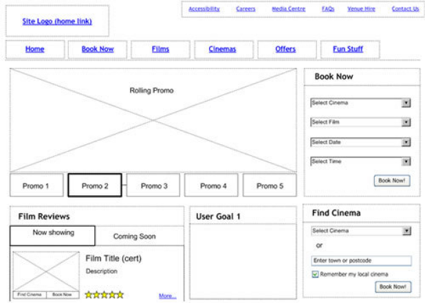
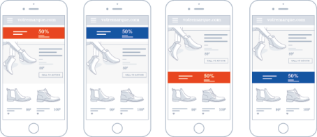
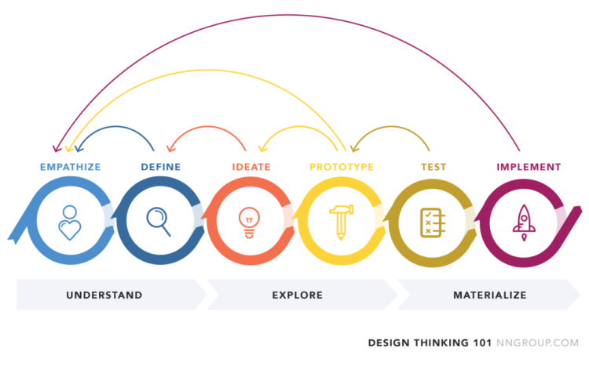

# Actuar sobre los datos

## Objetivos

- Transformar la información recogida en ideas
- Definir los wireframes y comprender su papel
- Descubrir el A/B testing y el funcionamiento iterativo

## Contexto

Las segundas y terceras fases de la metodología UX son las de la Definición y la Ideación, es decir, las etapas en las que el UX designer va a sintetizar la información recogida, generar ideas, definir los perímetros del proyecto y finalmente iniciar el trabajo de diseño y prototipado.

Vamos a ver cómo se pueden explotar y traducir las pistas de reflexión a través de un prototipo que nuestros futuros usuarios probarán en cada iteración.

La etapa de Ideación se desarrollará en torno a talleres con el equipo técnico (ingenieros, desarrolladores, UI designer, etc.) sin dejar de lado a los usuarios. En Design Thinking, todas las fases son, como habrás comprendido, iterativas. El usuario es siempre el actor principal del proyecto. Y, en cada etapa, debe ser consultado para probar y evaluar las soluciones propuestas, siempre con un único objetivo: reducir los errores y las frustraciones, y aumentar la productividad.

## El wireframing

El wireframe (o maqueta funcional) es una representación visual esquemática, a menudo en blanco y negro, utilizada durante el diseño de una interfaz de usuario para definir las zonas y componentes que debe contener. A diferencia de una maqueta gráfica, un wireframe hace abstracción total del aspecto gráfico y diseño del sitio. Así, permite limitar los riesgos de errores, ya que es más rápido y menos costoso revisar y modificar la estructura de las páginas antes de la fase de diseño gráfico, y más aún antes de la fase de desarrollo, o incluso de entrega.

Como en cada etapa de la metodología UX, el usuario está en el centro del proceso: la etapa de wireframe permite probar la estructura del sitio y la fluidez de la navegación con los usuarios, mucho antes de los desarrollos. Los usuarios suelen tener dificultades para proyectarse y visualizar el resultado de las pantallas. Estas maquetas funcionales les permiten hacerlo y utilizar estos soportes como base de reflexiones, interrogaciones, sugerencias.

Una maqueta funcional tiene la misma función que un plano de arquitecto. No se puede construir una casa en 3D sin haber diseñado previamente el plano, en 2D y en blanco y negro. Del mismo modo, no es posible crear motivos en Photoshop y escribir líneas de código sin saber de antemano dónde deben colocarse estos motivos y líneas de código en el sitio.

El inconveniente principal de esta fase es que, en esta etapa, las restricciones técnicas y temporales no siempre están definidas y claras. El diseñador y los usuarios pueden estar perfectamente de acuerdo sobre la expresión y el diseño de las necesidades, pero tener que revisar su copia a la baja para responder a las restricciones relacionadas con las tecnologías, los plazos de entrega, etc.

El conjunto de wireframes, validados por los usuarios, constituyen la base del prototipo de la solución digital.

## Ejemplo: Un ejemplo de wireframe

Aquí, el wireframe representa la interfaz de un sitio relacionado con el cine.

Fuente : captura de pantalla **[https://www.experienceux.co.uk/faqs/what-is-wireframing/](https://www.experienceux.co.uk/faqs/what-is-wireframing/)**

## Complemento: Algunas herramientas para crear wireframes

- Balsamiq está disponible en todos los soportes (Mac, Windows, Linux) y ofrece una versión web que te permite trabajar en la nube (SaaS).
- Axure es uno de los primeros software de wireframing profesionales. Hasta hace poco, sólo estaba disponible para Windows.
- Flairbuilder es mucho más reciente que Axure, disponible en versión Mac y Windows.

## El A/B testing

Un A/B test consiste en difundir dos versiones de un mismo contenido entre dos muestras de audiencia de tamaño similar, con el fin de comparar el rendimiento de cada variante. Permite medir el impacto de las dos propuestas, construir y verificar hipótesis, determinar qué versión genera más clics, suscripciones, compras...

Es totalmente posible probar varios cambios simultáneamente en una página web: un banner, un título, una descripción o incluso un vídeo. Esta variante del A/B testing se llama MVT («test multivariado»). Hay muchas otras en función de tus objetivos: test Bandit o test de asignación dinámica de tráfico (multi-armed bandit testing), test A/B/n, etc.

En resumen, el A/B testing permite tomar decisiones basadas en datos fiables.

El A/B testing también puede llamarse split testing o split URL testing. En un A/B test clásico, las dos variaciones de tus páginas están en la misma URL. En el caso del split URL testing, la variante B está en una URL distinta (tus visitantes no ven la diferencia).

## Proceder al A/B testing

- Seleccionar un elemento a probar
- Definir el objetivo del test e identificar los indicadores a medir
- Definir la versión de referencia y la versión test
- Crear el A/B test y difundirlo
- Promover el contenido probado entre una muestra relevante
- Recoger suficientes datos
- Ampliar el análisis al conjunto del embudo de marketing
- Aplicar las conclusiones

## Ejemplo: Un ejemplo de test A/B

En un A/B test, puedes evaluar la eficacia de diferentes componentes de tu interfaz, como por ejemplo:

- la estructura de la página
- la navegación
- los títulos y los textos
- los botones y/o llamadas a la acción
- las imágenes
- etc.

Fuente : captura de pantalla **[https://www.abtasty.com/fr/ab-testing/](https://www.abtasty.com/fr/ab-testing/)**

## La concepción iterativa

Es prácticamente imposible diseñar una interfaz de usuario que no presente ningún problema de uso desde el principio. Incluso los mejores expertos en usabilidad no pueden diseñar interfaces de usuario perfectas en un solo intento, por eso un ciclo de vida de ingeniería de usabilidad debe construirse en torno al concepto de iteración – Nielsen Norman Group

El principio del diseño iterativo es que, en cada etapa, somos susceptibles de volver atrás para realizar ajustes, hasta que se alcance un resultado deseado y esto incluso después de la puesta en línea de nuestro producto. El objetivo del modelo iterativo es eliminar progresivamente la incertidumbre durante los desarrollos.

Este enfoque es especialmente útil en los equipos que funcionan en Agile, y para los cuales es preferible trabajar por incrementos en lugar de hacerlo de una sola vez. Así, en cada iteración, los perfiles expertos pueden aportar mejoras o funcionalidades adicionales.

Desde el punto de vista UX, la iteración implica que las descripciones, las especificaciones y los prototipos sean revisados y afinados cuando se proporciona nueva información por parte de los usuarios. Comprenderás entonces que es imposible especificar completamente y con precisión cada detalle de cada aspecto de la interacción al inicio de cada desarrollo.

## Nota: Las ventajas e inconvenientes del funcionamiento iterativo

>El funcionamiento iterativo permite entre otras cosas:
>
>- Implicar al cliente y a los usuarios muy pronto, desde la fase de diseño. Así tienen una visión temprana del producto, no de forma global, sino por fracción de funcionalidades y pueden proyectarse continuamente.
>- Obtener feedbacks en flujo continuo, sobre temas concretos y no ahogar esta información en un libro blanco de impresiones.
>- Más reactividad y rapidez: es más fácil y rápido modificar una microfuncionalidad que cambiar un flujo completo con varias pantallas.
>- Más implicación de los equipos de desarrollo, que se sienten así más productivos, ya que entregan regularmente una producción al cliente.
>
>Sin embargo, este método puede ser costoso, ya que las iteraciones aumentan la duración del desarrollo.

## Para recordar

- Una vez recogida la información de los usuarios, el diseñador puede utilizarla para empezar a concretar el proyecto. Podrá utilizar los wireframes para determinar y delimitar las zonas y los diferentes componentes. Los wireframes no tienen como objetivo representar los elementos de forma gráfica, sino simplemente dar una idea de su disposición en la página y presentar un prototipo al cliente para su validación. Son más rápidos de realizar que las maquetas gráficas, y las modificaciones y comentarios eventuales formulados por el cliente serán más rápidamente aplicables que en las maquetas gráficas.

- Para asegurarse de que el diseño puesto en marcha se ajusta lo más posible a las necesidades de los usuarios, es posible realizar pruebas A/B, que consisten en proponer a los usuarios varias variantes, entre las cuales deberán elegir la que, según ellos, sea la más pertinente.

- También hemos visto que el diseño de una aplicación se adapta perfectamente a la metodología Agile, ya que es ella misma iterativa.