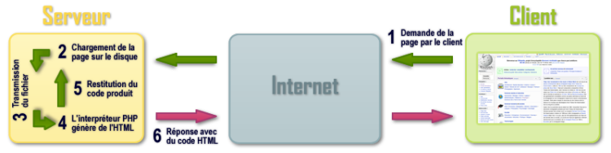

# **Que es PHP?**

<br>

## **_Objetivos:_**

- Aprender que es PHP

- Saber cuales son las diferencias entre las paginas web estáticas y las dinámicas

---

---

<br>

---

## **Contexto**

---

<br>

Cuando un usuario consulta una página HTML, la visualiza directamente en su navegador: 

👇

estas son las páginas web estáticas.

Para necesidades más avanzadas, es posible crear páginas web dinámicas generadas por un programa cuando el usuario las accede.

El contenido de estas páginas puede variar según cada acceso.

Esto permite, por ejemplo, buscar automáticamente las últimas noticias para mostrar.

Para crear páginas web dinámicas, utilizaremos el lenguaje de programación PHP.

<br>

---

---

<br>
<br>

---

## **Definición: PHP**

---

<br>

PHP, cuyo **acrónimo recursivo es PHP Hypertext Preprocessor, es un lenguaje de programación de código abierto** `creado en 1994 por Rasmus Lerdorf`.

<br>

Una gran mayoría de sitios web utilizan PHP (casi el 80% en 2018), incluyendo sitios muy conocidos como Wikipedia, sitios gubernamentales franceses, Facebook, entre otros.

Su mascota es un elefante.

<br>

---


```
La mascota de PHP
```

----

<br>

**PHP es un lenguaje de scripts ejecutado en el lado servidor,** lo que significa que **es el servidor el que interpretará el código `PHP` y generará la página web** para enviar al navegador web.

Para consultar una página `PHP` a través de nuestro navegador web (el cliente), este envía una solicitud HTTP al servidor.

El servidor identifica que se está solicitando una página `PHP` e interpreta el código para generar la página web final, que envía al cliente en formato HTML.

<br>

---



```
Esquema de como funciona PHP
```

----

<br>

---

---

<br>
<br>

---

### **ATENCIÓN!:**

---

<br>

A diferencia del código `JavaScript` o `HTML`, **en ningún momento el usuario puede ver el código `PHP` que se ha escrito para generar su página**, ya que **este código se interpreta en el servidor y no en el cliente.**

<br>

---

**Además de las páginas web, `PHP` es capaz de:**

- generar imágenes, PDF, etc.

    y
    
- también puede conectarse a varios sistemas de gestión de bases de datos.**

<br>

---

---

<br>
<br>

---

## **A Recordar**

---

<br>

- **PHP es un lenguaje de scripts ejecutado en el servidor:**

    - **es el servidor el que interpreta el código PHP y genera la página web enviada al navegador web.**

    <br>

- **El código PHP no es visible para el usuario.**

<br>

---

---

<br>
<br>

---

### **Complemento:**

---

<br>

- **[Que es PHP](https://www.php.net/manual/fr/intro-whatis.php)**

- **[PHP (Wikipedia)](https://fr.wikipedia.org/wiki/PHP)**

<br>

---

---
